<h1 align="center"> Rotavital 💉🩸🏥🚑<br>
 <br>


[](https://github.com/viictorpaes/Rotavital/blob/main/LICENSE)

</h1>

<p align="center">
Sistema de logística de distribuição de hemocomponentes entre hospitais e bancos de sangue — estoque com
regras de validade, requisições hospitalares com alocação por <b>FEFO + compatibilidade ABO/Rh</b>,
roteirização de entregas e telemetria da cadeia fria.
</p>

<h2 align="center" id="docentes">👥👨🏻‍🏫 Docentes Responsáveis: <br>

</h2>
<ul>
  <li><strong>José Maurício da Silva Júnior</strong> — Algoritmos e Estrutura de Dados</li>
  <li><strong>Raoni Monteiro de Oliveira</strong> — Infraestrutura de Software (SO)</li>
  <li><strong>Robson Godoi de Albuquerque Maranhão</strong> — Projeto 3</li>
  <li><strong>Maurício da Motta Braga</strong> — Programação Orientada a Objetos</li>
  <li><strong>Luiz Filipe Guimarães Novaes</strong> — Infraestrutura de Comunicação (RSD)</li>
  <li><strong>André Luiz da Silva Xavier</strong> — Estatística e Probabilidade</li>
</ul>

<h2 align="center" id="integrantes">👤👨‍🎓 Integrantes do Projeto: </h2>
<ul>
<li><b>Victor José Paes e Silva (Líder 👑)</b> <a href="https://www.linkedin.com/in/viictorpaes/" target="_blank"></a> <a href="https://github.com/viictorpaes" target="_blank"></a></li>
<li>Eduardo de Souza Cavalcanti Junior <a href="https://www.linkedin.com/in/eduardoscavalcantij/" target="_blank"></a> <a href="https://github.com/eduardo-scavalcanti" target="_blank"></a></li>
<li>Felipe Franca Alves de Lima <a href="https://www.linkedin.com/in/felipefrancaal/" target="_blank"></a> <a href="https://github.com/ffrancaal" target="_blank"></a></li>
<li>Helamã Leone de Lima Procídio <a href="https://www.linkedin.com/in/helam%C3%A3-procidio-428772367/" target="_blank"></a> <a href="https://github.com/procidiohelama-star" target="_blank"></a></li>
<li>João Pedro Arruda Guimarães <a href="https://www.linkedin.com/in/jo%C3%A3o-pedro-arruda-guimar%C3%A3es-157952287/" target="_blank"></a> <a href="https://github.com/Jp230603" target="_blank"></a></li>
<li>Lucas Paguetti Pereira <a href="https://www.linkedin.com/in/lucas-paguetti-pereira" target="_blank"></a> <a href="https://github.com/wqiluc" target="_blank"></a></li>
<li>Tiago Luiz Moreira de Vasconcelos <a href="https://www.linkedin.com/in/tiagoluiz23/" target="_blank"></a> <a href="https://github.com/tlmv23" target="_blank"></a></li>
</ul>

<h2 align="center" id="tecnologias"> ⛏️💻 Tecnologias Utilizadas: <br>

</h2>
<p align="center">
   <br>
  
    
  
  
  
   <br>
  
  
  
  
  
   <br>
  
  
  
   <br>
  
  
  
</p>

<h2 align="center" id="entregas">🚀 Entregas do Projeto Integrador <br>

</h2>

<p align="center">
Cada entrega do Projeto Integrador tem sua própria seção abaixo, com link direto para os artefatos
produzidos (histórias de usuário, protótipo, screencasts). Datas conforme o roadmap do 3º semestre.
</p>

<h3 id="-entrega-01" align="center">📌 Entrega 01 — 31/08 <br>
<a href="https://letter-raven-07178463.figma.site" target="_blank"></a>
<a href="https://youtu.be/SRvAFkqi4Nc" target="_blank"></a>

</h3>

| Artefato | Descrição | Link |
| :--- | :--- | :--- |
| 🎨 Protótipo low-Fi (Figma Make) | 10 histórias navegadas e confirmadas ponta a ponta (HU‑01 a HU‑10) | [Abrir protótipo](https://letter-raven-07178463.figma.site) |
| 🎬 Screencast (YouTube) | Demonstração do protótipo, explicando cada história implementada | [Assistir vídeo](https://youtu.be/SRvAFkqi4Nc) |

<h4 align="center">📋 Histórias de Usuário — Rota Vital 🩸<br>
Login, Estoque, Requisições, Rede Hospitalar, Pacientes e <b>Doações</b></h4>

> **Formato:** Como `[papel]`, quero `[funcionalidade]`, para que `[benefício]`.

<p align="center">


</p>

<h5 align="left">🖥️ Telas do Protótipo ↔ Histórias</h5>

| # | Tela do Figma | Papel | HUs |
| :---: | :--- | :--- | :--- |
| 1 | 🔐 Login / Seleção de acesso | Médico e Doador | HU‑01 |
| 2 | 📊 Painel Operacional (Início) | Médico | HU‑02 |
| 3 | 📦 Estoque por tipo sanguíneo | Médico | HU‑03 |
| 4 | 🏥 Requisição — Solicitar / Recebidas / Campanha | Médico | HU‑04, HU‑05, HU‑06 |
| 5 | 🚚 Rede hospitalar (mapa + plano de transporte) | Médico | HU‑07 |
| 6 | 🩺 Pacientes | Médico | HU‑08 |
| 7 | ❤️ Doações (pessoas que precisam + agendar) | Médico e Doador | HU‑09 |
| 8 | 👤 Portal do Doador | Doador | HU‑10 |

> Parte da lógica por trás de algumas telas (FEFO, compatibilidade ABO/Rh, grafo de rotas) já existe no
> backend Java — ver [`docs/MODULOS.md`](./docs/MODULOS.md). O que ainda é só protótipo está anotado como
> "Nível de código" em cada história abaixo; isso não é o foco desta entrega, só uma referência rápida.

<h5 align="left">✅ Implementadas</h5>

**🔐 Login e Painel**

| # | História |
| :---: | :--- |
| HU‑01 | Como **usuário do RotaVital (médico ou doador)**, quero escolher meu tipo de acesso e informar meu nome na tela inicial, para que eu entre direto na experiência certa para o meu papel, sem um cadastro completo. |
| HU‑02 | Como **médico**, quero ver um painel com números rápidos e uma caixa de avisos com alertas críticos em tempo real, para que eu identifique pacientes em risco e problemas de estoque sem navegar por todas as telas. |

**📦 Estoque**

| # | História |
| :---: | :--- |
| HU‑03 | Como **médico**, quero consultar o estoque agrupado por tipo sanguíneo, com o detalhe de cada lote (validade, temperatura e localização física), para que eu saiba exatamente quais lotes estão em risco de vencer ou fora da faixa de temperatura ideal. |

**🏥 Requisição**

| # | História |
| :---: | :--- |
| HU‑04 | Como **médico**, quero preencher uma requisição informando hemocomponente, tipo sanguíneo, ala de destino, quantidade, paciente e urgência, para que o sistema me sugira automaticamente o lote certo pela regra FEFO. |
| HU‑05 | Como **médico**, quero registrar o recebimento físico de hemocomponentes vindos de outras instituições, para que essas unidades sejam somadas automaticamente ao estoque, sem lançamento manual. |
| HU‑06 | Como **médico**, quero publicar uma campanha de doação para um paciente específico, para que doadores voluntários o vejam nas telas de Doações e Pacientes e se cadastrem para ajudar diretamente. |

**🚚 Rede Hospitalar**

| # | História |
| :---: | :--- |
| HU‑07 | Como **médico**, quero visualizar o mapa de hospitais conectados, escolher um destino e ver o plano de transporte com a rota calculada e as exigências da cadeia fria, para que a entrega siga pelo caminho mais eficiente, no veículo certo e na temperatura ideal. |

**🩺 Pacientes**

| # | História |
| :---: | :--- |
| HU‑08 | Como **médico**, quero, ao concluir o atendimento de um paciente, informar se o hemocomponente usado veio do estoque interno (com baixa automática por FEFO) ou de uma doação externa (sem baixa), para que o estoque reflita com exatidão o que foi realmente consumido. |

**❤️ Doações**

| # | História |
| :---: | :--- |
| HU‑09 | Como **médico ou doador**, quero visualizar as pessoas que precisam de doação — filtráveis por tipo sanguíneo — e agendar uma doação para uma delas, para que doadores compatíveis sejam direcionados a quem precisa com mais urgência. |
| HU‑10 | Como **doador**, quero acessar, após o login, uma versão simplificada da tela de Doações, sem o menu operacional do hospital, para que minha experiência seja direta: ver quem precisa e agendar minha doação. |

<h5 align="left">🚀 Podem Ser Implementadas no Futuro</h5>

> Identificadas navegando o próprio protótipo — coisas que ele hoje **não** cobre e que fariam sentido como
> próximo passo, seja no Figma ou já direto no backend.

| # | História |
| :---: | :--- |
| HU‑F01 | Como **administrador do sistema**, quero que o login exija senha e verificação de identidade (hoje a tela só pede um nome), para que o acesso a dados clínicos e de estoque seja de fato seguro. |
| HU‑F02 | Como **gestor da rede de sangue**, quero um painel que cruze indicadores de vários hemocentros (o painel atual mostra números de um só), para que eu identifique desequilíbrios regionais de estoque e demanda. |
| HU‑F03 | Como **médico**, quero receber uma notificação (push ou e-mail) quando um alerta crítico entrar na Caixa de Avisos, para que eu não dependa de estar com o painel aberto para ser avisado. |
| HU‑F04 | Como **médico**, quero acompanhar a localização em tempo real do veículo refrigerado durante o transporte (o Plano de Transporte hoje só mostra a rota calculada, não o rastreamento ao vivo), para que eu saiba exatamente quando a entrega vai chegar. |
| HU‑F05 | Como **gestor**, quero exportar relatórios de estoque e demanda em CSV/PDF a partir do Painel Operacional, para que eu leve esses números para reuniões e prestação de contas fora do sistema. |
| HU‑F06 | Como **doador**, quero que o sistema verifique minha elegibilidade (intervalo mínimo entre doações, idade, etc.) antes de confirmar o agendamento em "Fazer doação", para que eu não vá até o hemocentro para descobrir lá que não posso doar. |

<h5 align="left">📋 Resumo</h5>

| Status | Quantidade |
| :--- | :---: |
| ✅ Implementadas | 10 histórias |
| 🚀 Futuras | 6 histórias |
| **Total** | **16 histórias** |

<h5 align="left">🔍 Detalhamento:</h5>

<p align="center">
Cada história implementada abaixo traz o detalhamento completo — ator, ação, benefício, a tela do protótipo
onde ela vive, uma nota (curta) do que já existe em código, e <b>2 cenários de validação</b> em BDD com os
dados reais vistos no protótipo. Clique em <b>▶️</b> + no emoji da tela para expandir.
</p>

<details>
<summary>▶️🔐 <b>HU‑01</b> — Login e seleção de tipo de acesso</summary>

| Campo | Detalhe |
| :--- | :--- |
| **Ator** | Usuário do sistema (médico ou doador) |
| **Quero** | Escolher meu tipo de acesso ("Médico — acesso hospitalar completo" ou "Doador — portal de doações") e informar meu nome |
| **Para que** | Eu veja a tela adequada ao meu papel sem precisar de um cadastro completo |
| **Tela do Figma** | Tela inicial "Cesar Life · Estoque Inteligente" — cartões `Médico`/`Doador`, campo `Nome`, botão `Entrar` |
| **Nível de código** | `POST /acesso` (`AcessoController`) devolve a tela inicial e o menu do papel escolhido — é só identificação, como no protótipo: sem senha nem sessão real |

| Cenário | Dado | Quando | Então |
| :--- | :--- | :--- | :--- |
| Acesso como médico | Estou na tela inicial do Cesar Life | Seleciono o cartão "Médico", informo "Dra. Ana Souza" e clico em "Entrar" | Vejo o Painel Operacional do HEMOPE (Recife — PE), com o menu Início / Estoque / Requisição / Rede / Pacientes / Doações |
| Acesso como doador | Estou na tela inicial | Seleciono o cartão "Doador", informo "João Doador" e clico em "Entrar" | Vejo o cabeçalho "Cesar Life · Portal do Doador" e a lista de pessoas que precisam, sem o menu operacional do hospital |

</details>

<details>
<summary>▶️📊 <b>HU‑02</b> — Painel operacional com alertas em tempo real</summary>

| Campo | Detalhe |
| :--- | :--- |
| **Ator** | Médico |
| **Quero** | Ver um painel com números rápidos e uma caixa de avisos com alertas críticos em tempo real |
| **Para que** | Eu identifique rapidamente pacientes em risco e problemas de estoque sem navegar por todas as telas |
| **Tela do Figma** | "Início" — Números Rápidos (Unidades em Estoque, Tipos em Risco, Vencendo em 7 dias, Alertas Críticos) + Caixa de Avisos (9 ativos) |
| **Nível de código** | Sem equivalente no contrato/domínio hoje — é um gap real também descrito na visão original do projeto (painel de indicadores) |

| Cenário | Dado | Quando | Então |
| :--- | :--- | :--- | :--- |
| Alerta crítico de paciente | A paciente "Mariana Alves" precisa de sangue O- com urgência, em cirurgia cardíaca no Centro Cirúrgico | Entro no Painel Operacional | Vejo o aviso "CRÍTICO · Paciente Mariana Alves precisa de sangue O− urgente" na Caixa de Avisos |
| Alerta de estoque baixo | O tipo AB+ está com apenas 3 unidades de Concentrado de Hemácias | Entro no Painel Operacional | Vejo o aviso "Estoque de sangue tipo AB+ próximo do desabastecimento" e o contador "Tipos em Risco" reflete essa contagem |

</details>

<details>
<summary>▶️📦 <b>HU‑03</b> — Estoque por tipo sanguíneo com detalhe de lote</summary>

| Campo | Detalhe |
| :--- | :--- |
| **Ator** | Médico |
| **Quero** | Consultar o estoque agrupado por tipo sanguíneo, com detalhe de cada lote (validade, temperatura, localização) |
| **Para que** | Eu saiba exatamente quais lotes estão em risco de vencer ou fora da faixa de temperatura ideal |
| **Tela do Figma** | "Estoque" — filtro por tipo sanguíneo (A+ … O-), cartão de lote com código, unidades, volume, validade e temperatura (com etiqueta "FORA DA FAIXA") |
| **Nível de código** | Parcialmente coberto por `Estoque`/`BolsaHemocomponente` e `GET /estoque/{bancoId}` — mas o contrato atual não tem campos de localização física (rack/posição) nem de temperatura por lote |

| Cenário | Dado | Quando | Então |
| :--- | :--- | :--- | :--- |
| Lote fora da faixa de temperatura | O lote "PQ-3014" (Concentrado de Plaquetas, A+) está a 25,6°C, fora da faixa ideal de 20–24°C | Abro a tela de Estoque e filtro por "A+" | Vejo o lote "PQ-3014" marcado com a etiqueta "FORA DA FAIXA" |
| Filtrar por tipo sanguíneo específico | Existem lotes de vários tipos sanguíneos no estoque | Clico no filtro "O-" | Vejo apenas os 3 lotes de O- ("CH-1042", "CH-1043", "CR-4002"), totalizando 13 unidades |

</details>

<details>
<summary>▶️🏥 <b>HU‑04</b> — Solicitar requisição com sugestão de lote por FEFO</summary>

| Campo | Detalhe |
| :--- | :--- |
| **Ator** | Médico |
| **Quero** | Preencher uma requisição informando hemocomponente, tipo sanguíneo, ala de destino, quantidade, paciente e urgência |
| **Para que** | Eu atenda o paciente rapidamente usando o lote mais próximo do vencimento, sem precisar escolher manualmente |
| **Tela do Figma** | "Requisição" → aba "Solicitar" — formulário completo + painel lateral "Lote Sugerido (FEFO)" |
| **Nível de código** | Corresponde a `POST /requisicoes` + à lógica de FEFO já em `Estoque.buscarDisponiveis()`; o contrato atual não modela `alaMedica` nem `nomePaciente` |

| Cenário | Dado | Quando | Então |
| :--- | :--- | :--- | :--- |
| Sugestão automática do lote mais próximo do vencimento | Estou solicitando Concentrado de Hemácias tipo O- para a Emergência | Preencho o formulário na aba "Solicitar" | O sistema sugere o lote "CH-1042" com a etiqueta "3D P/ Vencer" e a localização "R1 · P3 · N2" |
| Requisição de emergência | Um paciente precisa de sangue com urgência "Emergência" | Envio a requisição pelo botão "Enviar requisição" | Ela é registrada vinculada ao paciente e à ala médica informados |

</details>

<details>
<summary>▶️🏥 <b>HU‑05</b> — Registrar recebimento de hemocomponentes (aba Recebidas)</summary>

| Campo | Detalhe |
| :--- | :--- |
| **Ator** | Médico |
| **Quero** | Registrar o recebimento físico de hemocomponentes vindos de outras instituições |
| **Para que** | As unidades recebidas sejam somadas automaticamente ao estoque, sem lançamento manual |
| **Tela do Figma** | "Requisição" → aba "Recebidas" — lista de recebimentos (`INC-001`…`INC-004`) com origem, tipo e quantidade |
| **Nível de código** | Sem endpoint equivalente — é um fluxo de entrada diferente do cadastro manual de `POST /hemocomponentes` |

| Cenário | Dado | Quando | Então |
| :--- | :--- | :--- | :--- |
| Recebimento de intercâmbio entre hemocentros | Chegaram 8 unidades de Concentrado de Hemácias O- do "HEMORIO — Intercâmbio Nordeste" | Confirmo o recebimento "INC-001" na aba "Recebidas" | As 8 unidades são somadas automaticamente ao estoque de O- |
| Recebimento de doação coletiva corporativa | A empresa "Nordeste Energia S.A." fez uma doação coletiva de 4 unidades de Concentrado de Plaquetas AB+ | Confirmo o recebimento "INC-003" | Essas 4 unidades entram no estoque de AB+ |

</details>

<details>
<summary>▶️🏥 <b>HU‑06</b> — Publicar campanha de doação para um paciente</summary>

| Campo | Detalhe |
| :--- | :--- |
| **Ator** | Médico |
| **Quero** | Publicar uma campanha de doação informando idade, sexo, tipo sanguíneo, componente necessário, diagnóstico e gravidade do paciente |
| **Para que** | Doadores voluntários vejam esse paciente nas telas de Doações e Pacientes e se cadastrem para ajudar diretamente |
| **Tela do Figma** | "Requisição" → aba "Campanha" — formulário de publicação, com aviso de que ela aparece em Doações e Pacientes |
| **Nível de código** | Sem equivalente no domínio/contrato — não existe conceito de campanha pública nem de doador no backend hoje |

| Cenário | Dado | Quando | Então |
| :--- | :--- | :--- | :--- |
| Publicar campanha para paciente crítico | Um paciente com diagnóstico "Insuficiência cardíaca aguda" precisa de sangue O- com urgência | Preencho e publico o formulário na aba "Campanha" | O paciente passa a aparecer nas telas "Doações" e "Pacientes" para possíveis doadores |
| Campanha exige causa/diagnóstico | Estou preenchendo uma campanha de doação | Tento publicar sem informar "Causa/Diagnóstico" | O sistema deveria bloquear a publicação até o campo ser preenchido — regra a confirmar/reforçar na próxima iteração do protótipo |

</details>

<details>
<summary>▶️🚚 <b>HU‑07</b> — Rede hospitalar e plano de transporte na cadeia fria</summary>

| Campo | Detalhe |
| :--- | :--- |
| **Ator** | Médico |
| **Quero** | Visualizar o mapa de hospitais conectados, escolher um destino e ver o plano de transporte com a rota calculada |
| **Para que** | A entrega siga o caminho mais eficiente, no veículo certo e respeitando a temperatura ideal de transporte |
| **Tela do Figma** | "Rede" — mapa de hospitais conectados (distância/tempo) + painel "Plano de Transporte" (rota, veículo, checklist de hemocomponentes, prioridade de envio por FEFO) |
| **Nível de código** | Corresponde ao módulo de Rotas (`PontoDeRede`, `Conexao`, Dijkstra em `RedeDistribuicao`/`RotaCalculada`) — mas o backend ainda não modela tipo de veículo nem checklist de envio |

| Cenário | Dado | Quando | Então |
| :--- | :--- | :--- | :--- |
| Selecionar hospital e calcular rota | O "Hospital das Clínicas de PE" está a 7,8 km / 18 min do hemocentro | Eu o seleciono no mapa da Rede | O Plano de Transporte exibe destino, endereço, melhor rota, "Veículo refrigerado monitorado" e temperatura ideal de 2 a 6°C |
| Priorização de envio por FEFO no transporte | Os lotes "CH-1042" (O-, vence em 3 dias), "CH-1080" (AB+, vence em 6 dias) e "CH-1061" (A-, vence em 9 dias) estão disponíveis para envio | Visualizo a "Prioridade de Envio (FEFO)" do Plano de Transporte | Eles aparecem ranqueados nessa ordem, do mais próximo do vencimento para o mais distante |

</details>

<details>
<summary>▶️🩺 <b>HU‑08</b> — Concluir procedimento com baixa por FEFO ou doação externa</summary>

| Campo | Detalhe |
| :--- | :--- |
| **Ator** | Médico |
| **Quero** | Ao concluir o atendimento de um paciente, informar se o hemocomponente veio do estoque interno ou de uma doação externa |
| **Para que** | O estoque reflita com exatidão o que foi realmente consumido, sem duplicar ou perder unidades |
| **Tela do Figma** | "Pacientes" → botão "Concluir procedimento" → modal com as opções "Utilizou hemocomponentes do estoque" (deduz por FEFO) e "Paciente recebeu doação externa" (não deduz) |
| **Nível de código** | A baixa por FEFO já existe conceitualmente em `Estoque.reservar()` + `RequisicaoHospitalar.marcarComoAlocada()`, mas não há classe de domínio para Paciente nem para o registro de conclusão de procedimento |

| Cenário | Dado | Quando | Então |
| :--- | :--- | :--- | :--- |
| Concluir procedimento usando estoque interno | A paciente "Mariana Alves" (O-, Concentrado de Hemácias, crítico) está em atendimento | Concluo o procedimento e seleciono "Utilizou hemocomponentes do estoque" | 1 unidade de Concentrado de Hemácias O- é deduzida do estoque seguindo FEFO |
| Concluir procedimento com doação externa | A mesma paciente recebeu sangue por uma doação externa emergencial | Concluo o procedimento e seleciono "Paciente recebeu doação externa" | Nenhuma unidade é deduzida do estoque |

</details>

<details>
<summary>▶️❤️ <b>HU‑09</b> — Ver quem precisa de doação e agendar</summary>

| Campo | Detalhe |
| :--- | :--- |
| **Ator** | Médico ou doador |
| **Quero** | Visualizar as pessoas que precisam de doação, filtráveis por tipo sanguíneo, e agendar uma doação para uma delas |
| **Para que** | Doadores compatíveis sejam direcionados a quem precisa com mais urgência, com local e horário claros |
| **Tela do Figma** | "Doações" — lista de pessoas com filtro por tipo sanguíneo, botão "Fazer doação" → modal "Agende sua doação" (endereço, horário, "Confirmar e traçar rota no celular") |
| **Nível de código** | Sem equivalente no domínio/contrato — não existe conceito de doador nem de matching paciente↔doador no backend |

| Cenário | Dado | Quando | Então |
| :--- | :--- | :--- | :--- |
| Agendar doação para paciente crítico | "Mariana Alves" (O-, Concentrado de Hemácias, crítico, a 1,8 km) aparece na lista de Doações | Clico em "Fazer doação" para ela | Vejo a tela "Agende sua doação" com endereço do hemocentro, horário de funcionamento e a opção "Confirmar e traçar rota no celular" |
| Filtrar pessoas que precisam por tipo sanguíneo | Existem 6 pessoas cadastradas, com tipos sanguíneos diferentes | Filtro por "AB+" | Vejo apenas "Beatriz Carvalho" na lista |

</details>

<details>
<summary>▶️👤 <b>HU‑10</b> — Portal do Doador simplificado</summary>

| Campo | Detalhe |
| :--- | :--- |
| **Ator** | Doador |
| **Quero** | Acessar, após o login, uma versão simplificada da tela de Doações, sem o menu operacional do hospital |
| **Para que** | Minha experiência como doador seja direta — só ver quem precisa e agendar minha doação |
| **Tela do Figma** | "Portal do Doador" — mesmo header "Cesar Life · Portal do Doador", sem o menu Início/Estoque/Requisição/Rede/Pacientes |
| **Nível de código** | Sem equivalente — perfis de acesso (Médico/Doador) não existem no backend ainda |

| Cenário | Dado | Quando | Então |
| :--- | :--- | :--- | :--- |
| Doador vê apenas o portal de doações | Fiz login como "Doador" com o nome "João Doador" | Acesso o sistema | Vejo o cabeçalho "Cesar Life · Portal do Doador" e a lista de pessoas que precisam, sem os menus Início/Estoque/Requisição/Rede/Pacientes |
| Doador consegue agendar doação do mesmo jeito que o médico | Estou logado como doador | Clico em "Fazer doação" para uma pessoa da lista | Vejo a mesma tela "Agende sua doação", com endereço e horário do hemocentro |

</details>

<h3 id="-entrega-02" align="center">📌 Entrega 02 — 21/09 <br>


<a href="https://youtu.be/3RlgYAGPyaE" target="_blank"></a>

</h3>

<p align="center">
Segunda entrega do Projeto Integrador — sai do protótipo Figma e liga o domínio a código rodando de
verdade: back-end em <b>Spring Boot</b> (HU‑01, HU‑03 — em <a href="https://github.com/viictorpaes/Rotavital/pull/2">PR #2</a>,
ainda não mesclado) e front-end em <b>React</b> (HU‑01, HU‑09, HU‑10 — nesta branch), somando 5 histórias
com código real, acima do mínimo de 2 exigido. Screencast de uso do sistema e explicação do código
publicado no <a href="https://youtu.be/3RlgYAGPyaE" target="_blank">YouTube</a>, fechando a entrega.
</p>

| Requisito da entrega | Descrição | Status |
| :--- | :--- | :---: |
| ✅ Histórias implementadas | Mínimo de 2 HUs em código real (não só Figma) |  **Feito** |
| 🔁 Versionamento atuante | Commits de código direto na `main`, no mínimo semanais |  **Feito** — PRs #2 e #10 mesclados na `main` em 14/09, com commits também em 23/08, 09/09 e 12/09, mantendo cadência semanal |
| 🐞 Issue/Bug Tracker | GitHub Issues atualizado todas as semanas + print no README |  **Feito** — 7 issues registradas no GitHub (label `bug`), 1 já fechada, com prints na seção [Issue/Bug Tracker](#issue-tracker) abaixo |

| Artefato | Descrição | Link |
| :--- | :--- | :--- |
| 🎬 Screencast — Uso do sistema | Aplicação Spring Boot rodando, explicando as HUs implementadas | [Assistir vídeo](https://youtu.be/3RlgYAGPyaE) |
| 💻 Screencast — Explicação do código | Código da aplicação Spring Boot e das HUs implementadas | [Assistir vídeo](https://youtu.be/3RlgYAGPyaE) |

<h4 align="center">📝 Histórias Implementadas — Entrega 02</h4>

<p align="center">
Resumo em formato <b>post-it</b> (como visto em sala) das histórias já rodando em código — Spring Boot
no backend, React no frontend. O detalhamento completo (ator, tela, BDD) de cada HU está na
<a href="#-entrega-01">Entrega 01</a> acima.
</p>

> 🟨 **HU‑01** — Como **usuário (médico ou doador)**, preciso escolher meu tipo de acesso e informar meu
> nome, para entrar direto na experiência certa para o meu papel, sem um cadastro completo.
>
> ✅ Frontend — [`PaginaLogin.tsx`](./frontend/src/pages/Login/PaginaLogin.tsx) (nesta branch)
> ✅ Backend — `POST /acesso` via [`AcessoController.java`](https://github.com/viictorpaes/Rotavital/blob/eduardo-entrega2/backend/src/main/java/com/rotavital/api/AcessoController.java) (PR #2, não mesclado)

> 🟨 **HU‑03** — Como **médico**, preciso consultar o estoque por tipo sanguíneo, com validade, temperatura
> e localização de cada lote, para saber quais estão em risco de vencer ou fora da faixa ideal.
>
> ✅ Backend — `GET /estoque/{bancoId}?tipoSanguineo=` via [`EstoqueController.java`](https://github.com/viictorpaes/Rotavital/blob/eduardo-entrega2/backend/src/main/java/com/rotavital/api/EstoqueController.java) (PR #2, não mesclado)
> ❌ Frontend — página `Estoque` segue como placeholder `EmBreve` (ver [Figma × Mockado](#figma-vs-mockado))

> 🟨 **HU‑09** — Como **médico ou doador**, preciso visualizar as pessoas que precisam de doação — filtráveis
> por tipo sanguíneo — e agendar uma doação, para direcionar doadores compatíveis a quem precisa com urgência.
>
> ✅ Frontend — [`PaginaDoacoes.tsx`](./frontend/src/pages/Doacoes/PaginaDoacoes.tsx) + [`ModalAgendarDoacao.tsx`](./frontend/src/components/donations/ModalAgendarDoacao.tsx) (nesta branch)

> 🟨 **HU‑10** — Como **doador**, preciso acessar uma versão simplificada da tela de Doações, sem o menu
> operacional do hospital, para uma experiência direta: ver quem precisa e agendar minha doação.
>
> ✅ Frontend — [`PaginaPortalDoador.tsx`](./frontend/src/pages/PortalDoador/PaginaPortalDoador.tsx) (nesta branch)

<h4 align="center" id="issue-tracker">🐛 Issue/Bug Tracker — Entrega 02 <br>


</h4>

<p align="center">
7 issues registradas no <a href="https://github.com/viictorpaes/Rotavital/issues" target="_blank">GitHub Issues</a> do repositório,
todas com a label <code>bug</code>, registrando gaps reais encontrados entre o protótipo Figma, a documentação
técnica (<code>docs/</code>) e o código que de fato roda hoje (backend Spring Boot + frontend React). A Issue #2 já
foi fechada nesta entrega; as demais viram trabalho de entrada da Entrega 03.
</p>

<p align="center">
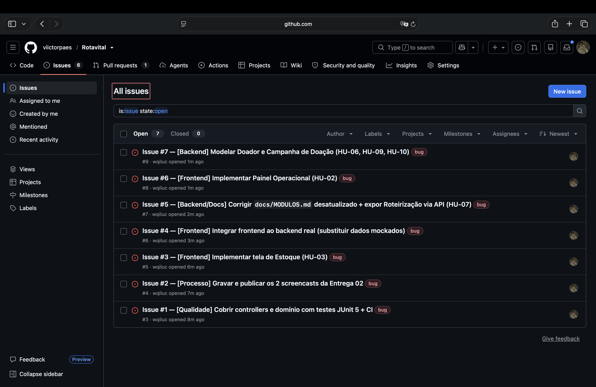
</p>

| Imagem | Título | Descrição |
| :---: | :--- | :--- |
| 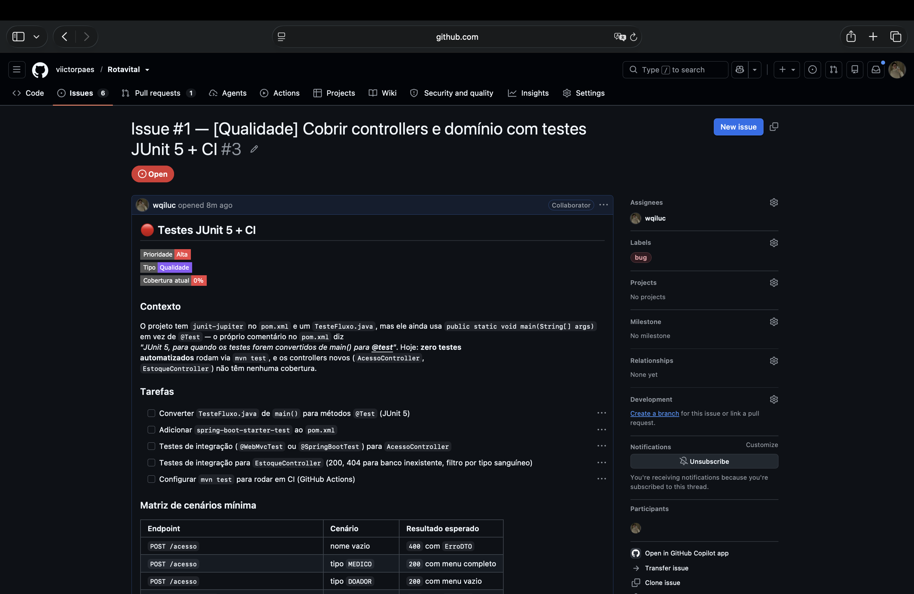 | 🔴 Issue #1 — Testes JUnit 5 + CI (contexto) | Cobertura de testes em 0%: o projeto já tem `junit-jupiter` no `pom.xml`, mas `TesteFluxo.java` ainda usa `main()` em vez de `@Test`. Tarefas para convertê-lo, adicionar `spring-boot-starter-test` e cobrir `AcessoController`/`EstoqueController`. |
| 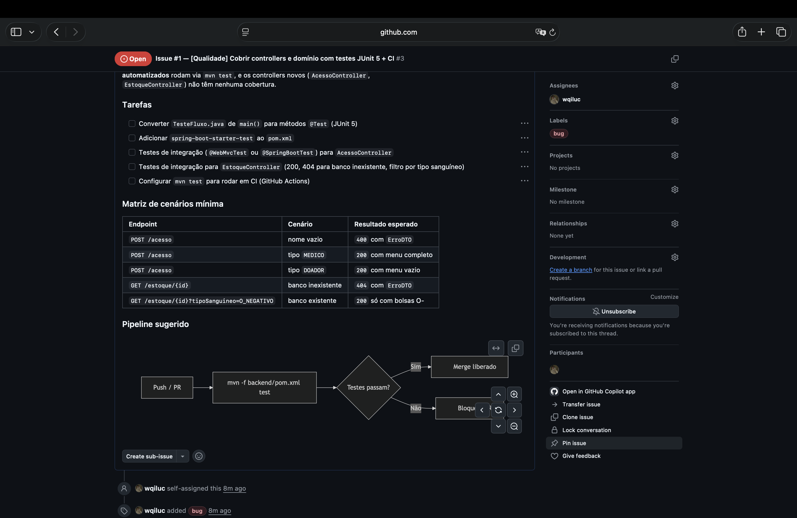 | 🔴 Issue #1 — Testes JUnit 5 + CI (cenários e pipeline) | Matriz mínima de cenários de teste por endpoint (`POST /acesso`, `GET /estoque/{id}`) e pipeline de CI sugerido, bloqueando o merge quando `mvn test` falha. |
| 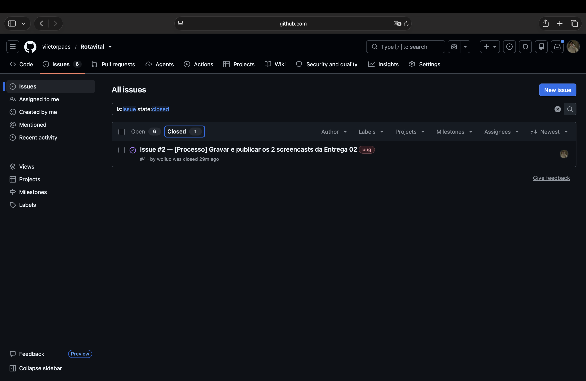 | ✅ Issue #2 — Screencasts da Entrega 02 (fechada) | Checklist para gravar e publicar os 2 vídeos exigidos nesta entrega (uso do sistema rodando e explicação do código) concluído; vídeos publicados no YouTube e issue fechada no GitHub. |
| 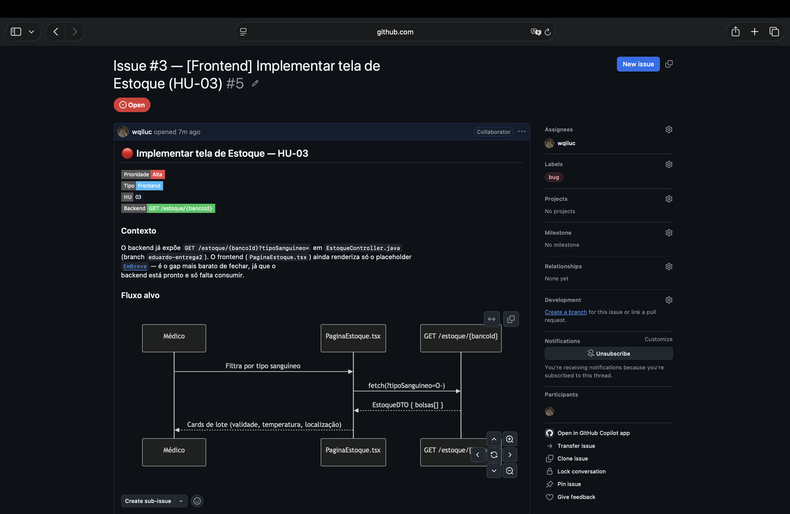 | 🔴 Issue #3 — Implementar tela de Estoque (HU‑03) | O backend já expõe `GET /estoque/{bancoId}?tipoSanguineo=`; falta a `PaginaEstoque.tsx` sair do placeholder `EmBreve` e consumir esse endpoint de verdade. |
| 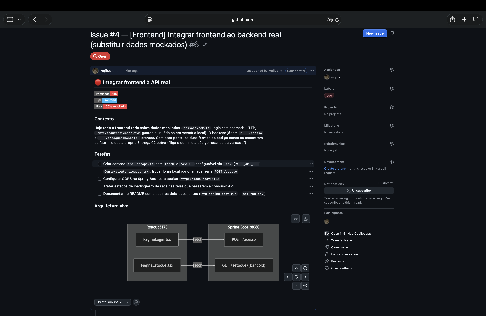 | 🔴 Issue #4 — Integrar frontend ao backend real | Hoje o frontend roda 100% sobre dados mockados (`pessoasMock.ts`, login só em memória). Plano para criar uma camada `api.ts`, trocar login/estoque por chamadas HTTP reais e configurar CORS no Spring Boot. |
| 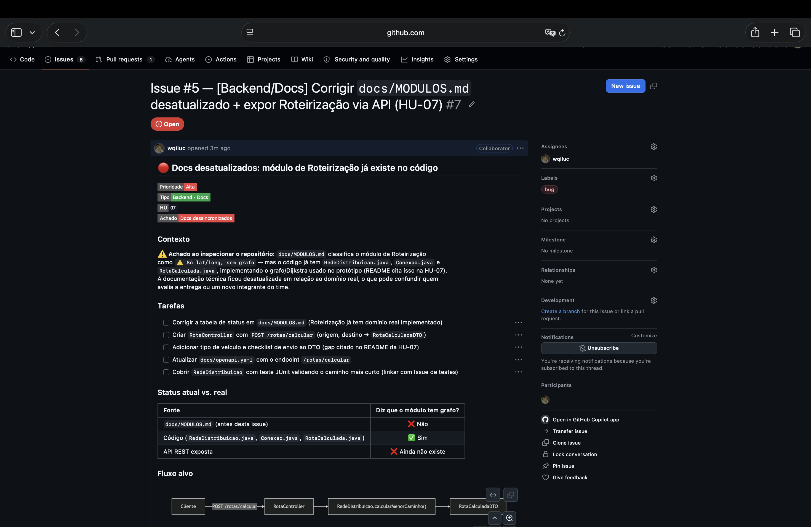 | 🟠 Issue #5 — Docs desatualizados sobre Roteirização (achado) | `docs/MODULOS.md` classifica o módulo de Roteirização como "só lat/long, sem grafo", mas o código já implementa o grafo/Dijkstra (`RedeDistribuicao`, `Conexao`, `RotaCalculada`) usado no protótipo. |
| 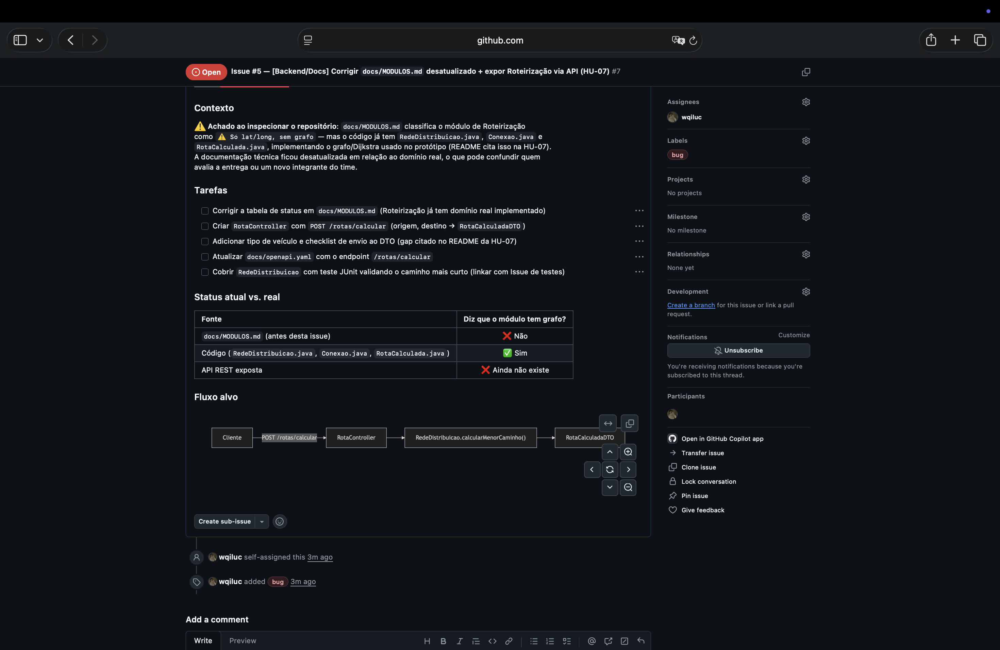 | 🟠 Issue #5 — Docs desatualizados sobre Roteirização (status e fluxo alvo) | Tabela comparando documentação vs. código real e fluxo alvo para expor o cálculo de rota via um novo endpoint `POST /rotas/calcular`. |
| 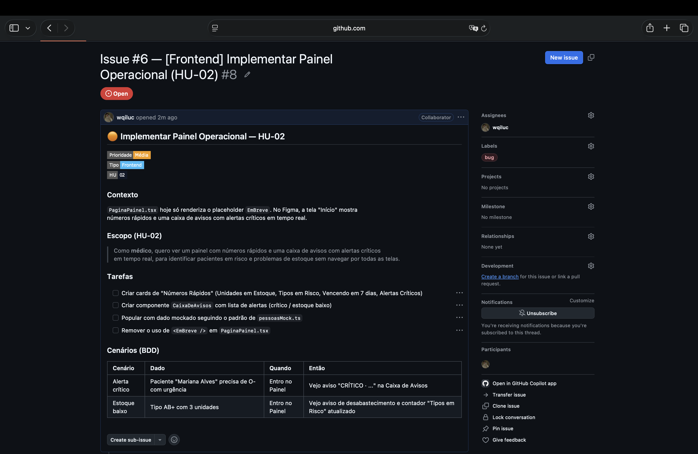 | 🟠 Issue #6 — Implementar Painel Operacional (HU‑02) | Escopo e cenários BDD para tirar a `PaginaPainel.tsx` do placeholder `EmBreve` e implementar os cards de "Números Rápidos" e a caixa de avisos com alertas críticos. |
| 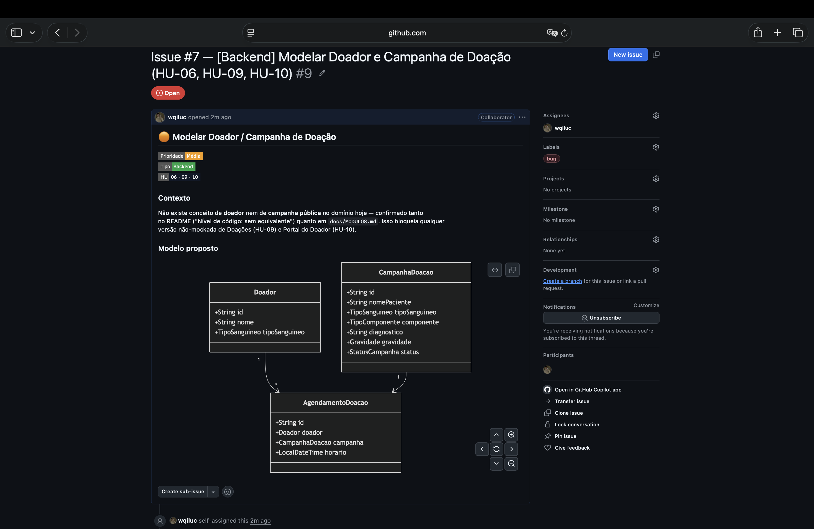 | 🟠 Issue #7 — Modelar Doador e Campanha de Doação | Diagrama de classes proposto (`Doador`, `CampanhaDoacao`, `AgendamentoDoacao`) — hoje não existe conceito de doador nem de campanha pública no domínio, o que bloqueia versões não mockadas de HU‑06, HU‑09 e HU‑10. |

<h2 align="center" id="modulos">📦 Módulos do Sistema <br>

</h2>

<p align="center">
4 módulos — Estoque, Requisições e Alocação, Roteirização e Telemetria — catalogados em detalhe, com
endpoints e classes de domínio, em <a href="./docs/MODULOS.md"><code>docs/MODULOS.md</code></a>.
</p>

<h2 align="center" id="arquitetura">🏰 Arquitetura do Projeto <br>

</h2>
<pre>
Rotavital🩸/
├── backend  /
│   ├── pom.xml 
│   └── src /
│       ├── main/java/com/rotavital /
│       │   ├── api/dto /
│       │   │   ├── comum /
│       │   │   ├── estoque /
│       │   │   ├── requisicao /
│       │   │   ├── rota /
│       │   │   └── telemetria /
│       │   └── dominio /
│       │       ├── PontoDeRede.java 
│       │       ├── Hospital.java 
│       │       ├── BancoDeSangue.java 
│       │       ├── Estoque.java 
│       │       ├── BolsaHemocomponente.java 
│       │       ├── RequisicaoHospitalar.java 
│       │       ├── Endereco.java 
│       │       └── Enums 
│       └── test/java/com/rotavital/dominio /
│           └── TesteFluxo.java 
|
├── frontend    /
│   ├── index.html 
│   ├── package.json 
│   ├── vite.config.ts 
│   ├── tailwind.config.ts 
│   ├── postcss.config.js 
│   ├── tsconfig.json 
│   └── src /
│       ├── main.tsx 
│       ├── App.tsx 
│       ├── index.css 
│       ├── vite-env.d.ts 
│       │
│       ├── routes /
│       │   └── index.tsx 
│       │
│       ├── context /
│       │   └── ContextoAutenticacao.tsx  
│       │
│       ├── components /
│       │   ├── layout /
│       │   │   ├── LayoutPrincipal.tsx 
│       │   │   └── BarraLateral.tsx 
│       │   ├── donations /
│       │   │   ├── FiltroTipoSanguineo.tsx  
│       │   │   ├── CartaoPessoa.tsx 
│       │   │   └── ModalAgendarDoacao.tsx  
│       │   └── ui /
│       │       ├── SeloTipoSanguineo.tsx 
│       │       ├── PontoStatus.tsx 
│       │       └── EmBreve.tsx 
│       │
│       ├── pages /
│       │   ├── Login/
│       │   │   └── PaginaLogin.tsx  
│       │   ├── PainelOperacional/
│       │   │   └── PaginaPainel.tsx  
│       │   ├── Estoque/
│       │   │   └── PaginaEstoque.tsx  
│       │   ├── Requisicao/
│       │   │   └── PaginaRequisicao.tsx  
│       │   ├── RedeHospitalar/
│       │   │   └── PaginaRede.tsx  
│       │   ├── Pacientes/
│       │   │   └── PaginaPacientes.tsx  
│       │   ├── Doacoes/
│       │   │   └── PaginaDoacoes.tsx  
│       │   └── PortalDoador/
│       │       └── PaginaPortalDoador.tsx  
│       │
│       ├── data /
│       │   └── pessoasMock.ts  
│       │
│       └── types /
│           └── index.ts 
│
├── docs /
│   ├── DOCUMENTACAO.md 
│   ├── MODELO_DE_DOMINIO.md 
│   ├── CONTRATOS_DE_API.md 
│   ├── MODULOS.md 
│   └── openapi.yaml 
│
├── img/ 
├── .gitignore 
├── LICENSE 
├── RotaVital.fig 
└── README.md 
</pre>

> [!NOTE]
> O backend hoje é **Java puro + Maven** (domínio + DTOs, sem framework web ainda). O contrato OpenAPI já
> cobre os 4 módulos acima; a implementação dos endpoints é a próxima etapa.
>
> O frontend implementa de fato 3 das 10 histórias da Entrega 01 — **HU‑01** (Login), **HU‑09** (Doações)
> e **HU‑10** (Portal do Doador) — com dados mockados em `src/data/pessoasMock.ts`. As demais (**HU‑02** a
> **HU‑08**) já têm rota e página criadas, mas renderizam o placeholder `EmBreve` até virarem telas reais.

<h2 align="center" id="como-executar">🚀 Como Executar <br>

</h2>

```bash
git clone https://github.com/viictorpaes/Rotavital.git
cd Rotavital/backend
mvn compile
```

**Fluxo de demonstração do domínio** (`TesteFluxo`: cria banco de sangue, popula estoque, abre requisição e
aloca por FEFO/ABO-Rh):

```bash
javac -d out $(find src/main/java src/test/java -name "*.java")
java -cp out com.rotavital.dominio.TesteFluxo
```

<h2 align="center" id="como-executar-frontend">🖥️ Como Executar o Frontend <br>


</h2>

<p align="center">
Interface em <b>React + TypeScript + Vite + Tailwind CSS</b>, com as telas já implementadas
(Login, Doações e Portal do Doador — HU‑01, HU‑09 e HU‑10) rodando com dados mockados.
</p>

```bash
cd Rotavital/frontend
npm install
npm run dev
```

> O servidor de desenvolvimento sobe em `http://localhost:5173`.

| Comando | Descrição |
| :--- | :--- |
| `npm run dev` | Inicia o servidor de desenvolvimento, com hot reload |
| `npm run build` | Roda a checagem de tipos (`tsc -b`) e gera o build de produção em `frontend/dist` |
| `npm run preview` | Serve localmente o build de produção gerado por `npm run build` |
| `npm run lint` | Roda o ESLint sobre o código do frontend |

<h4 align="center"> 🚢🐳 Com Docker (backend + frontend + Supabase) <br>
</h4>

<p align="center">
O <a href="./docker-compose.yml"><code>docker-compose.yml</code></a> na raiz do projeto sobe o backend Spring Boot
e o frontend (build de produção servido via Nginx) já conectados ao banco <b>Supabase</b>. Crie um arquivo
<code>backend/.env</code> com a variável <code>SUPABASE_DB_PASSWORD</code> antes de subir os containers.
</p>

```bash
cd Rotavital
docker compose up --build
```

> Frontend em `http://localhost:80` e backend em `http://localhost:8080`.

<h2 align="center" id="figma-vs-mockado">🖼️ Figma × Mockado <br>
 vs 
</h2>

<p align="center">
Comparação lado a lado entre o protótipo do Figma e a tela equivalente rodando de fato em
<b>React + TypeScript</b> (dados mockados), cobrindo as histórias já implementadas em código real:
HU‑01, HU‑02, HU‑03, HU‑04/05/06, HU‑07, HU‑08, HU‑09 e HU‑10.
Screenshots tiradas do app rodando em <code>localhost:5173</code>, mesma resolução do export do Figma
(1470×956 @2x).
</p>

<h4 align="left">🔐 HU‑01 — Login (seleção Médico / Doador)</h4>

| Figma | Mockado (React) |
| :---: | :---: |
| 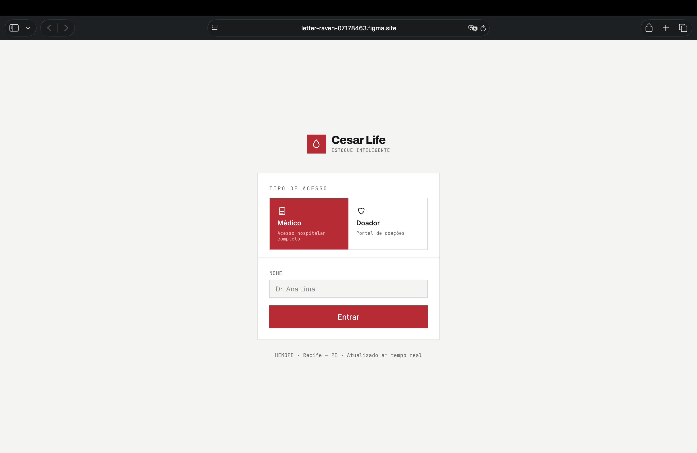 | 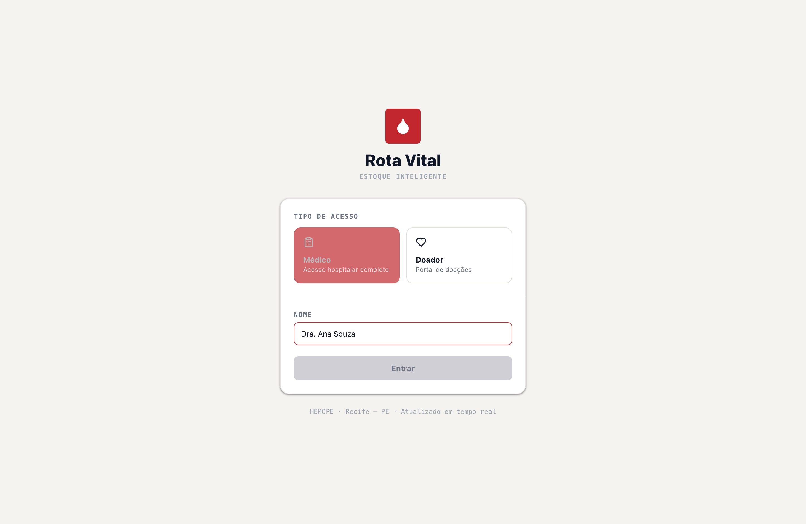 |
| 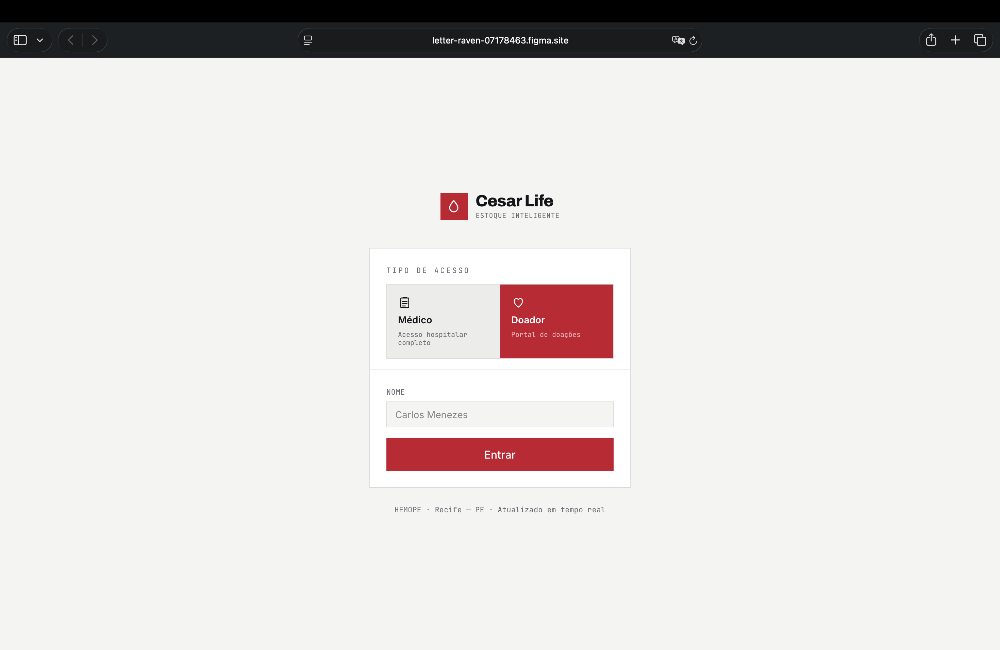 | 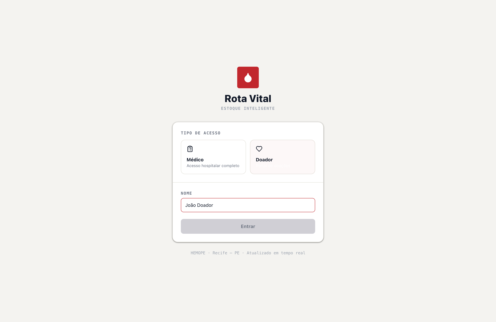 |

<details>
<summary>🩸 <a href="./frontend/src/pages/Login/PaginaLogin.tsx"><code>frontend/src/pages/Login/PaginaLogin.tsx</code></a></summary>

```tsx
export default function PaginaLogin()
{
  const [papel, setPapel] = useState<PapelUsuario | null>(null);
  const [nome, setNome] = useState("");
  const { login } = useAutenticacao();
  const navigate = useNavigate();

  const podeEntrar = papel !== null && nome.trim().length > 0;

  function handleEntrar()
  {
    if (!podeEntrar || !papel) 
    {
      return;
    }
    
    login(nome, papel);
    navigate(papel === "medico" ? "/painel" : "/portal-doador", { replace: true });
  }
  // ...
}
```
</details>

<h4 align="left">📊 HU‑02 — Painel Operacional (início)</h4>

| Figma | Mockado (React) |
| :---: | :---: |
| 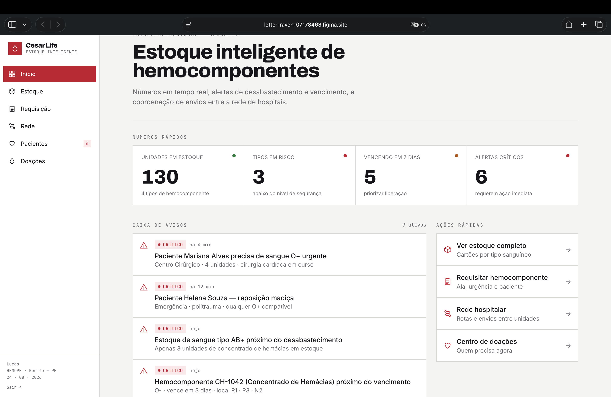 | 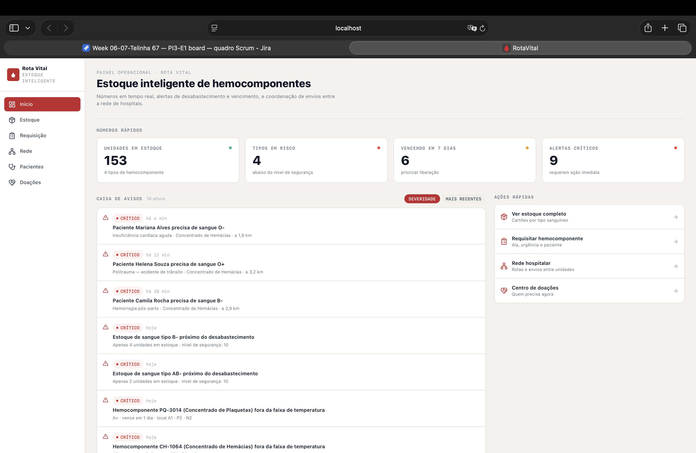 |

<details>
<summary>🩸 <a href="./frontend/src/pages/PainelOperacional/PaginaPainel.tsx"><code>frontend/src/pages/PainelOperacional/PaginaPainel.tsx</code></a></summary>

```tsx
/**
 * HU-02 — Painel operacional: números rápidos, caixa de avisos ordenável e
 * atalhos, para o médico agir sem percorrer todas as telas. Indicadores e
 * avisos derivam dos mocks de estoque e de pacientes (ver `lib/painel.ts`).
 */
export default function PaginaPainel()
{
  const { lotes, pacientes } = useDados();
  const [ordenacao, setOrdenacao] = useState<OrdenacaoAvisos>("severidade");

  const avisos = useMemo(() => montarAvisos(lotes, pacientes), [lotes, pacientes]);
  const indicadores = useMemo(() => montarIndicadores(lotes, avisos), [lotes, avisos]);
  const avisosOrdenados = useMemo(() => ordenarAvisos(avisos, ordenacao), [avisos, ordenacao]);
  // ...
}
```
</details>

<h4 align="left">📦 HU‑03 — Estoque (por tipo sanguíneo)</h4>

| Figma | Mockado (React) |
| :---: | :---: |
| 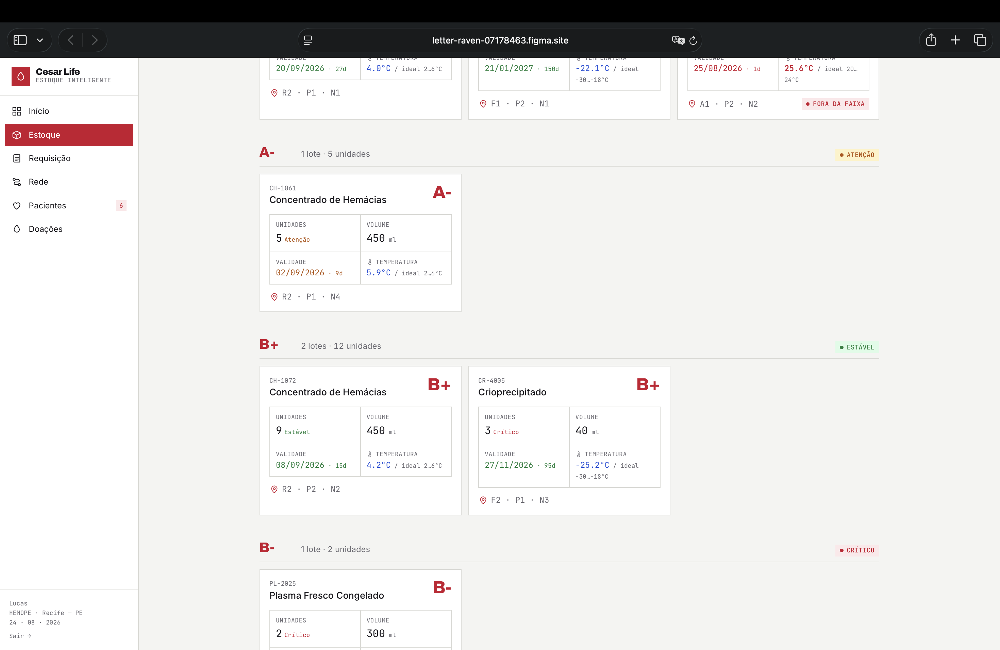 | 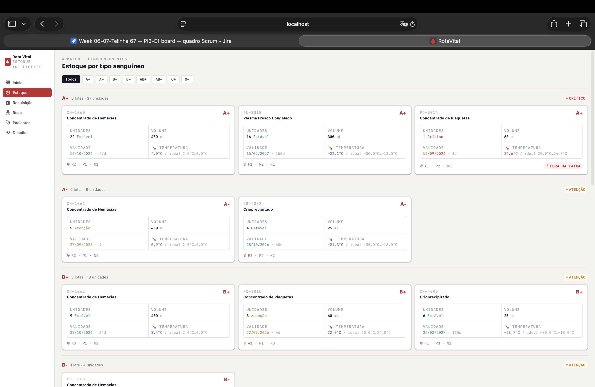 |

<details>
<summary>🩸 <a href="./frontend/src/pages/Estoque/PaginaEstoque.tsx"><code>frontend/src/pages/Estoque/PaginaEstoque.tsx</code></a></summary>

```tsx
/**
 * HU-03 — Estoque agrupado por tipo sanguíneo, com detalhe de lote (validade,
 * temperatura e localização) para identificar risco de vencimento/temperatura.
 * Dados mockados nesta primeira versão (ver `data/estoqueMock.ts`).
 */
const grupos = useMemo<GrupoEstoque[]>(() =>
{
  const tipos = filtroTipo === "todos" ? TIPOS_SANGUINEOS : [filtroTipo];

  return tipos
    .map((tipo) =>
    {
      const lotes = lotesEstoque.filter((lote) => lote.tipoSanguineo === tipo);
      return { 
        tipo, lotes, unidades: lotes.reduce((total, lote) => total + lote.unidades, 0) 
      };
    })
    .filter((grupo) => grupo.lotes.length > 0);
}, [lotesEstoque, filtroTipo]);
```
</details>

<h4 align="left">📋 HU‑04/05/06 — Requisição de hemocomponente (solicitar)</h4>

| Figma | Mockado (React) |
| :---: | :---: |
| 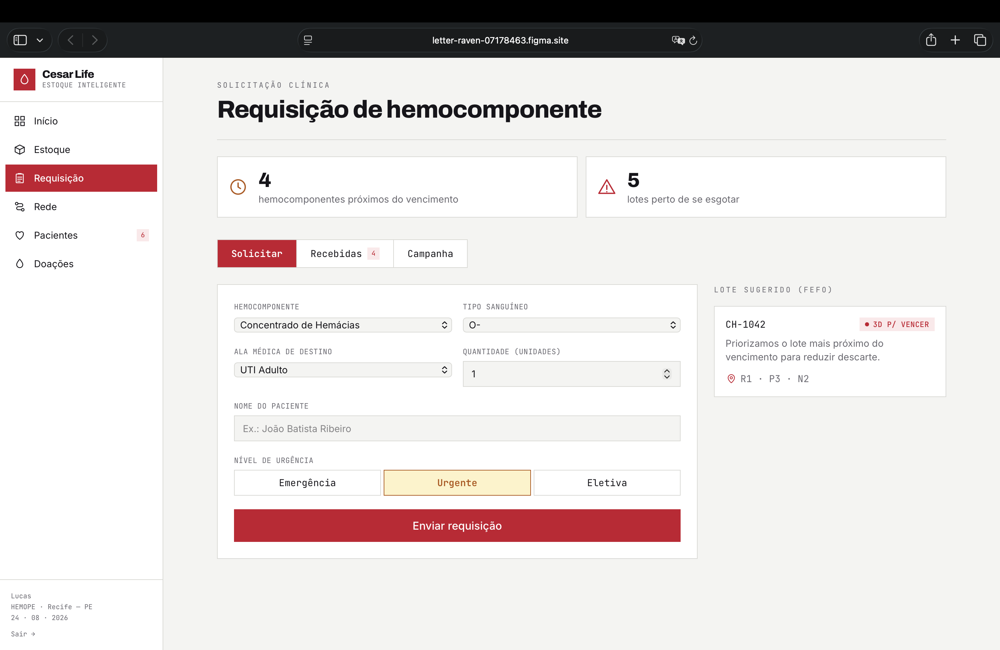 | 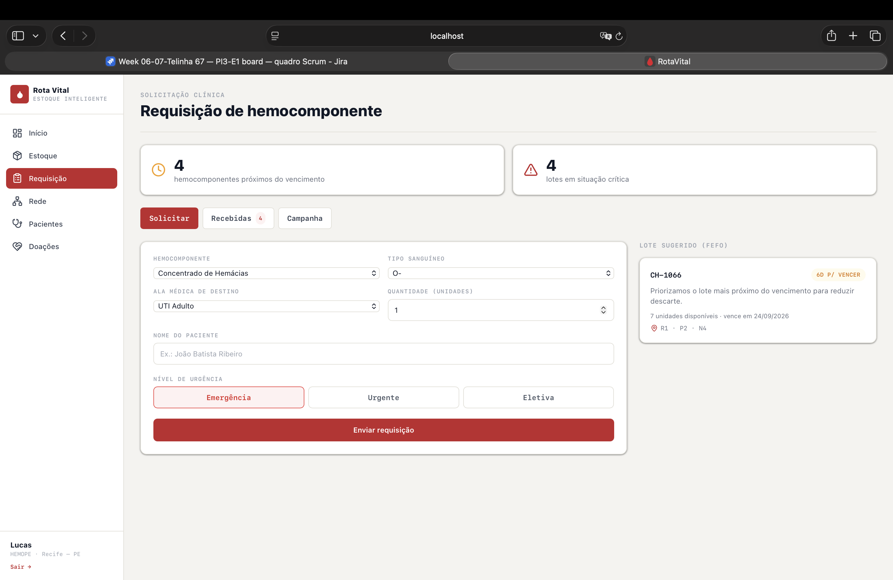 |

<h4 align="left">📋 HU‑04/05/06 — Requisição de hemocomponente (recebidas)</h4>

| Figma | Mockado (React) |
| :---: | :---: |
| 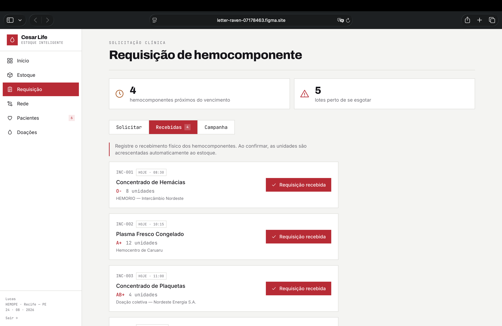 | 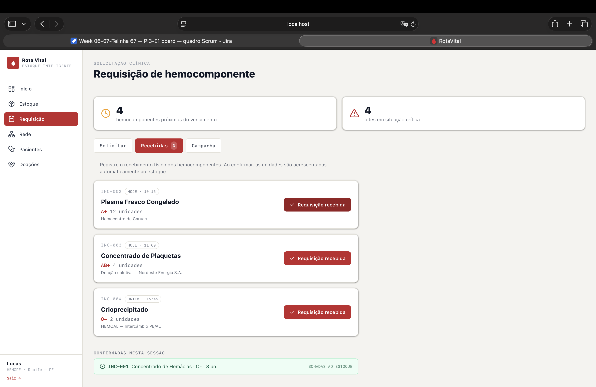 |

<details>
<summary>🩸 <a href="./frontend/src/pages/Requisicao/PaginaRequisicao.tsx"><code>frontend/src/pages/Requisicao/PaginaRequisicao.tsx</code></a></summary>

```tsx
/**
 * HU-04, HU-05 e HU-06 — Solicitação clínica em três abas: solicitar um
 * hemocomponente (com sugestão FEFO), conferir remessas recebidas e publicar
 * uma campanha de doação. Dados ainda mockados (ver `context/ContextoDados.tsx`).
 */
export default function PaginaRequisicao()
{
  const { lotes, recebimentosPendentes } = useDados();
  const [aba, setAba] = useState<Aba>("solicitar");

  const vencendo = useMemo
  (
    () => lotes.filter((lote) => diasAteVencer(lote) <= JANELA_VENCIMENTO_DIAS).length,
    [lotes],
  );
  // ...
}
```
</details>

<h4 align="left">🗺️ HU‑07 — Rede hospitalar (mapa e rota de transporte)</h4>

| Figma | Mockado (React) |
| :---: | :---: |
| 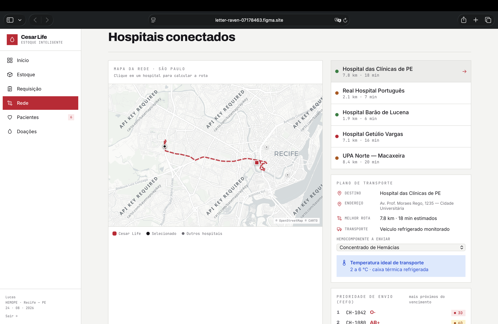 | 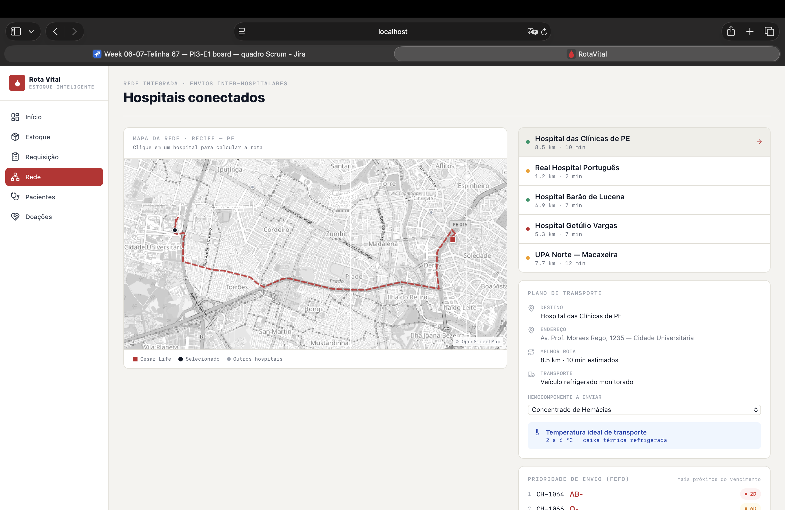 |

<details>
<summary>🩸 <a href="./frontend/src/pages/RedeHospitalar/PaginaRede.tsx"><code>frontend/src/pages/RedeHospitalar/PaginaRede.tsx</code></a></summary>

```tsx
/**
 * HU-07 — Mapa dos hospitais conectados e plano de transporte na cadeia fria.
 * Selecionar um hospital (no mapa ou na lista) recalcula a rota e o plano.
 * Dados mockados nesta primeira versão (ver `data/redeMock.ts`).
 */
export default function PaginaRede()
{
  const [selecionado, setSelecionado] = useState<PontoDeRede>(hospitais[0:]);
  const [componente, setComponente] = useState<TipoComponente>("Concentrado de Hemácias");
  const { rotas, carregando } = useRotasDaRede();
  const rota = rotas[selecionado.id];
  // ...
}
```
</details>

<h4 align="left">🏥 HU‑08 — Pacientes (fila clínica)</h4>

| Figma | Mockado (React) |
| :---: | :---: |
| 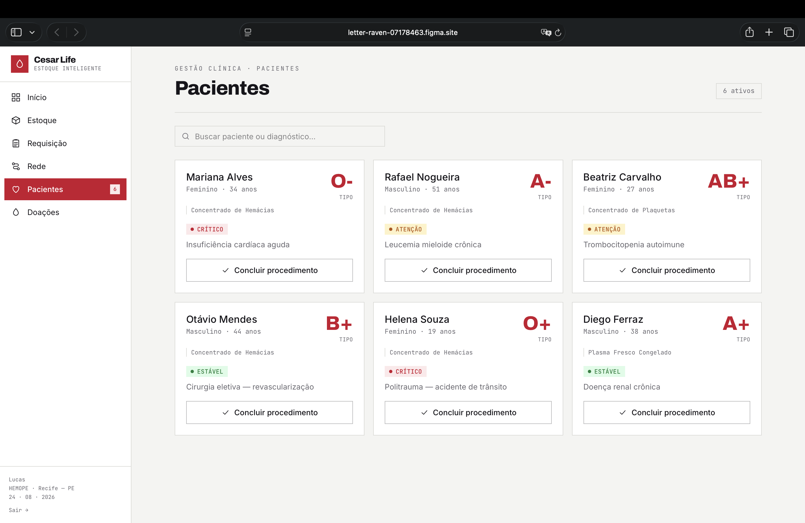 | 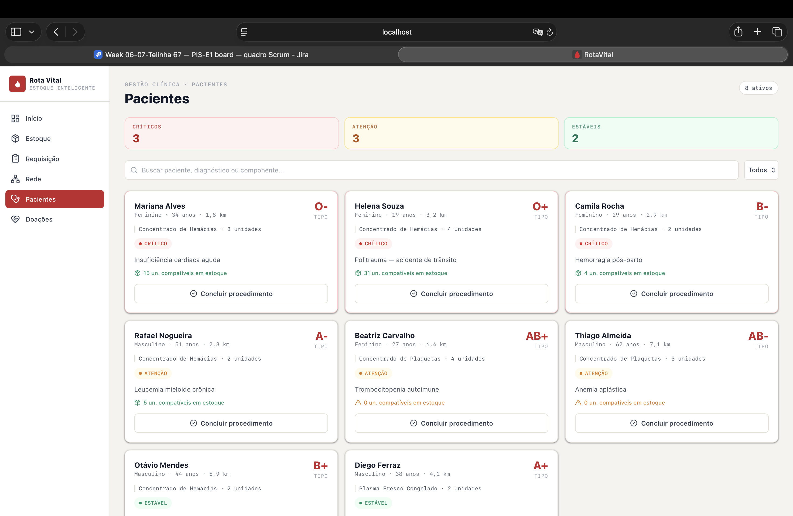 |

<h4 align="left">🏥 HU‑08 — Pacientes (concluir procedimento)</h4>

| Figma | Mockado (React) |
| :---: | :---: |
| 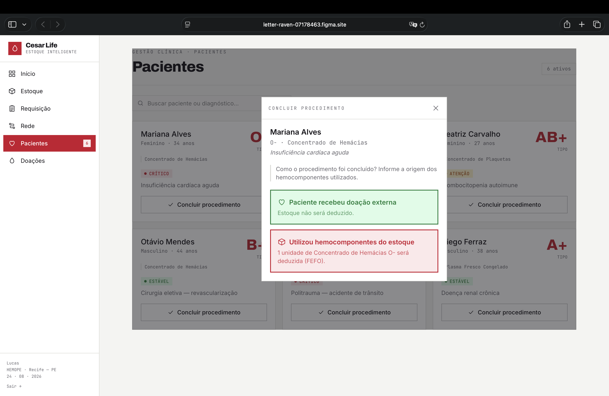 | 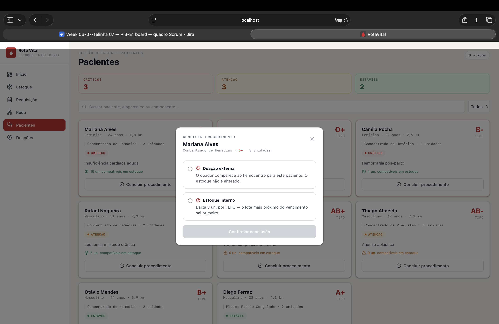 |

<details>
<summary>🩸 <a href="./frontend/src/pages/Pacientes/PaginaPacientes.tsx"><code>frontend/src/pages/Pacientes/PaginaPacientes.tsx</code></a></summary>

```tsx
/**
 * HU-08 — Fila clínica de pacientes com necessidade ativa. A conclusão do
 * procedimento tira o paciente da fila e, quando atendido pelo estoque interno,
 * baixa as unidades por FEFO.
 */
function handleConfirmar(origem: OrigemAtendimento)
{
  if (!selecionado) 
  {
    return undefined;
  }

  return concluirProcedimento(selecionado.id, origem);
}
```
</details>

<h4 align="left">❤️ HU‑09 — Doações (lista de pessoas que precisam)</h4>

| Figma | Mockado (React) |
| :---: | :---: |
| 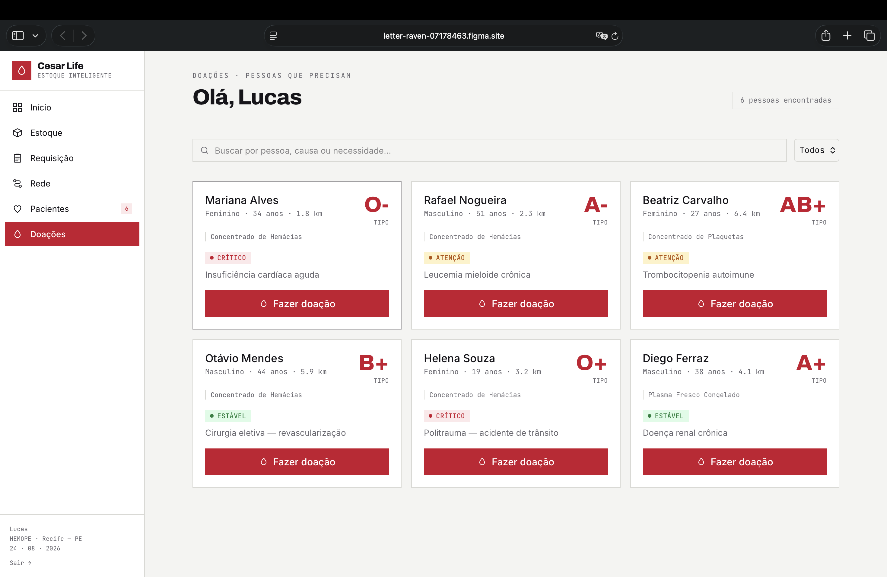 | 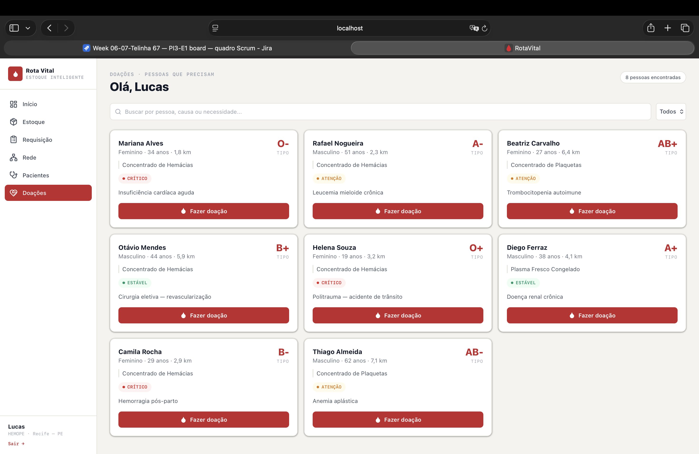 |

<details>
<summary>🩸 <a href="./frontend/src/pages/Doacoes/PaginaDoacoes.tsx"><code>frontend/src/pages/Doacoes/PaginaDoacoes.tsx</code></a></summary>

```tsx
const pessoasFiltradas = useMemo(() =>
{
  const termo = busca.trim().toLowerCase();

  return pessoasNecessitadas.filter((p) =>
  {
      const combinaTipo = filtroTipo === "todos" || p.tipoSanguineo === filtroTipo;
      const combinaBusca = 
      termo.length === 0 ||
      p.nome.toLowerCase().includes(termo) ||
      p.causa.toLowerCase().includes(termo) ||
      p.componente.toLowerCase().includes(termo);

    return combinaTipo && combinaBusca;
  });
}, [busca, filtroTipo]);
```

</details>

<h4 align="left">❤️ HU‑09 — Agende sua doação (modal)</h4>

| Figma | Mockado (React) |
| :---: | :---: |
| 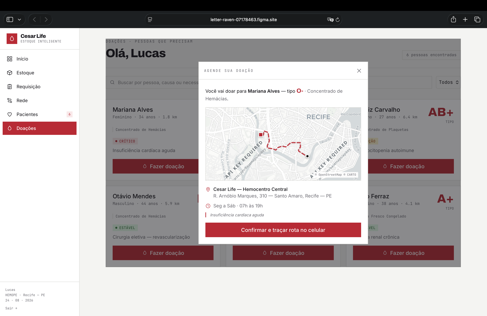 | 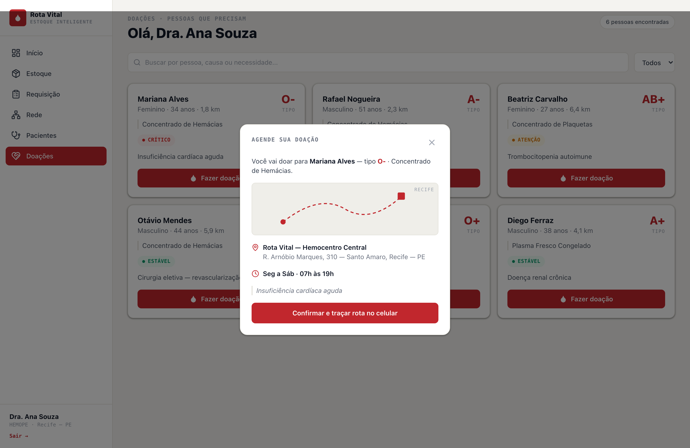 |

<details>
<summary>🩸 <a href="./frontend/src/components/donations/ModalAgendarDoacao.tsx"><code>frontend/src/components/donations/ModalAgendarDoacao.tsx</code></a></summary>

```tsx
export function ModalAgendarDoacao({ pessoa, onClose }: Readonly<Props>)
{
  const [confirmado, setConfirmado] = useState(false);
  // ...
  <button
    type="button"
    onClick={() => setConfirmado(true)}
    disabled={confirmado}
    className="w-full rounded-lg bg-rota-red px-4 py-3 text-sm font-semibold text-white transition-colors hover:bg-rota-redDark disabled:cursor-default disabled:bg-emerald-600"
  >
    {confirmado ? "Rota traçada — até logo! 👋🏻" : "Confirmar e traçar rota no celular ✅"}
  </button>
}
```
</details>

<h4 align="left">👤 HU‑10 — Portal do Doador</h4>

| Figma | Mockado (React) |
| :---: | :---: |
| 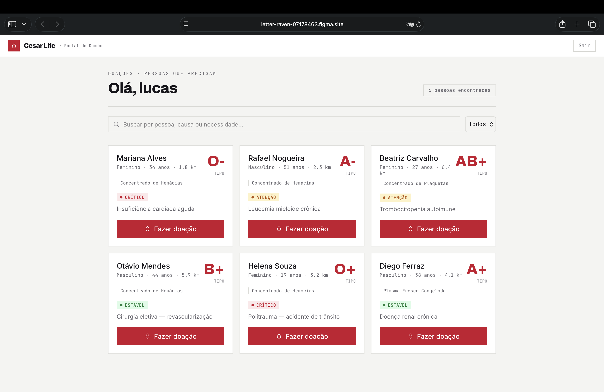 | 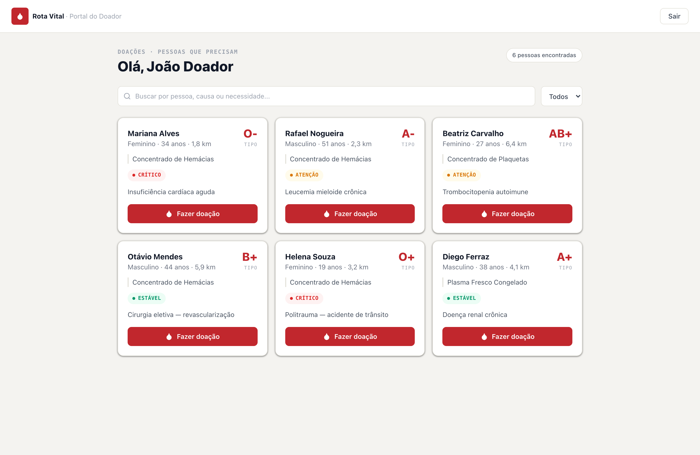 |

<details>
<summary>🩸 <a href="./frontend/src/pages/PortalDoador/PaginaPortalDoador.tsx"><code>frontend/src/pages/PortalDoador/PaginaPortalDoador.tsx</code></a></summary>

```tsx
export default function PaginaPortalDoador()
{
  const { usuario, logout } = useAutenticacao();
  // ...
  if (usuario?.papel !== "doador")
  {
    return <Navigate to="/login" replace />;
  }
  // ...
}
```
</details>


<h2 align="center" id="documentacao">📚 Documentação <br>

</h2>

<p align="center">
Índice completo dos documentos técnicos (modelo de domínio, contratos de API, OpenAPI, módulos e Figma) em
<a href="./docs/DOCUMENTACAO.md"><code>docs/DOCUMENTACAO.md</code></a>.
</p>