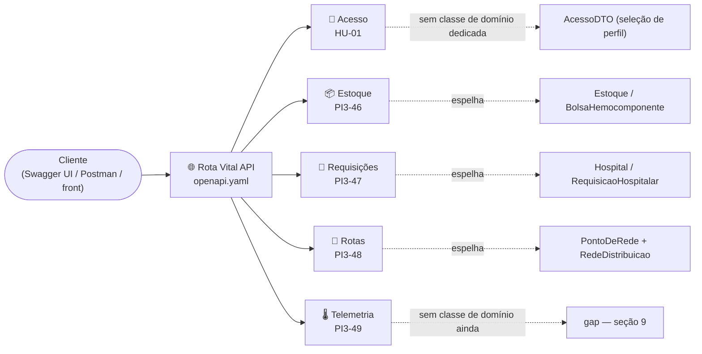
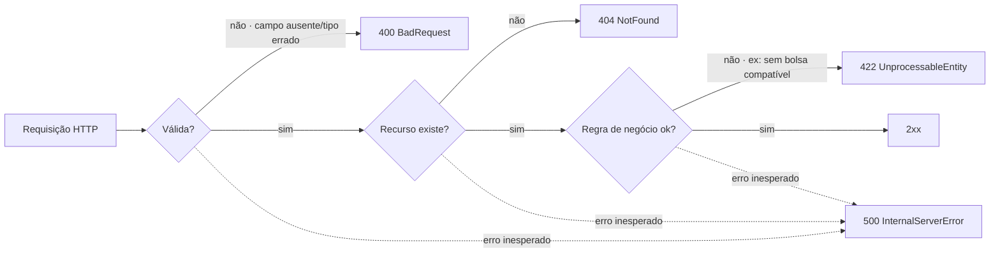
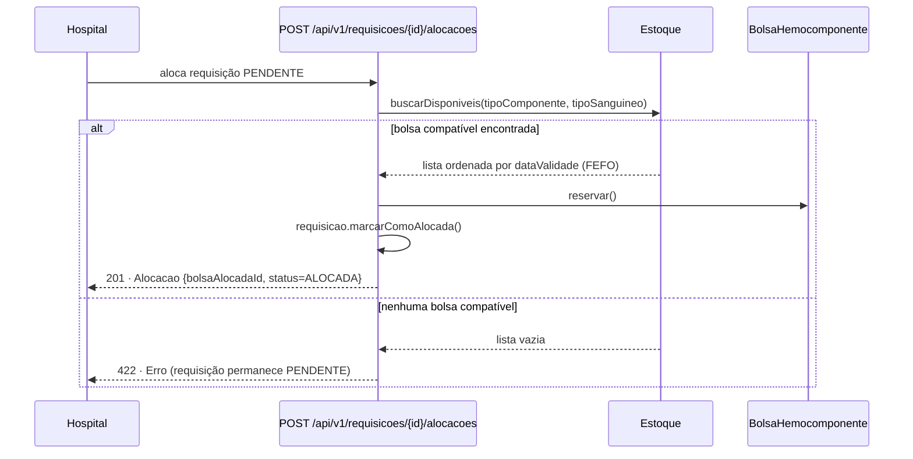

<h1 align="center">
  Rota Vital — Documentação Técnica <br> Contratos de API (RSD) <br>
  🩸🌐
</h1>

<p align="center">
    
    
    
    
    
    
</p>

>Referência: Jira **PI3-14 · W04-Contratos de API (RSD)**, subtarefas **PI3-45** a **PI3-50**. Contratos REST
>formais do sistema Rota Vital — estoque de hemocomponentes, requisições hospitalares, alocação com regras
>de compatibilidade/validade (FEFO), roteirização de entregas e telemetria da cadeia fria. Fonte da verdade,
>em OpenAPI 3.0.3: [`docs/openapi.yaml`](openapi.yaml). Para o modelo de domínio Java que este contrato
>espelha 1:1, ver [`MODELO_DE_DOMINIO.md`](MODELO_DE_DOMINIO.md). 

<h2 align="left">🧭 Sumário: </h2>

1. [Visão geral: mapa dos módulos](#1-visao-geral)
2. [Estrutura e Padrões da API (PI3-45)](#2-padroes)
    - 2.1 [Divergências REST resolvidas](#2-1-divergencias)
    - 2.2 [Autenticação e 401 × 403](#2-2-autenticacao)
    - 2.3 [Endpoints REST do MVP, por recurso](#2-3-endpoints)
    - 2.4 [Os 6 endpoints principais, em detalhe](#2-4-principais)
3. [Módulo de Acesso (HU-01)](#3-acesso)
4. [Módulo de Estoque e Hemocomponentes (PI3-46)](#4-estoque)
5. [Módulo de Requisições Hospitalares e Alocação (PI3-47)](#5-requisicoes)
6. [Módulo de Roteirização e Logística (PI3-48)](#6-rotas)
7. [Módulo de Telemetria e Cadeia Fria (PI3-49)](#7-telemetria)
8. [Validação e Documentação Interativa (PI3-50)](#8-validacao)
9. [Gaps conhecidos entre contrato e domínio](#9-gaps)
10. [Resumo final](#10-resumo)

<h2 align="left" id="1-visao-geral">🗺️ 1. Visão geral: mapa dos módulos</h2>

Cinco módulos, cada um espelhando uma fatia do [modelo de domínio](MODELO_DE_DOMINIO.md), todos por trás do mesmo tratamento de erro (RFC 7807).



| Módulo | Subtask | Recursos | Espelha no domínio | Implementado? |
|---|---|---|---|:---:|
| 🔑 Acesso | HU-01 | `/acessos` | *(nenhuma — seleção de perfil, não é entidade de domínio)* | ✅ |
| 📦 Estoque e Hemocomponentes | PI3-46 | `/bancos/{bancoId}/estoque`, `/hemocomponentes` | `Estoque`, `BolsaHemocomponente` | ⚠️ parcial (só `GET /bancos/{bancoId}/estoque`) |
| 🏥 Requisições e Alocação | PI3-47 | `/requisicoes` | `Hospital`, `RequisicaoHospitalar` | ❌ sem controller |
| 🚚 Roteirização e Logística | PI3-48 | `/pontos`, `/conexoes`, `/rotas` | `PontoDeRede`, `RedeDistribuicao`, `Conexao`, `RotaCalculada` | ✅ |
| 🌡️ Telemetria e Cadeia Fria | PI3-49 | `/entregas/{id}/leituras` | *(gap — sem classe de domínio)* | ❌ sem controller |

<h2 align="left" id="2-padroes">🧱 2. Estrutura e Padrões da API (PI3-45)</h2>

Convenções fixadas em `docs/openapi.yaml` e seguidas em todo o contrato.

| Convenção | Valor |
|---|---|
| Versão OpenAPI | `3.0.3` |
| Prefixo e versão | `/api/v1` em todos os caminhos (`/api/v1/hemocomponentes`) |
| Nomenclatura de recursos | Substantivo no plural, sem verbo na URL (`/hemocomponentes`, `/requisicoes`, `/rotas`) |
| Sub-recursos | Por hierarquia (`/bancos/{bancoId}/estoque`, `/requisicoes/{id}/alocacoes`, `/entregas/{id}/leituras`) |
| Filtros e paginação | Query string (`?tipoSanguineo=O_NEGATIVO&page=0&size=20`) |
| Nomenclatura de campos | `camelCase` (`tipoComponente`, `dataValidade`, `bancoOrigemId`) |
| Erros | RFC 7807 (`application/problem+json`), schema `Erro` |

**Schema `Erro`** (`components.schemas.Erro`):

| Campo | Tipo | Descrição |
|---|---|---|
| `type` | `string` (uri) | Tipo do problema; `about:blank` quando não há um tipo específico documentado |
| `title` | `string` | Resumo curto e legível do problema |
| `status` | `integer` | Código HTTP repetido no corpo (`400`, `404`, `422` ou `500`) |
| `detail` | `string` | Explicação específica desta ocorrência |
| `instance` | `string` (uri-reference) | Caminho do recurso que originou o erro |

Respostas reutilizáveis (`components.responses`): `BadRequest` (400), `NotFound` (404), `UnprocessableEntity`
(422) e `InternalServerError` (500, aplicado como resposta `default` em toda operação).



**DTO Java equivalente**: [`ErroDTO`](../backend/src/main/java/com/rotavital/api/dto/comum/ErroDTO.java).

<h3 align="left" id="2-1-divergencias">🔧 2.1 Divergências REST resolvidas (Etapa 2)</h3>

Antes da tabela de endpoints, o grupo decidiu **ajustar código e contrato** (em vez de documentar como
estava e assumir o desconto). Controllers, `openapi.yaml`, `nginx.conf` e o
[diagrama de contêineres](diagrama-arquitetura.drawio) foram alterados juntos, então a tabela abaixo bate com o
código em execução.

| Divergência encontrada | Antes | Depois | Regra aplicada |
|---|---|---|---|
| Sem versionamento, base inconsistente (`openapi.yaml` em `/api`, código na raiz) | `http://localhost:8080/...` | `http://localhost:8080/api/v1/...` | Versionamento no caminho |
| Recurso no singular | `POST /acesso` | `POST /api/v1/acessos` | Substantivo no plural |
| Singular e sem hierarquia | `GET /estoque/{bancoId}` | `GET /api/v1/bancos/{bancoId}/estoque` | Sub-recurso (o estoque é único por banco, por isso fica no singular) |
| Verbo na URL | `POST /requisicoes/{id}/alocar` | `POST /api/v1/requisicoes/{id}/alocacoes` → **201** | Criar a alocação vira criar um sub-recurso |
| Verbo na URL | `POST /requisicoes/{id}/cancelar` | `PATCH /api/v1/requisicoes/{id}` com `{"status":"CANCELADA"}` | Mudança de estado é uma atualização parcial |
| Verbo na URL | `POST /rotas/calcular` (corpo JSON) | `GET /api/v1/rotas?origemId=&destinoId=&janelaEntregaLimite=` | Consulta segura e idempotente, com filtros na query string |
| Nós e arestas "dentro" de rotas | `GET /rotas/pontos`, `GET /rotas/conexoes` | `GET /api/v1/pontos`, `GET /api/v1/conexoes` | Recurso próprio (um ponto não é filho de uma rota) |
| Recurso "temperatura" solto | `POST /telemetria/temperatura` + `GET /entregas/{id}/monitoramento` | `POST` e `GET /api/v1/entregas/{id}/leituras` | Hierarquia (a leitura pertence à entrega) |
| Prefixo duplicado pelo proxy | `/api/benchmark/...`: com o proxy chegava como `/api/api/...` | `/api/v1/benchmarks/auditoria-telemetria`; o Nginx repassa `/api/*` intacto | Versionamento no caminho |

<h3 align="left" id="2-2-autenticacao">🔐 2.2 Autenticação e 401 × 403</h3>

**O MVP não tem autenticação.** `POST /api/v1/acessos` só escolhe o perfil (médico ou doador) e não emite
token. Por isso **nenhum endpoint devolve 401 ou 403 hoje**, e a coluna *Status* abaixo não lista esses códigos.
A coluna *Autenticação* mostra o que vale agora e, entre parênteses, o perfil que cada rota vai exigir quando
houver token. Quando isso entrar, a regra será:

| Código | Quando | Exemplo |
|---|---|---|
| `401 Unauthorized` | Falta o token ou ele é inválido/expirado: **não sabemos quem é** | `GET /api/v1/hemocomponentes` sem cabeçalho `Authorization` |
| `403 Forbidden` | O token é válido, mas o perfil **não tem permissão** | Um DOADOR autenticado chama `POST /api/v1/requisicoes/{id}/alocacoes` |

<h3 align="left" id="2-3-endpoints">🧾 2.3 Endpoints REST do MVP, por recurso</h3>

São **19 endpoints**, mais de 15. Por isso a tabela está agrupada por recurso, e os 6 principais estão detalhados na
[seção 2.4](#2-4-principais). Caminhos relativos a `http://localhost:8080` (backend direto) ou a
`http://localhost` (via Nginx). ✅ = implementado e respondendo · 🕓 = só no contrato (a rota dá 404
até o controller existir). Toda operação também pode devolver `500` (RFC 7807), que foi omitido nas linhas.

| Método | Caminho | Descrição | Autenticação | Resposta | Status |
|---|---|---|---|---|---|
| **🔑 Acessos** | *`AcessoController`* | | | | |
| `POST` | `/api/v1/acessos` | ✅ Identifica o perfil (MÉDICO/DOADOR) e devolve tela inicial + menu. Não persiste nada, por isso 200 | Pública | `Acesso` | `200` · `400` |
| **🏦 Bancos → Estoque** | *`EstoqueController`* | | | | |
| `GET` | `/api/v1/bancos/{bancoId}/estoque?tipoSanguineo=` | ✅ Estoque consolidado de um banco de sangue | Nenhuma no MVP (alvo: médico) | `Estoque` | `200` · `404` |
| **📦 Hemocomponentes** | *`HemocomponenteController` (planejado)* | | | | |
| `GET` | `/api/v1/hemocomponentes?bancoId=&tipoComponente=&tipoSanguineo=&status=&page=0&size=20` | 🕓 Lista bolsas com filtros e paginação | Nenhuma no MVP (alvo: médico) | `BolsaHemocomponente[]` | `200` |
| `POST` | `/api/v1/hemocomponentes` | 🕓 Cadastra uma bolsa (status inicial `DISPONIVEL`) | Nenhuma no MVP (alvo: médico) | `BolsaHemocomponente` | `201` · `400` · `422` |
| `GET` | `/api/v1/hemocomponentes/{id}` | 🕓 Detalhe de uma bolsa | Nenhuma no MVP (alvo: médico) | `BolsaHemocomponente` | `200` · `404` |
| `PATCH` | `/api/v1/hemocomponentes/{id}` | 🕓 Transição de status (reservar, descartar…) | Nenhuma no MVP (alvo: médico) | `BolsaHemocomponente` | `200` · `404` · `422` |
| `DELETE` | `/api/v1/hemocomponentes/{id}` | 🕓 Remove um cadastro feito por engano | Nenhuma no MVP (alvo: médico) | *(sem corpo)* | `204` · `404` |
| **🏥 Requisições** | *`RequisicaoController` (planejado)* | | | | |
| `POST` | `/api/v1/requisicoes` | 🕓 Registra o pedido de um hospital (status `PENDENTE`) | Nenhuma no MVP (alvo: médico) | `RequisicaoHospitalar` | `201` · `400` |
| `GET` | `/api/v1/requisicoes?hospitalId=&status=&page=0&size=20` | 🕓 Lista requisições com filtros e paginação | Nenhuma no MVP (alvo: médico) | `RequisicaoHospitalar[]` | `200` |
| `GET` | `/api/v1/requisicoes/{id}` | 🕓 Detalhe de uma requisição | Nenhuma no MVP (alvo: médico) | `RequisicaoHospitalar` | `200` · `404` |
| `PATCH` | `/api/v1/requisicoes/{id}` | 🕓 Transição de status; cancelar = `{"status":"CANCELADA"}` | Nenhuma no MVP (alvo: médico) | `RequisicaoHospitalar` | `200` · `400` · `404` · `422` |
| `POST` | `/api/v1/requisicoes/{id}/alocacoes` | 🕓 Cria a alocação: matching ABO/Rh + FEFO e reserva da bolsa | Nenhuma no MVP (alvo: médico) | `Alocacao` | `201` · `404` · `422` |
| **🗺️ Pontos e Conexões (grafo)** | *`RotaController`* | | | | |
| `GET` | `/api/v1/pontos` | ✅ Nós do grafo (hemocentros + hospitais) | Nenhuma no MVP (alvo: médico) | `PontoRede[]` | `200` |
| `GET` | `/api/v1/conexoes` | ✅ Arestas do grafo (distância/tempo) | Nenhuma no MVP (alvo: médico) | `Conexao[]` | `200` |
| **🚚 Rotas** | *`RotaController`* | | | | |
| `GET` | `/api/v1/rotas?origemId=&destinoId=&janelaEntregaLimite=` | ✅ Rota de menor custo (Dijkstra) e se ela cabe na janela de entrega | Nenhuma no MVP (alvo: médico) | `RotaCalculada` | `200` · `400` · `404` · `422` |
| **🌡️ Entregas → Leituras** | *`EntregaController` (planejado)* | | | | |
| `POST` | `/api/v1/entregas/{id}/leituras` | 🕓 Registra uma leitura simulada (GPS + °C) | Nenhuma no MVP (alvo: médico) | `LeituraTelemetria` | `201` · `400` · `404` · `422` |
| `GET` | `/api/v1/entregas/{id}/leituras` | 🕓 Histórico de leituras da entrega, em ordem cronológica | Nenhuma no MVP (alvo: médico) | `MonitoramentoEntrega` | `200` · `404` |
| **📊 Benchmarks** | *`BenchmarkController`* | | | | |
| `GET` | `/api/v1/benchmarks/auditoria-telemetria?tamanho=100000&modo=TODOS` | ✅ Auditoria sequencial × paralela sobre uma massa sintética (não persiste nada) | Nenhuma (uso interno) | `BenchmarkResponse` | `200` |
| `POST` | `/api/v1/benchmarks/auditoria-telemetria` | ✅ A mesma auditoria, com os parâmetros no corpo JSON (não persiste nada, por isso 200) | Nenhuma (uso interno) | `BenchmarkResponse` | `200` |

**Coerência dos status:**
- `201` só aparece onde nasce um recurso (bolsa, requisição, alocação, leitura).
- `204` só aparece no `DELETE`.
- `200` aparece em leituras e em `POST` que não criam nada (`/acessos`, `/benchmarks`).
- `400` é para entrada malformada, `404` para recurso inexistente e `422` para regra de negócio violada.

**Evidência de execução:** [`evidencias/PI3-14_endpoints_rest.md`](evidencias/PI3-14_endpoints_rest.md) reúne as 14 chamadas reais (status esperado × obtido, com `curl` e corpo da resposta) e o resultado do lint Spectral.

**Rastreabilidade com o diagrama:** cada grupo da tabela aparece na caixa *Container: backend* do
[`diagrama-arquitetura.drawio`](diagrama-arquitetura.drawio). Os grupos ✅ estão listados pelo controller, e os 🕓 estão
na linha *PLANEJADO (só contrato)*.

<h3 align="left" id="2-4-principais">🔎 2.4 Os 6 endpoints principais, em detalhe</h3>

Os seis endpoints abaixo cobrem o fluxo central do MVP: entrar → consultar estoque → registrar o pedido →
alocar a bolsa → calcular a rota. Os exemplos usam os dados em memória (`BS-01`, `HOSP-01`). Os
marcados com ✅ foram conferidos com `curl` contra o backend.

**1. `POST /api/v1/acessos`** ✅ · Pública
```http
POST /api/v1/acessos
Content-Type: application/json

{ "nome": "Dra. Ana", "tipoAcesso": "MEDICO" }
```
| Status | Quando | Corpo |
|---|---|---|
| `200` | Perfil válido | `{"nome":"Dra. Ana","tipoAcesso":"MEDICO","telaInicial":"Painel Operacional","menu":["Início","Estoque","Requisição","Rede","Pacientes","Doações"]}` |
| `400` | `nome` vazio ou `tipoAcesso` ausente | `Erro` com `instance: /api/v1/acessos` |

**2. `GET /api/v1/bancos/{bancoId}/estoque`** ✅ · Nenhuma no MVP (alvo: médico)
```http
GET /api/v1/bancos/BS-01/estoque?tipoSanguineo=O_NEGATIVO
```
| Status | Quando | Corpo |
|---|---|---|
| `200` | Banco existe | `Estoque`: `{"bancoDeSangueId":"BS-01","totalBolsas":3,"bolsas":[…]}` |
| `404` | `bancoId` desconhecido | `Erro`: `"Nenhum banco de sangue encontrado com id XX"` |

**3. `GET /api/v1/hemocomponentes`** 🕓 · Nenhuma no MVP (alvo: médico)
```http
GET /api/v1/hemocomponentes?bancoId=BS-01&tipoSanguineo=O_POSITIVO&status=DISPONIVEL&page=0&size=20
```
| Status | Quando | Corpo |
|---|---|---|
| `200` | Sempre (lista vazia se nada bater com os filtros) | `BolsaHemocomponente[]` |

**4. `POST /api/v1/requisicoes`** 🕓 · Nenhuma no MVP (alvo: médico)
```http
POST /api/v1/requisicoes
Content-Type: application/json

{ "hospitalId": "HOSP-01", "tipoComponente": "HEMACIAS", "tipoSanguineo": "O_POSITIVO", "quantidade": 1, "urgencia": "ALTA" }
```
| Status | Quando | Corpo |
|---|---|---|
| `201` | Requisição criada com status `PENDENTE` | `RequisicaoHospitalar` |
| `400` | Campo obrigatório ausente ou `quantidade < 1` | `Erro` |

**5. `POST /api/v1/requisicoes/{id}/alocacoes`** 🕓 · Nenhuma no MVP (alvo: médico)
```http
POST /api/v1/requisicoes/9f1c1e7e-2d3a-4b1a-8a1e-000000000001/alocacoes
```
| Status | Quando | Corpo |
|---|---|---|
| `201` | Bolsa compatível (ABO/Rh) de vencimento mais próximo (FEFO) reservada; requisição passa a `ALOCADA` | `Alocacao`: `{requisicaoId, bolsaAlocadaId, dataAlocacao, status}` |
| `404` | Requisição inexistente | `Erro` |
| `422` | Nenhuma bolsa compatível; a requisição continua `PENDENTE` | `Erro`: `"Nenhuma bolsa compatível (HEMACIAS/O_POSITIVO)…"` |

**6. `GET /api/v1/rotas`** ✅ · Nenhuma no MVP (alvo: médico)
```http
GET /api/v1/rotas?origemId=BS-01&destinoId=HOSP-01&janelaEntregaLimite=2026-12-31T21:00:00
```
| Status | Quando | Corpo |
|---|---|---|
| `200` | Caminho encontrado | `{"origemId":"BS-01","destinoId":"HOSP-01","nos":["BS-01","HOSP-01"],"distanciaTotalKm":3.2,"tempoEstimadoMin":9.0,"dentroDaJanela":true}` |
| `400` | `origemId` ou `destinoId` ausente | `Erro`: `"Informe origemId e destinoId na query string"` |
| `404` | Ponto de rede inexistente | `Erro`: `"Ponto de rede não encontrado: NOPE"` |
| `422` | Os pontos existem, mas não há caminho entre eles no grafo | `Erro` |

<h2 align="left" id="3-acesso">🔑 3. Módulo de Acesso (HU-01)</h2>

Identifica o tipo de usuário (médico ou doador) e devolve a tela inicial e o menu correspondentes.
**Seleção de perfil, não autenticação** — não valida credenciais nem emite token/sessão; qualquer nome
não-vazio é aceito.

| Método | Endpoint | Descrição | Equivalente no domínio |
|---|---|---|---|
| `POST` | `/api/v1/acessos` | Recebe nome e tipo de acesso, devolve tela inicial + menu | *(nenhum — lógica só em `AcessoController`, sem classe de domínio)* |

```mermaid
flowchart LR
    R["POST /api/v1/acessos&#10;{nome, tipoAcesso}"] --> V{tipoAcesso}
    V -- MEDICO --> M["200 · Painel Operacional&#10;menu: Início, Estoque, Requisição, Rede, Pacientes, Doações"]
    V -- DOADOR --> D["200 · Portal do Doador&#10;menu: []"]
    R -. "nome vazio ou tipoAcesso ausente" .-> E["400 BadRequest"]
```



✅ **Único módulo 100% implementado e documentado nos dois lados** — `AcessoController` bate exatamente
com o contrato abaixo (testado manualmente com os dois exemplos e o caso de erro).

**DTOs Java equivalentes** (`backend/src/main/java/com/rotavital/api/dto/acesso/`):
[`AcessoDTO`](../backend/src/main/java/com/rotavital/api/dto/acesso/AcessoDTO.java) ·
[`NovoAcessoRequest`](../backend/src/main/java/com/rotavital/api/dto/acesso/NovoAcessoRequest.java) ·
[`TipoAcesso`](../backend/src/main/java/com/rotavital/api/dto/acesso/TipoAcesso.java) (enum).

<h2 align="left" id="4-estoque">📦 4. Módulo de Estoque e Hemocomponentes (PI3-46)</h2>

Endpoints CRUD/consulta para o estoque dos hemocentros, mapeando `Estoque` e `BolsaHemocomponente`.

| Método | Endpoint | Descrição | Equivalente no domínio |
|---|---|---|---|
| `GET` | `/api/v1/bancos/{bancoId}/estoque` | Estoque consolidado de um banco de sangue (filtro: `tipoSanguineo`) | `BancoDeSangue.getEstoque()` |
| `GET` | `/api/v1/hemocomponentes` | Lista bolsas (filtros: `bancoId`, `tipoComponente`, `tipoSanguineo`, `status`, `page`, `size`) | `Estoque.getBolsas()` / `buscarDisponiveis(...)` |
| `POST` | `/api/v1/hemocomponentes` | Cadastra uma nova bolsa (status inicial `DISPONIVEL`) | construtor de `BolsaHemocomponente` |
| `GET` | `/api/v1/hemocomponentes/{id}` | Detalhe de uma bolsa | — |
| `PATCH` | `/api/v1/hemocomponentes/{id}` | Transição de status (`reservar`, `descartar`, etc.) | `reservar()` / `descartar()` |
| `DELETE` | `/api/v1/hemocomponentes/{id}` | Remove o cadastro (erro de lançamento) | — |

**Schema `BolsaHemocomponente`**:

| Campo | Tipo | Observação |
|---|---|---|
| `id` | `string` | — |
| `tipoComponente` | enum | `HEMACIAS` \| `PLASMA` \| `PLAQUETAS` \| `CRIOPRECIPITADO` |
| `tipoSanguineo` | enum | `A_POSITIVO` … `O_NEGATIVO` |
| `dataColeta` / `dataValidade` | `date` | — |
| `loteSintetico` | `string` | Identifica o lote gerado para simulação — `BolsaHemocomponente.getLoteSintetico()` |
| `volumeMl` | `number` | — |
| `status` | enum | `DISPONIVEL` \| `RESERVADA` \| `EM_TRANSITO` \| `ENTREGUE` \| `DESCARTADA` |
| `bancoOrigemId` | `string` | — |

**DTOs Java equivalentes** (`backend/src/main/java/com/rotavital/api/dto/estoque/`):
[`BolsaHemocomponenteDTO`](../backend/src/main/java/com/rotavital/api/dto/estoque/BolsaHemocomponenteDTO.java) ·
[`NovaBolsaHemocomponenteRequest`](../backend/src/main/java/com/rotavital/api/dto/estoque/NovaBolsaHemocomponenteRequest.java) ·
[`AtualizarStatusBolsaRequest`](../backend/src/main/java/com/rotavital/api/dto/estoque/AtualizarStatusBolsaRequest.java) ·
[`EstoqueDTO`](../backend/src/main/java/com/rotavital/api/dto/estoque/EstoqueDTO.java).

<h2 align="left" id="5-requisicoes">🏥 5. Módulo de Requisições Hospitalares e Alocação (PI3-47)</h2>

Recepção de pedidos de hospitais e disparo do algoritmo de matching/alocação (compatibilidade ABO/Rh +
priorização FEFO).

| Método | Endpoint | Descrição | Equivalente no domínio |
|---|---|---|---|
| `POST` | `/api/v1/requisicoes` | Cria requisição (status inicial `PENDENTE`) | `Hospital.solicitar(...)` |
| `GET` | `/api/v1/requisicoes` | Lista requisições (filtros: `hospitalId`, `status`, `page`, `size`) | `Hospital.getRequisicoes()` |
| `GET` | `/api/v1/requisicoes/{id}` | Detalhe de uma requisição | — |
| `PATCH` | `/api/v1/requisicoes/{id}` | Transição de status — cancelar é enviar `{"status": "CANCELADA"}` | `RequisicaoHospitalar.cancelar()` |
| `POST` | `/api/v1/requisicoes/{id}/alocacoes` | Cria a alocação: dispara o matching FEFO/ABO-Rh e reserva a bolsa compatível de vencimento mais próximo | `Estoque.buscarDisponiveis(...)` + `BolsaHemocomponente.reservar()` + `RequisicaoHospitalar.marcarComoAlocada()` |



Quando `POST /api/v1/requisicoes/{id}/alocacoes` não encontra bolsa compatível, a resposta é **422** (regra de negócio, não
erro de cliente) e a requisição permanece `PENDENTE` — o mesmo comportamento demonstrado em
[`TesteFluxo.main`](../backend/src/test/java/com/rotavital/dominio/TesteFluxo.java).

**Schema `RequisicaoHospitalar`**: `id`, `hospitalId`, `tipoComponente`, `tipoSanguineo`, `quantidade`,
`urgencia` (**ver gap** — [seção 9](#9-gaps)), `dataSolicitacao`, `status`
(`PENDENTE`/`ALOCADA`/`EM_TRANSITO`/`ENTREGUE`/`CANCELADA`).

**DTOs Java equivalentes** (`backend/src/main/java/com/rotavital/api/dto/requisicao/`):
[`RequisicaoHospitalarDTO`](../backend/src/main/java/com/rotavital/api/dto/requisicao/RequisicaoHospitalarDTO.java) ·
[`NovaRequisicaoRequest`](../backend/src/main/java/com/rotavital/api/dto/requisicao/NovaRequisicaoRequest.java) ·
[`AlocacaoDTO`](../backend/src/main/java/com/rotavital/api/dto/requisicao/AlocacaoDTO.java) ·
[`NivelUrgencia`](../backend/src/main/java/com/rotavital/api/dto/requisicao/NivelUrgencia.java) (enum).

<h2 align="left" id="6-rotas">🚚 6. Módulo de Roteirização e Logística (PI3-48)</h2>

Consulta do grafo de distribuição e cálculo de rota mínima com janela de tempo (algoritmos de AED).

| Método | Endpoint | Descrição | Equivalente no domínio |
|---|---|---|---|
| `GET` | `/api/v1/pontos` | Lista os nós do grafo (hospitais + bancos de sangue) | implementações de `PontoDeRede` |
| `GET` | `/api/v1/conexoes` | Lista as arestas do grafo (distância/tempo entre nós) | — (**ver gap** — [seção 9](#9-gaps)) |
| `GET` | `/api/v1/rotas?origemId=&destinoId=&janelaEntregaLimite=` | Calcula a rota de menor custo entre origem e destino, avaliando a janela de entrega (consulta idempotente, por isso `GET`) | algoritmo de menor caminho sobre o grafo |

**Schema `PontoRede`**: `id`, `nome`, `tipo` (`HOSPITAL`/`BANCO_DE_SANGUE`), `latitude`, `longitude` —
corresponde à interface `PontoDeRede`, implementada por `Hospital` e `BancoDeSangue` **sem relação de
herança entre si** (só o contrato em comum — ver [`MODELO_DE_DOMINIO.md`](MODELO_DE_DOMINIO.md#1-visao-geral)).

> ✅ **Implementado.** O grafo de distribuição existe no domínio —
> [`RedeDistribuicao`](MODELO_DE_DOMINIO.md#10-rededistribuicao) guarda nós (`PontoDeRede`) e arestas
> (`Conexao`) e calcula o menor caminho com Dijkstra, devolvendo `RotaCalculada`. Os três endpoints abaixo
> rodam via `RotaController`, sobre uma `RedeDistribuicao` populada em memória por
> `RedeDistribuicaoEmMemoria` (hemocentro `BS-01` + 6 hospitais, topologia em estrela — dados sintéticos,
> mesma convenção de `BancosEmMemoria`).

**DTOs Java equivalentes** (`backend/src/main/java/com/rotavital/api/dto/rota/`):
[`PontoRedeDTO`](../backend/src/main/java/com/rotavital/api/dto/rota/PontoRedeDTO.java) ·
[`ConexaoDTO`](../backend/src/main/java/com/rotavital/api/dto/rota/ConexaoDTO.java) ·
[`RotaCalculadaDTO`](../backend/src/main/java/com/rotavital/api/dto/rota/RotaCalculadaDTO.java) ·
[`TipoPontoRede`](../backend/src/main/java/com/rotavital/api/dto/rota/TipoPontoRede.java) (enum).

<h2 align="left" id="7-telemetria">🌡️ 7. Módulo de Telemetria e Cadeia Fria (PI3-49)</h2>

Recepção e consulta de telemetria simulada (dados sintéticos) de veículos/maletas em trânsito.

| Método | Endpoint | Descrição |
|---|---|---|
| `POST` | `/api/v1/entregas/{id}/leituras` | Registra uma leitura simulada (timestamp, coordenadas GPS, temperatura em °C) de uma entrega |
| `GET` | `/api/v1/entregas/{id}/leituras` | Retorna o histórico de leituras de uma entrega, em ordem cronológica |

**Schema `LeituraTelemetria`**: `entregaId` (no `POST`, vem do caminho), `timestamp`, `latitude`, `longitude`, `temperaturaCelsius`.

**DTOs Java equivalentes** (`backend/src/main/java/com/rotavital/api/dto/telemetria/`):
[`RegistrarTelemetriaRequest`](../backend/src/main/java/com/rotavital/api/dto/telemetria/RegistrarTelemetriaRequest.java) ·
[`LeituraTelemetriaDTO`](../backend/src/main/java/com/rotavital/api/dto/telemetria/LeituraTelemetriaDTO.java) ·
[`MonitoramentoEntregaDTO`](../backend/src/main/java/com/rotavital/api/dto/telemetria/MonitoramentoEntregaDTO.java).

<h2 align="left" id="8-validacao">✅ 8. Validação e Documentação Interativa (PI3-50)</h2>

**Lint do arquivo (Spectral)** — `docs/openapi.yaml` validado com
[Spectral](https://github.com/stoplightio/spectral), ruleset padrão `spectral:oas`:

```bash
npx --yes @stoplight/spectral-cli lint docs/openapi.yaml --ruleset <(echo "extends: spectral:oas")
```

| Severidade | Resultado |
|---|---|
| `error` | **0** |
| `warn` | **0** |

**Importar no Swagger UI / Postman / Insomnia**:

```bash
docker run -p 8081:8080 -e SWAGGER_JSON=/spec/openapi.yaml \
  -v "$(pwd)/docs:/spec" swaggerapi/swagger-ui
```

Acesse `http://localhost:8081`. No **Postman**/**Insomnia**: `Importar → File → docs/openapi.yaml`. Os
`examples` definidos em cada operação (baseados nos dados de
[`TesteFluxo.java`](../backend/src/test/java/com/rotavital/dominio/TesteFluxo.java): `BS-01`/`Hemope
Central`, `BOLSA-001`, `HOSP-01`/`Hospital das Clínicas`) já populam os mocks de contrato para teste manual
sem backend.

> ✅ **Testando contra o backend de verdade (não os mocks do contrato):** suba o backend
> (`cd backend && mvn spring-boot:run`, porta `8080`) e use o server **"Backend Spring Boot direto"**
> (`http://localhost:8080/api/v1`) na coleção importada. Só `POST /acessos`, `GET /bancos/{bancoId}/estoque`,
> `GET /pontos`, `GET /conexoes`, `GET /rotas` e `/benchmarks/auditoria-telemetria` respondem de verdade — os
> demais (`/hemocomponentes`, `/requisicoes`, `/entregas`) dão **404**, pois ainda não têm controller (ver
> [seção 1](#1-visao-geral)).

<h2 align="left" id="9-gaps">🕳️ 9. Gaps conhecidos entre contrato e domínio</h2>

Documentados aqui em vez de alterados silenciosamente no domínio, já que o escopo desta task é o contrato de
API, não a evolução do modelo POO (ver [`MODELO_DE_DOMINIO.md`](MODELO_DE_DOMINIO.md#15-onde-o-contrato-diverge)).

| Gap | Onde aparece no contrato | Por quê existe | O que falta |
|---|---|---|---|
| `urgencia` (`NivelUrgencia`) | `NovaRequisicaoRequest`, `RequisicaoHospitalarDTO` | PI3-47 pede payload "com prioridade da requisição (urgência, tipo de componente, quantidade)" | `RequisicaoHospitalar` não tem esse campo — construtor precisaria recebê-lo |
| Telemetria (módulo inteiro) | `RegistrarTelemetriaRequest`, `LeituraTelemetria`, `MonitoramentoEntrega` | Modelado só a partir da descrição da PI3-49 | Não existe nenhuma classe de domínio para telemetria/entrega, nem controller |

<h2 align="left" id="10-resumo">📌 10. Resumo final</h2>

```
┌──────────────────────────────────────────────────────────────────┐
│  CONTRATOS DE API (RSD) — ROTA VITAL                              │
├──────────────────────────────────────────────────────────────────┤
│  🌐 openapi.yaml   → OpenAPI 3.0.3, fonte da verdade               │
│  🔑 acessos        → POST /api/v1/acessos → perfil médico/doador ✅│
│  🧱 padrões        → /api/v1 + plural + sem verbo + RFC 7807       │
│  📦 estoque        → GET/POST/PATCH/DELETE /hemocomponentes        │
│  🏥 requisições    → POST /requisicoes/{id}/alocacoes → FEFO+ABO/Rh│
│  🚚 rotas          → GET /pontos, /conexoes, /rotas → Dijkstra ✅   │
│  🌡️ telemetria     → cadeia fria simulada (dados sintéticos)       │
│  ✅ validação      → Spectral: 0 erros · 0 warnings                │
│  🕳️ 2 gaps         → documentados, não escondidos no domínio       │
└──────────────────────────────────────────────────────────────────┘
```

> 🎓 **Conclusão:** os cinco módulos cobrem o ciclo completo do Rota Vital — da seleção de perfil até a
> telemetria da entrega — sobre uma base comum de erro padronizado (RFC 7807) e nomenclatura consistente.
> Onde o contrato antecipa algo que o domínio Java ainda não tem, isso fica documentado como gap explícito
> em vez de vazar silenciosamente para as classes de `com.rotavital.dominio`. Hoje, na prática, `POST
> /api/v1/acessos`, `GET /api/v1/bancos/{bancoId}/estoque` e os três endpoints de rede/rotas
> (`AcessoController`, `EstoqueController`, `RotaController`) estão
> implementados dentro deste contrato — os endpoints de requisições e telemetria (seções 5 e 7) ainda
> descrevem só o desenho aprovado (PI3-14), não código em produção
> .
