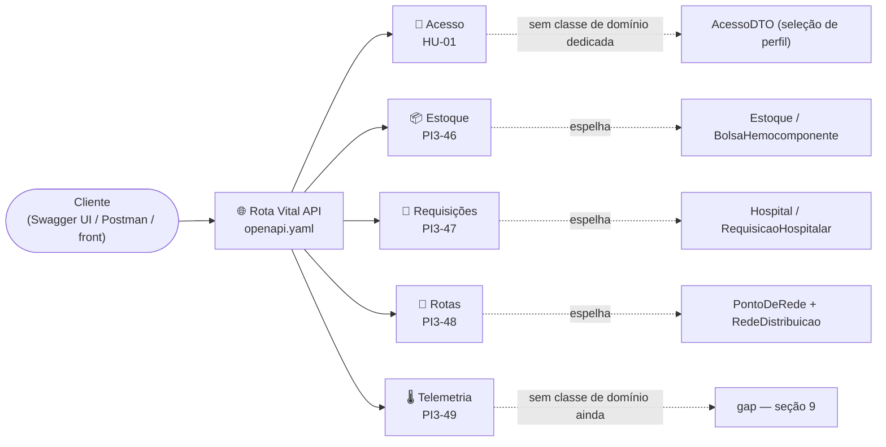
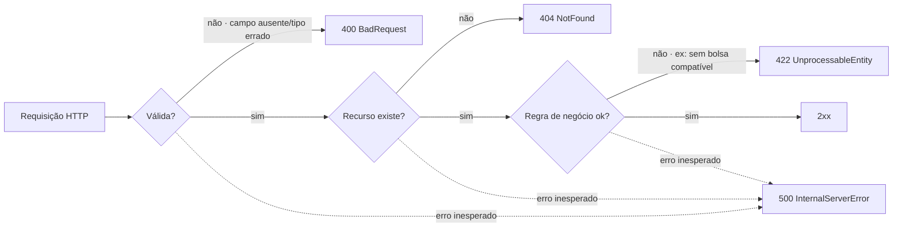
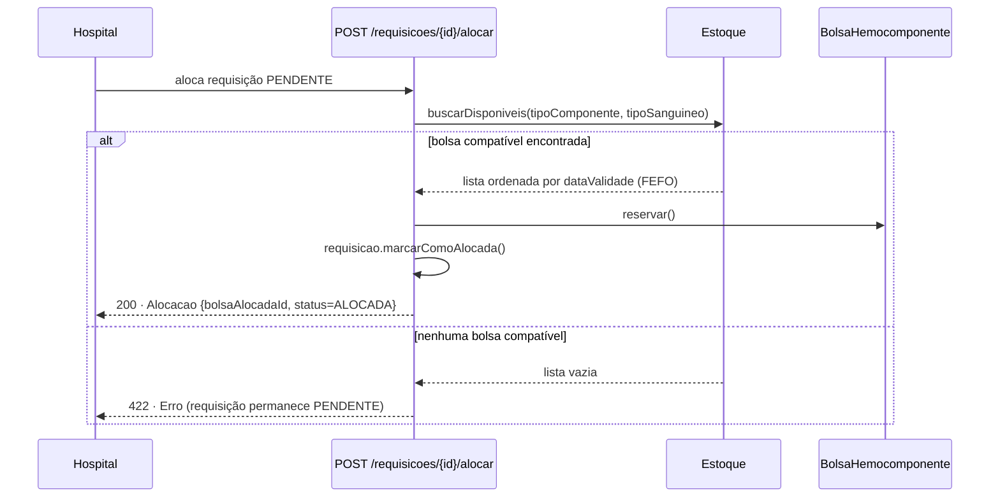

<h1 align="center">
  Rota Vital — Documentação Técnica <br> Contratos de API (RSD) <br>
  🩸🌐
</h1>

<p align="center">
    
    
    
    
    
    
</p>

>Referência: Jira **PI3-14 · W04-Contratos de API (RSD)**, subtarefas **PI3-45** a **PI3-50**. Contratos REST
>formais do sistema Rota Vital — estoque de hemocomponentes, requisições hospitalares, alocação com regras
>de compatibilidade/validade (FEFO), roteirização de entregas e telemetria da cadeia fria. Fonte da verdade,
>em OpenAPI 3.0.3: [`docs/openapi.yaml`](openapi.yaml). Para o modelo de domínio Java que este contrato
>espelha 1:1, ver [`MODELO_DE_DOMINIO.md`](MODELO_DE_DOMINIO.md). 

<h2 align="left">🧭 Sumário: </h2>

1. [Visão geral: mapa dos módulos](#1-visao-geral)
2. [Estrutura e Padrões da API (PI3-45)](#2-padroes)
3. [Módulo de Acesso (HU-01)](#3-acesso)
4. [Módulo de Estoque e Hemocomponentes (PI3-46)](#4-estoque)
5. [Módulo de Requisições Hospitalares e Alocação (PI3-47)](#5-requisicoes)
6. [Módulo de Roteirização e Logística (PI3-48)](#6-rotas)
7. [Módulo de Telemetria e Cadeia Fria (PI3-49)](#7-telemetria)
8. [Validação e Documentação Interativa (PI3-50)](#8-validacao)
9. [Gaps conhecidos entre contrato e domínio](#9-gaps)
10. [Resumo final](#10-resumo)

<h2 align="left" id="1-visao-geral">🗺️ 1. Visão geral: mapa dos módulos</h2>

Cinco módulos, cada um espelhando uma fatia do [modelo de domínio](MODELO_DE_DOMINIO.md), todos por trás do mesmo tratamento de erro (RFC 7807).



| Módulo | Subtask | Recursos | Espelha no domínio | Implementado? |
|---|---|---|---|:---:|
| 🔑 Acesso | HU-01 | `/acesso` | *(nenhuma — seleção de perfil, não é entidade de domínio)* | ✅ |
| 📦 Estoque e Hemocomponentes | PI3-46 | `/estoque`, `/hemocomponentes` | `Estoque`, `BolsaHemocomponente` | ⚠️ parcial (só `GET /estoque/{bancoId}`) |
| 🏥 Requisições e Alocação | PI3-47 | `/requisicoes` | `Hospital`, `RequisicaoHospitalar` | ❌ sem controller |
| 🚚 Roteirização e Logística | PI3-48 | `/rotas` | `PontoDeRede`, `RedeDistribuicao`, `Conexao`, `RotaCalculada` | ✅ |
| 🌡️ Telemetria e Cadeia Fria | PI3-49 | `/telemetria`, `/entregas` | *(gap — sem classe de domínio)* | ❌ sem controller |

<h2 align="left" id="2-padroes">🧱 2. Estrutura e Padrões da API (PI3-45)</h2>

Convenções fixadas em `docs/openapi.yaml` e seguidas em todo o contrato.

| Convenção | Valor |
|---|---|
| Versão OpenAPI | `3.0.3` |
| Nomenclatura de recursos | Plural (`/hemocomponentes`, `/requisicoes`, `/rotas`) |
| Nomenclatura de campos | `camelCase` (`tipoComponente`, `dataValidade`, `bancoOrigemId`) |
| Erros | RFC 7807 (`application/problem+json`), schema `Erro` |

**Schema `Erro`** (`components.schemas.Erro`):

| Campo | Tipo | Descrição |
|---|---|---|
| `type` | `string` (uri) | Tipo do problema; `about:blank` quando não há um tipo específico documentado |
| `title` | `string` | Resumo curto e legível do problema |
| `status` | `integer` | Código HTTP repetido no corpo (`400`, `404`, `422` ou `500`) |
| `detail` | `string` | Explicação específica desta ocorrência |
| `instance` | `string` (uri-reference) | Caminho do recurso que originou o erro |

Respostas reutilizáveis (`components.responses`): `BadRequest` (400), `NotFound` (404), `UnprocessableEntity`
(422) e `InternalServerError` (500, aplicado como resposta `default` em toda operação).



**DTO Java equivalente**: [`ErroDTO`](../backend/src/main/java/com/rotavital/api/dto/comum/ErroDTO.java).

<h2 align="left" id="3-acesso">🔑 3. Módulo de Acesso (HU-01)</h2>

Identifica o tipo de usuário (médico ou doador) e devolve a tela inicial e o menu correspondentes.
**Seleção de perfil, não autenticação** — não valida credenciais nem emite token/sessão; qualquer nome
não-vazio é aceito.

| Método | Endpoint | Descrição | Equivalente no domínio |
|---|---|---|---|
| `POST` | `/acesso` | Recebe nome e tipo de acesso, devolve tela inicial + menu | *(nenhum — lógica só em `AcessoController`, sem classe de domínio)* |


✅ **Único módulo 100% implementado e documentado nos dois lados** — `AcessoController` bate exatamente
com o contrato abaixo (testado manualmente com os dois exemplos e o caso de erro).

**DTOs Java equivalentes** (`backend/src/main/java/com/rotavital/api/dto/acesso/`):
[`AcessoDTO`](../backend/src/main/java/com/rotavital/api/dto/acesso/AcessoDTO.java) ·
[`NovoAcessoRequest`](../backend/src/main/java/com/rotavital/api/dto/acesso/NovoAcessoRequest.java) ·
[`TipoAcesso`](../backend/src/main/java/com/rotavital/api/dto/acesso/TipoAcesso.java) (enum).

<h2 align="left" id="4-estoque">📦 4. Módulo de Estoque e Hemocomponentes (PI3-46)</h2>

Endpoints CRUD/consulta para o estoque dos hemocentros, mapeando `Estoque` e `BolsaHemocomponente`.

| Método | Endpoint | Descrição | Equivalente no domínio |
|---|---|---|---|
| `GET` | `/estoque/{bancoId}` | Estoque consolidado de um banco de sangue | `BancoDeSangue.getEstoque()` |
| `GET` | `/hemocomponentes` | Lista bolsas (filtros: `bancoId`, `tipoComponente`, `tipoSanguineo`, `status`) | `Estoque.getBolsas()` / `buscarDisponiveis(...)` |
| `POST` | `/hemocomponentes` | Cadastra uma nova bolsa (status inicial `DISPONIVEL`) | construtor de `BolsaHemocomponente` |
| `GET` | `/hemocomponentes/{id}` | Detalhe de uma bolsa | — |
| `PATCH` | `/hemocomponentes/{id}` | Transição de status (`reservar`, `descartar`, etc.) | `reservar()` / `descartar()` |
| `DELETE` | `/hemocomponentes/{id}` | Remove o cadastro (erro de lançamento) | — |

**Schema `BolsaHemocomponente`**:

| Campo | Tipo | Observação |
|---|---|---|
| `id` | `string` | — |
| `tipoComponente` | enum | `HEMACIAS` \| `PLASMA` \| `PLAQUETAS` \| `CRIOPRECIPITADO` |
| `tipoSanguineo` | enum | `A_POSITIVO` … `O_NEGATIVO` |
| `dataColeta` / `dataValidade` | `date` | — |
| `loteSintetico` | `string` | Identifica o lote gerado para simulação — `BolsaHemocomponente.getLoteSintetico()` |
| `volumeMl` | `number` | — |
| `status` | enum | `DISPONIVEL` \| `RESERVADA` \| `EM_TRANSITO` \| `ENTREGUE` \| `DESCARTADA` |
| `bancoOrigemId` | `string` | — |

**DTOs Java equivalentes** (`backend/src/main/java/com/rotavital/api/dto/estoque/`):
[`BolsaHemocomponenteDTO`](../backend/src/main/java/com/rotavital/api/dto/estoque/BolsaHemocomponenteDTO.java) ·
[`NovaBolsaHemocomponenteRequest`](../backend/src/main/java/com/rotavital/api/dto/estoque/NovaBolsaHemocomponenteRequest.java) ·
[`AtualizarStatusBolsaRequest`](../backend/src/main/java/com/rotavital/api/dto/estoque/AtualizarStatusBolsaRequest.java) ·
[`EstoqueDTO`](../backend/src/main/java/com/rotavital/api/dto/estoque/EstoqueDTO.java).

<h2 align="left" id="5-requisicoes">🏥 5. Módulo de Requisições Hospitalares e Alocação (PI3-47)</h2>

Recepção de pedidos de hospitais e disparo do algoritmo de matching/alocação (compatibilidade ABO/Rh +
priorização FEFO).

| Método | Endpoint | Descrição | Equivalente no domínio |
|---|---|---|---|
| `POST` | `/requisicoes` | Cria requisição (status inicial `PENDENTE`) | `Hospital.solicitar(...)` |
| `GET` | `/requisicoes` | Lista requisições (filtros: `hospitalId`, `status`) | `Hospital.getRequisicoes()` |
| `GET` | `/requisicoes/{id}` | Detalhe de uma requisição | — |
| `POST` | `/requisicoes/{id}/alocar` | Dispara o matching FEFO/ABO-Rh; reserva a bolsa compatível de vencimento mais próximo | `Estoque.buscarDisponiveis(...)` + `BolsaHemocomponente.reservar()` + `RequisicaoHospitalar.marcarComoAlocada()` |
| `POST` | `/requisicoes/{id}/cancelar` | Cancela a requisição | `RequisicaoHospitalar.cancelar()` |



Quando `/requisicoes/{id}/alocar` não encontra bolsa compatível, a resposta é **422** (regra de negócio, não
erro de cliente) e a requisição permanece `PENDENTE` — o mesmo comportamento demonstrado em
[`TesteFluxo.main`](../backend/src/test/java/com/rotavital/dominio/TesteFluxo.java).

**Schema `RequisicaoHospitalar`**: `id`, `hospitalId`, `tipoComponente`, `tipoSanguineo`, `quantidade`,
`urgencia` (**ver gap** — [seção 9](#9-gaps)), `dataSolicitacao`, `status`
(`PENDENTE`/`ALOCADA`/`EM_TRANSITO`/`ENTREGUE`/`CANCELADA`).

**DTOs Java equivalentes** (`backend/src/main/java/com/rotavital/api/dto/requisicao/`):
[`RequisicaoHospitalarDTO`](../backend/src/main/java/com/rotavital/api/dto/requisicao/RequisicaoHospitalarDTO.java) ·
[`NovaRequisicaoRequest`](../backend/src/main/java/com/rotavital/api/dto/requisicao/NovaRequisicaoRequest.java) ·
[`AlocacaoDTO`](../backend/src/main/java/com/rotavital/api/dto/requisicao/AlocacaoDTO.java) ·
[`NivelUrgencia`](../backend/src/main/java/com/rotavital/api/dto/requisicao/NivelUrgencia.java) (enum).

<h2 align="left" id="6-rotas">🚚 6. Módulo de Roteirização e Logística (PI3-48)</h2>

Consulta do grafo de distribuição e cálculo de rota mínima com janela de tempo (algoritmos de AED).

| Método | Endpoint | Descrição | Equivalente no domínio |
|---|---|---|---|
| `GET` | `/rotas/pontos` | Lista os nós do grafo (hospitais + bancos de sangue) | implementações de `PontoDeRede` |
| `GET` | `/rotas/conexoes` | Lista as arestas do grafo (distância/tempo entre nós) | — (**ver gap** — [seção 9](#9-gaps)) |
| `POST` | `/rotas/calcular` | Calcula a rota de menor custo entre origem e destino, avaliando a janela de entrega | algoritmo de menor caminho sobre o grafo |

**Schema `PontoRede`**: `id`, `nome`, `tipo` (`HOSPITAL`/`BANCO_DE_SANGUE`), `latitude`, `longitude` —
corresponde à interface `PontoDeRede`, implementada por `Hospital` e `BancoDeSangue` **sem relação de
herança entre si** (só o contrato em comum — ver [`MODELO_DE_DOMINIO.md`](MODELO_DE_DOMINIO.md#1-visao-geral)).

> ✅ **Implementado.** O grafo de distribuição existe no domínio —
> [`RedeDistribuicao`](MODELO_DE_DOMINIO.md#10-rededistribuicao) guarda nós (`PontoDeRede`) e arestas
> (`Conexao`) e calcula o menor caminho com Dijkstra, devolvendo `RotaCalculada`. Os três endpoints abaixo
> já rodam via `RotaController`, sobre uma `RedeDistribuicao` populada em memória por
> `RedeDistribuicaoEmMemoria` (hemocentro `BS-01` + 6 hospitais, topologia em estrela — dados sintéticos,
> mesma convenção de `BancosEmMemoria`).

**DTOs Java equivalentes** (`backend/src/main/java/com/rotavital/api/dto/rota/`):
[`PontoRedeDTO`](../backend/src/main/java/com/rotavital/api/dto/rota/PontoRedeDTO.java) ·
[`ConexaoDTO`](../backend/src/main/java/com/rotavital/api/dto/rota/ConexaoDTO.java) ·
[`CalcularRotaRequest`](../backend/src/main/java/com/rotavital/api/dto/rota/CalcularRotaRequest.java) ·
[`RotaCalculadaDTO`](../backend/src/main/java/com/rotavital/api/dto/rota/RotaCalculadaDTO.java) ·
[`TipoPontoRede`](../backend/src/main/java/com/rotavital/api/dto/rota/TipoPontoRede.java) (enum).

<h2 align="left" id="7-telemetria">🌡️ 7. Módulo de Telemetria e Cadeia Fria (PI3-49)</h2>

Recepção e consulta de telemetria simulada (dados sintéticos) de veículos/maletas em trânsito.

| Método | Endpoint | Descrição |
|---|---|---|
| `POST` | `/telemetria/temperatura` | Registra uma leitura simulada (timestamp, coordenadas GPS, temperatura em °C) de uma entrega |
| `GET` | `/entregas/{id}/monitoramento` | Retorna o histórico de leituras de uma entrega, em ordem cronológica |

**Schema `LeituraTelemetria`**: `entregaId`, `timestamp`, `latitude`, `longitude`, `temperaturaCelsius`.

**DTOs Java equivalentes** (`backend/src/main/java/com/rotavital/api/dto/telemetria/`):
[`RegistrarTelemetriaRequest`](../backend/src/main/java/com/rotavital/api/dto/telemetria/RegistrarTelemetriaRequest.java) ·
[`LeituraTelemetriaDTO`](../backend/src/main/java/com/rotavital/api/dto/telemetria/LeituraTelemetriaDTO.java) ·
[`MonitoramentoEntregaDTO`](../backend/src/main/java/com/rotavital/api/dto/telemetria/MonitoramentoEntregaDTO.java).

<h2 align="left" id="8-validacao">✅ 8. Validação e Documentação Interativa (PI3-50)</h2>

**Lint do arquivo (Spectral)** — `docs/openapi.yaml` validado com
[Spectral](https://github.com/stoplightio/spectral), ruleset padrão `spectral:oas`:

```bash
npx --yes @stoplight/spectral-cli lint docs/openapi.yaml --ruleset <(echo "extends: spectral:oas")
```

| Severidade | Resultado |
|---|---|
| `error` | **0** |
| `warn` | **0** |

**Importar no Swagger UI / Postman / Insomnia**:

```bash
docker run -p 8081:8080 -e SWAGGER_JSON=/spec/openapi.yaml \
  -v "$(pwd)/docs:/spec" swaggerapi/swagger-ui
```

Acesse `http://localhost:8081`. No **Postman**/**Insomnia**: `Importar → File → docs/openapi.yaml`. Os
`examples` definidos em cada operação (baseados nos dados de
[`TesteFluxo.java`](../backend/src/test/java/com/rotavital/dominio/TesteFluxo.java): `BS-01`/`Hemope
Central`, `BOLSA-001`, `HOSP-01`/`Hospital das Clínicas`) já populam os mocks de contrato para teste manual
sem backend.

> ✅ **Testando contra o backend de verdade (não os mocks do contrato):** suba o backend
> (`cd backend && mvn spring-boot:run`, porta `8080`) e use o server **"Backend Spring Boot direto"**
> (`http://localhost:8080`, sem prefixo `/api`) na coleção importada. Só `POST /acesso`,
> `GET /estoque/{bancoId}` e os 3 endpoints de `/rotas` respondem de verdade — os demais (`/hemocomponentes`,
> `/requisicoes`, `/telemetria`, `/entregas`) dão **404**, pois ainda não têm controller (ver
> [seção 1](#1-visao-geral)).

<h2 align="left" id="9-gaps">🕳️ 9. Gaps conhecidos entre contrato e domínio</h2>

Documentados aqui em vez de alterados silenciosamente no domínio, já que o escopo desta task é o contrato de
API, não a evolução do modelo POO (ver [`MODELO_DE_DOMINIO.md`](MODELO_DE_DOMINIO.md#15-onde-o-contrato-diverge)).

| Gap | Onde aparece no contrato | Por quê existe | O que falta |
|---|---|---|---|
| `urgencia` (`NivelUrgencia`) | `NovaRequisicaoRequest`, `RequisicaoHospitalarDTO` | PI3-47 pede payload "com prioridade da requisição (urgência, tipo de componente, quantidade)" | `RequisicaoHospitalar` não tem esse campo — construtor precisaria recebê-lo |
| Telemetria (módulo inteiro) | `RegistrarTelemetriaRequest`, `LeituraTelemetria`, `MonitoramentoEntrega` | Modelado só a partir da descrição da PI3-49 | Não existe nenhuma classe de domínio para telemetria/entrega, nem controller |

<h2 align="left" id="10-resumo">📌 10. Resumo final</h2>

```
┌──────────────────────────────────────────────────────────────────┐
│  CONTRATOS DE API (RSD) — ROTA VITAL                              │
├──────────────────────────────────────────────────────────────────┤
│  🌐 openapi.yaml   → OpenAPI 3.0.3, fonte da verdade               │
│  🔑 acesso         → POST /acesso → perfil médico/doador ✅        │
│  🧱 padrões        → plural + camelCase + erro RFC 7807            │
│  📦 estoque        → GET/POST/PATCH/DELETE /hemocomponentes        │
│  🏥 requisições    → POST /requisicoes/{id}/alocar → FEFO + ABO/Rh │
│  🚚 rotas          → GET/GET/POST /rotas/* → grafo + Dijkstra ✅    │
│  🌡️ telemetria     → cadeia fria simulada (dados sintéticos)       │
│  ✅ validação      → Spectral: 0 erros · 0 warnings                │
│  🕳️ 2 gaps         → documentados, não escondidos no domínio       │
└──────────────────────────────────────────────────────────────────┘
```

> 🎓 **Conclusão:** os cinco módulos cobrem o ciclo completo do Rota Vital — da seleção de perfil até a
> telemetria da entrega — sobre uma base comum de erro padronizado (RFC 7807) e nomenclatura consistente.
> Onde o contrato antecipa algo que o domínio Java ainda não tem, isso fica documentado como gap explícito
> em vez de vazar silenciosamente para as classes de `com.rotavital.dominio`. Hoje, na prática, `POST
> /acesso`, `GET /estoque/{bancoId}` e os três endpoints de `/rotas` (`AcessoController`,
> `EstoqueController`, `RotaController`) estão
> implementados dentro deste contrato — os endpoints de requisições e telemetria (seções 5 e 7) ainda
> descrevem só o desenho aprovado (PI3-14), não código em produção
> .
