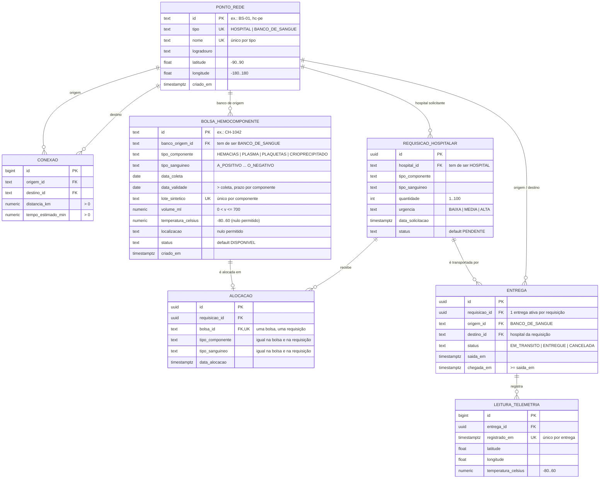

<h1 align="center">
  Rota Vital — Modelo Relacional (DER)   Supabase / PostgreSQL 🗄️🩸
</h1>

    
    
    

> Espelha o pacote `com.rotavital.dominio` ([`MODELO_DE_DOMINIO.md`](MODELO_DE_DOMINIO.md)) e o contrato
> [`openapi.yaml`](openapi.yaml). O SQL fica em [`supabase/migrations/`](../supabase/migrations/):
>
> | Migration | Conteúdo |
> | :--- | :--- |
> | [`20260924120000_schema_inicial.sql`](../supabase/migrations/20260924120000_schema_inicial.sql) | Tabelas, PKs, FKs, índices e RLS ligado |
> | [`20260924120100_constraints_integridade.sql`](../supabase/migrations/20260924120100_constraints_integridade.sql) | NOT NULL, UNIQUE, CHECK, DEFAULT, FKs de regra de negócio e gatilho de alocação |

<h2 align="left" id="1-der">🧭 1. Diagrama Entidade-Relacionamento</h2>

**Por que `ponto_rede` é uma tabela só:** `Conexao` liga dois `PontoDeRede` quaisquer (hospital ↔ banco), então
as duas pontas precisam apontar para a mesma tabela. A distinção entre hospital e banco fica na coluna `tipo`,
e as FKs compostas `(id, tipo)` garantem, por exemplo, que uma bolsa só tenha origem em um banco de sangue.

<h2 align="left" id="2-constraints">🔒 2. Catálogo de constraints</h2>

Todas têm nome explícito (`ck_`, `uq_`, `fk_`) — o nome vem na mensagem de erro do Postgres, então o backend
pode devolver um `422` dizendo qual regra foi violada.

<h3 align="left">2.1 NOT NULL e DEFAULT</h3>

| Tabela | Obrigatórias | Opcionais | Defaults |
| :--- | :--- | :--- | :--- |
| `ponto_rede` | todas | — | `criado_em = now()` |
| `conexao` | todas | — | — |
| `bolsa_hemocomponente` | todas, exceto as opcionais | `temperatura_celsius`, `localizacao` (não vêm em `NovaBolsaHemocomponenteRequest`) | `status = 'DISPONIVEL'`, `criado_em = now()` |
| `requisicao_hospitalar` | todas | — | `urgencia = 'MEDIA'`, `status = 'PENDENTE'`, `data_solicitacao = now()` |
| `alocacao` | todas | — | `data_alocacao = now()`; componente/tipo copiados da requisição pelo gatilho |
| `entrega` | todas, exceto `chegada_em` | `chegada_em` | `status = 'EM_TRANSITO'`, `saida_em = now()` |
| `leitura_telemetria` | todas | — | — |

<h3 align="left">2.2 CHECK (domínio de valores e regra de negócio)</h3>

| Constraint | Regra | Origem |
| :--- | :--- | :--- |
| `ck_ponto_rede_tipo` | `HOSPITAL` ou `BANCO_DE_SANGUE` | enum `TipoPontoRede` |
| `ck_ponto_rede_id_formato`, `ck_bolsa_id_formato` | 2–40 caracteres `[A-Za-z0-9_-]` | ids usados no backend (`BS-01`, `hc-pe`, `CH-1042`) |
| `ck_ponto_rede_nome_preenchido`, `ck_ponto_rede_logradouro_preenchido`, `ck_bolsa_lote_preenchido` | texto não vazio (nem só espaços) | — |
| `ck_ponto_rede_latitude` / `_longitude`, `ck_leitura_latitude` / `_longitude` | coordenada geográfica válida | `Endereco`, `LeituraTelemetria` |
| `ck_conexao_sem_laco` | origem ≠ destino | grafo de `RedeDistribuicao` |
| `ck_conexao_distancia_positiva`, `ck_conexao_tempo_positivo` | peso > 0 | Dijkstra não aceita peso ≤ 0 |
| `ck_bolsa_tipo_componente`, `ck_requisicao_tipo_componente` | 4 componentes | enum `TipoComponente` |
| `ck_bolsa_tipo_sanguineo`, `ck_requisicao_tipo_sanguineo` | 8 tipos ABO/Rh | enum `TipoSanguineo` |
| `ck_bolsa_status` | 5 status | enum `StatusBolsa` |
| `ck_requisicao_status` | 5 status | enum `StatusRequisicao` |
| `ck_requisicao_urgencia` | `BAIXA`, `MEDIA`, `ALTA` | enum `NivelUrgencia` |
| `ck_entrega_status` | `EM_TRANSITO`, `ENTREGUE`, `CANCELADA` | subconjunto de `StatusRequisicao` usado em `MonitoramentoEntrega` |
| `ck_bolsa_validade_apos_coleta` | `data_validade > data_coleta` | — |
| `ck_bolsa_prazo_maximo_por_componente` | validade − coleta ≤ 42 d (hemácias), 7 d (plaquetas), 365 d (crioprecipitado), 730 d (plasma) | RDC ANVISA 34/2014 |
| `ck_bolsa_volume_ml` | `0 < volume ≤ 700` | — |
| `ck_bolsa_temperatura_sensor`, `ck_leitura_temperatura_sensor` | −80 °C a 60 °C (faixa física do sensor) | fora da **faixa ideal** do componente é alerta (`estaForaDaFaixa`), não erro |
| `ck_requisicao_quantidade` | 1 a 100 bolsas por pedido | — |
| `ck_entrega_chegada_apos_saida` | `chegada_em ≥ saida_em` | — |
| `ck_entrega_entregue_tem_chegada` | `ENTREGUE` exige `chegada_em` | — |

<h3 align="left">2.3 UNIQUE</h3>

| Constraint | Garante |
| :--- | :--- |
| `uq_ponto_rede_tipo_nome` | dois hospitais (ou dois bancos) não têm o mesmo nome |
| `uq_conexao_origem_destino` | uma aresta por sentido entre dois pontos |
| `uq_bolsa_lote_componente` | uma doação gera no máximo uma bolsa de cada componente |
| `uq_alocacao_bolsa` | uma bolsa física atende uma única requisição |
| `uq_entrega_requisicao_ativa` (índice parcial) | uma entrega ativa por requisição; depois de `CANCELADA` pode ser despachada de novo |
| `uq_leitura_entrega_instante` | sem leitura duplicada no mesmo instante para a mesma entrega |

<h3 align="left">2.4 FKs de regra de negócio (compostas)</h3>

| Constraint | Garante |
| :--- | :--- |
| `fk_bolsa_banco_origem_e_banco_de_sangue` | a origem da bolsa é um `BANCO_DE_SANGUE` |
| `fk_requisicao_hospital_e_hospital` | quem requisita é um `HOSPITAL` |
| `fk_alocacao_requisicao_compativel` + `fk_alocacao_bolsa_compativel` | bolsa alocada tem o **mesmo componente e tipo sanguíneo** do pedido (regra atual de `Estoque.buscarDisponiveis`) |
| `fk_entrega_origem_e_banco_de_sangue` / `fk_entrega_destino_e_hospital` | entrega sai de um banco e chega em um hospital |
| `fk_entrega_destino_e_hospital_da_requisicao` | o destino é o hospital que fez a requisição |

<h3 align="left">2.5 Gatilho <code>trg_alocacao_validar</code></h3>

Regras que um `CHECK` não alcança porque dependem de outra linha. Rodam antes de cada `INSERT` em `alocacao`
e levantam erro com o nome da regra:

| Regra | Nome no erro |
| :--- | :--- |
| Requisição precisa estar `PENDENTE` ou `ALOCADA` | `ck_alocacao_requisicao_aberta` |
| Não alocar mais bolsas do que a `quantidade` pedida | `ck_alocacao_quantidade_maxima` |
| Bolsa precisa estar `DISPONIVEL` | `ck_alocacao_bolsa_disponivel` |
| Bolsa não pode estar vencida (FEFO só usa bolsas válidas) | `ck_alocacao_bolsa_dentro_validade` |

A linha da requisição é travada (`FOR UPDATE`), então duas alocações simultâneas não ultrapassam a quantidade.

<h2 align="left" id="3-validacao">✅ 3. Validação</h2>

As duas migrations foram aplicadas no projeto Supabase dentro de uma transação, com os dados-semente de
`BancosEmMemoria` e `RedeDistribuicaoEmMemoria`, seguidas de 31 inserções inválidas (cada uma rejeitada pela
constraint esperada) e 3 fluxos válidos (alocação → entrega → telemetria → `ENTREGUE`; bolsa fora da faixa
ideal aceita como alerta; novo despacho depois de entrega cancelada): **34/34 ok**.
