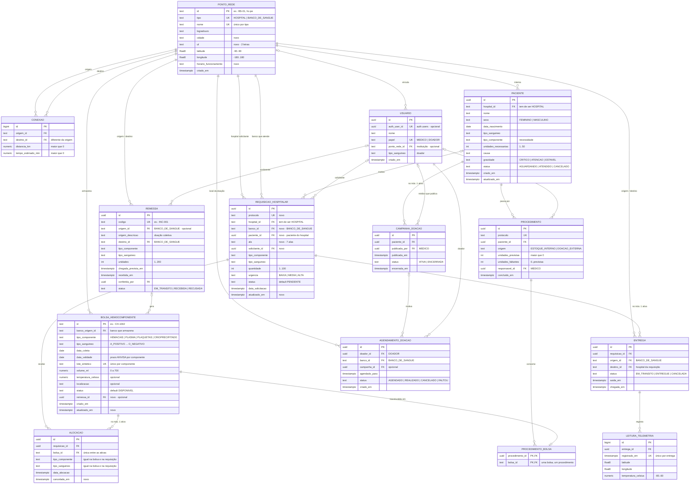

<h1 align="center">
  Rota Vital — Modelo Relacional (DER)   Supabase / PostgreSQL 🗄️🩸
</h1>

    
    
    
    
    

> Estrutura relacional do domínio do Rota Vital, registrada em **Mermaid** dentro do repositório: o DER é
> versionado junto com o código e com as migrations em [`supabase/migrations/`](../supabase/migrations/).
> Parte do schema já aplicado no Supabase (PI3-139: 7 tabelas) e o estende para cobrir todas as histórias
> de usuário do MVP. Espelha o pacote `com.rotavital.dominio` ([`MODELO_DE_DOMINIO.md`](MODELO_DE_DOMINIO.md))
> e o contrato [`openapi.yaml`](openapi.yaml).

<h2 align="left">🧭 Sumário: </h2>

1. [Escopo e requisitos de dados](#1-escopo)
2. [Diagrama Entidade-Relacionamento](#2-der)
3. [Convenções de modelagem](#3-convencoes)
4. [Dicionário de dados](#4-dicionario)
5. [Relacionamentos](#5-relacionamentos)
6. [Regras que dependem de outras linhas (gatilhos)](#6-gatilhos)
7. [Views](#7-views)
8. [Plano de migrations](#8-migrations)
9. [Decisões de modelagem](#9-decisoes)
10. [Fora do escopo do MVP](#10-fora-do-escopo)

<h2 align="left" id="1-escopo">🎯 1. Escopo e requisitos de dados</h2>

Cada história de usuário do MVP e a parte do banco que a sustenta. Legenda: ✅ já existe no Supabase ·
🆕 tabela nova · 🔧 tabela existente com ajuste.

| HU | Necessidade de dados | Tabelas |
| :--- | :--- | :--- |
| HU-01 · Acesso por perfil | Quem usa o sistema e com qual papel | 🆕 `usuario` |
| HU-02 · Painel operacional | Totais por tipo sanguíneo, nível de segurança, vencimentos, pacientes críticos | `vw_estoque_por_tipo`, 🆕 `paciente` |
| HU-03 · Estoque | Bolsas com validade, temperatura e localização | 🔧 `bolsa_hemocomponente`, `vw_estoque_agrupado` |
| HU-04 · Solicitar hemocomponente | Pedido com ala, paciente, urgência e sugestão FEFO | 🔧 `requisicao_hospitalar`, 🔧 `alocacao` |
| HU-05 · Recebimento de outras instituições | Remessa em trânsito, conferência física e bolsas geradas | 🆕 `remessa` → `bolsa_hemocomponente` |
| HU-06 · Campanha de doação | Paciente divulgado, quem publicou e quando | 🆕 `campanha_doacao` |
| HU-07 · Rede e transporte | Pontos, conexões, entrega e cadeia fria | ✅ `ponto_rede`, ✅ `conexao`, ✅ `entrega`, ✅ `leitura_telemetria` |
| HU-08 · Concluir procedimento | Baixa FEFO por bolsa ou doação externa | 🆕 `procedimento`, 🆕 `procedimento_bolsa` |
| HU-09 · Pessoas que precisam de sangue | Fila de pacientes e agendamento de doação | 🆕 `paciente`, 🆕 `agendamento_doacao` |
| HU-10 · Portal do doador | Doador e seus agendamentos | 🆕 `usuario` (papel `DOADOR`), 🆕 `agendamento_doacao` |

<h2 align="left" id="2-der">🧭 2. Diagrama Entidade-Relacionamento</h2>

<h2 align="left" id="3-convencoes">📐 3. Convenções de modelagem</h2>

| Convenção | Regra | Por quê |
| :--- | :--- | :--- |
| Nomes | `snake_case`, singular, espelhando a classe Java (`BolsaHemocomponente` → `bolsa_hemocomponente`) | Mapeamento direto no JPA |
| Enums | `text` + `CHECK` com os mesmos valores do enum Java | `@Enumerated(EnumType.STRING)` sem conversor; enum nativo do Postgres exige configuração extra no Hibernate |
| Chave primária | `text` quando a API já expõe um código (`BS-01`, `CH-1042`); `uuid` nas demais; `bigint identity` em tabelas de alto volume | Ids legíveis na URL; `uuid` evita colisão |
| Tipo do ponto garantido | Coluna fixa (`hospital_tipo = 'HOSPITAL'`) + FK composta `(id, tipo)` → `ponto_rede` | Um hospital não pode ser usado onde se espera banco, e vice-versa |
| Papel do usuário garantido | Mesmo padrão: `doador_papel = 'DOADOR'` + FK composta `(id, papel)` → `usuario` | Só doador agenda; só médico publica campanha e conclui procedimento |
| Nomes de constraint | `ck_<tabela>_<regra>`, `uq_<tabela>_<colunas>`, `fk_<tabela>_<regra>` | O nome vem no erro do Postgres e o backend devolve um `422` legível |
| Datas | `timestamptz` para eventos, `date` para coleta, validade e nascimento | Fuso consistente entre backend e banco |
| Auditoria mínima | `criado_em` e `atualizado_em` com `default now()` e gatilho de atualização | Ordenação do painel e rastreabilidade |
| Unicidade condicional | Índice único parcial (`where cancelada_em is null`, `where status = 'ATIVA'`) | Permite refazer a operação depois de um cancelamento |
| Segurança | RLS ligado em todas as tabelas, sem políticas | Bloqueia a API REST pública do Supabase; o backend usa o role `postgres` |

<h2 align="left" id="4-dicionario">📚 4. Dicionário de dados</h2>

Legenda: ✅ coluna existente · 🆕 coluna nova · 🔧 coluna existente com mudança. "—" = não.

<h3 align="left">4.1 <code>ponto_rede</code> ✅ — <code>Hospital</code> e <code>BancoDeSangue</code></h3>

| Coluna | Tipo | Nulo | Default | Regra | |
| :--- | :--- | :---: | :--- | :--- | :---: |
| `id` | text PK | — | — | `^[A-Za-z0-9_-]{2,40}$` | ✅ |
| `tipo` | text | — | — | `HOSPITAL` \| `BANCO_DE_SANGUE` | ✅ |
| `nome` | text | — | — | não vazio; `uq (tipo, nome)` | ✅ |
| `logradouro` | text | — | — | não vazio | ✅ |
| `cidade` | text | sim | — | — | 🆕 |
| `uf` | char(2) | sim | — | `^[A-Z]{2}$` | 🆕 |
| `latitude` / `longitude` | float8 | — | — | faixa geográfica válida | ✅ |
| `horario_funcionamento` | text | sim | — | exibido no agendamento de doação | 🆕 |
| `criado_em` | timestamptz | — | `now()` | — | ✅ |

`uq (id, tipo)` é o alvo das FKs compostas.

<h3 align="left">4.2 <code>conexao</code> ✅ — aresta dirigida do grafo (Dijkstra)</h3>

| Coluna | Tipo | Nulo | Regra |
| :--- | :--- | :---: | :--- |
| `id` | bigint identity PK | — | — |
| `origem_id` / `destino_id` | text FK → `ponto_rede` | — | `origem ≠ destino`; `uq (origem_id, destino_id)` |
| `distancia_km` | numeric(8,2) | — | `> 0` |
| `tempo_estimado_min` | numeric(8,2) | — | `> 0` |

Ida e volta são duas linhas, como em `RedeDistribuicao.adicionarConexao`.

<h3 align="left">4.3 <code>usuario</code> 🆕 — médico e doador</h3>

| Coluna | Tipo | Nulo | Default | Regra |
| :--- | :--- | :---: | :--- | :--- |
| `id` | uuid PK | — | `gen_random_uuid()` | — |
| `auth_user_id` | uuid | sim | — | único; FK → `auth.users (id)` `on delete set null` (HU-F01) |
| `nome` | text | — | — | não vazio |
| `papel` | text | — | — | `MEDICO` \| `DOADOR` |
| `ponto_rede_id` | text FK → `ponto_rede` | sim | — | instituição do médico |
| `tipo_sanguineo` | text | sim | — | enum ABO/Rh; preenchido para doador |
| `criado_em` | timestamptz | — | `now()` | — |

`uq (id, papel)` é o alvo das FKs compostas de papel.

<h3 align="left">4.4 <code>paciente</code> 🆕 — pessoa que precisa de hemocomponente</h3>

| Coluna | Tipo | Nulo | Default | Regra |
| :--- | :--- | :---: | :--- | :--- |
| `id` | uuid PK | — | `gen_random_uuid()` | — |
| `hospital_id` + `hospital_tipo` | text | — | `'HOSPITAL'` | FK composta → `ponto_rede (id, tipo)` |
| `nome` | text | — | — | não vazio |
| `sexo` | text | — | — | `FEMININO` \| `MASCULINO` |
| `data_nascimento` | date | — | — | `> 1900-01-01` (data futura é validada no backend) |
| `tipo_sanguineo` | text | — | — | enum ABO/Rh |
| `tipo_componente` | text | — | — | enum `TipoComponente` |
| `unidades_necessarias` | int | — | — | `1..50` |
| `causa` | text | — | — | não vazio |
| `gravidade` | text | — | — | `CRITICO` \| `ATENCAO` \| `ESTAVEL` |
| `status` | text | — | `'AGUARDANDO'` | `AGUARDANDO` \| `ATENDIDO` \| `CANCELADO` |
| `criado_em` | timestamptz | — | `now()` | tempo de espera exibido no painel |
| `atualizado_em` | timestamptz | — | `now()` | — |

`uq (id, hospital_id)` é o alvo da FK de `requisicao_hospitalar`. A idade e a distância até o hemocentro são
calculadas, não armazenadas.

<h3 align="left">4.5 <code>bolsa_hemocomponente</code> 🔧 — unidade física em estoque</h3>

| Coluna | Tipo | Nulo | Default | Regra | |
| :--- | :--- | :---: | :--- | :--- | :---: |
| `id` | text PK | — | — | `^[A-Za-z0-9_-]{2,40}$` | ✅ |
| `banco_origem_id` + `banco_origem_tipo` | text | — | `'BANCO_DE_SANGUE'` | FK composta; **banco que armazena a bolsa** | 🔧 |
| `tipo_componente` / `tipo_sanguineo` | text | — | — | enums | ✅ |
| `data_coleta` / `data_validade` | date | — | — | validade > coleta; prazo máximo ANVISA (42/7/365/730 dias) | ✅ |
| `lote_sintetico` | text | — | — | `uq (lote_sintetico, tipo_componente)` | ✅ |
| `volume_ml` | numeric(6,1) | — | — | `0 < v ≤ 700` | ✅ |
| `temperatura_celsius` | numeric(5,2) | sim | — | `-80..60` (faixa física do sensor) | ✅ |
| `localizacao` | text | sim | — | refrigerador · prateleira · nível | ✅ |
| `status` | text | — | `'DISPONIVEL'` | `DISPONIVEL` \| `RESERVADA` \| `EM_TRANSITO` \| `ENTREGUE` \| `DESCARTADA` \| **`UTILIZADA`** | 🔧 |
| `remessa_id` | uuid | sim | — | FK composta → `remessa` (ver abaixo) | 🆕 |
| `criado_em` | timestamptz | — | `now()` | — | ✅ |
| `atualizado_em` | timestamptz | — | `now()` | gatilho de atualização | 🆕 |

A FK `fk_bolsa_remessa_compativel (remessa_id, banco_origem_id, tipo_componente, tipo_sanguineo)` →
`remessa (id, destino_id, tipo_componente, tipo_sanguineo)` garante que a bolsa gerada por uma remessa fique no
banco de destino, com o mesmo componente e tipo. Com `remessa_id` nulo a FK não se aplica.

<h3 align="left">4.6 <code>remessa</code> 🆕 — chegada de outra instituição (HU-05)</h3>

| Coluna | Tipo | Nulo | Default | Regra |
| :--- | :--- | :---: | :--- | :--- |
| `id` | uuid PK | — | `gen_random_uuid()` | — |
| `codigo` | text | — | — | único (`INC-001`) |
| `origem_id` + `origem_tipo` | text | sim | `'BANCO_DE_SANGUE'` | FK composta (HEMORIO, HEMOAL, Caruaru) |
| `origem_descricao` | text | sim | — | doação coletiva de empresa |
| `destino_id` + `destino_tipo` | text | — | `'BANCO_DE_SANGUE'` | FK composta |
| `tipo_componente` / `tipo_sanguineo` | text | — | — | enums |
| `unidades` | int | — | — | `1..200` |
| `chegada_prevista_em` | timestamptz | — | — | — |
| `recebida_em` | timestamptz | sim | — | — |
| `conferida_por` | uuid FK → `usuario` | sim | — | `on delete set null` |
| `status` | text | — | `'EM_TRANSITO'` | `EM_TRANSITO` \| `RECEBIDA` \| `RECUSADA` |

Checks: `origem_id` ou `origem_descricao` preenchido · `origem_id ≠ destino_id` · `RECEBIDA` exige
`recebida_em` e `conferida_por`. `uq (id, destino_id, tipo_componente, tipo_sanguineo)` é o alvo da FK da bolsa.

<h3 align="left">4.7 <code>requisicao_hospitalar</code> 🔧 — pedido de um hospital (HU-04)</h3>

| Coluna | Tipo | Nulo | Default | Regra | |
| :--- | :--- | :---: | :--- | :--- | :---: |
| `id` | uuid PK | — | `gen_random_uuid()` | — | ✅ |
| `protocolo` | text | — | — | único | 🆕 |
| `hospital_id` + `hospital_tipo` | text | — | `'HOSPITAL'` | FK composta | ✅ |
| `banco_id` + `banco_tipo` | text | — | `'BANCO_DE_SANGUE'` | FK composta: quem atende | 🆕 |
| `paciente_id` | uuid | sim | — | FK composta `(paciente_id, hospital_id)` → `paciente (id, hospital_id)` | 🆕 |
| `ala` | text | sim | — | `UTI_ADULTO` \| `UTI_NEONATAL` \| `CENTRO_CIRURGICO` \| `EMERGENCIA` \| `ONCOLOGIA` \| `HEMODIALISE` \| `MATERNIDADE` | 🆕 |
| `solicitante_id` | uuid FK → `usuario` | sim | — | `on delete set null` | 🆕 |
| `tipo_componente` / `tipo_sanguineo` | text | — | — | enums | ✅ |
| `quantidade` | int | — | — | `1..100` | ✅ |
| `urgencia` | text | — | `'MEDIA'` | `BAIXA` \| `MEDIA` \| `ALTA` | ✅ |
| `status` | text | — | `'PENDENTE'` | `PENDENTE` \| `ALOCADA` \| `EM_TRANSITO` \| `ENTREGUE` \| `CANCELADA` | ✅ |
| `data_solicitacao` | timestamptz | — | `now()` | — | ✅ |
| `atualizado_em` | timestamptz | — | `now()` | gatilho de atualização | 🆕 |

<h3 align="left">4.8 <code>alocacao</code> 🔧 — requisição ↔ bolsa escolhida pelo FEFO</h3>

| Coluna | Tipo | Nulo | Default | Regra | |
| :--- | :--- | :---: | :--- | :--- | :---: |
| `id` | uuid PK | — | `gen_random_uuid()` | — | ✅ |
| `requisicao_id` | uuid | — | — | FK composta de compatibilidade `on delete cascade` | ✅ |
| `bolsa_id` | text | — | — | FK composta de compatibilidade `on delete restrict` | 🔧 |
| `tipo_componente` / `tipo_sanguineo` | text | — | copiados pelo gatilho | iguais na bolsa e na requisição | ✅ |
| `data_alocacao` | timestamptz | — | `now()` | — | ✅ |
| `cancelada_em` | timestamptz | sim | — | `≥ data_alocacao` | 🆕 |

🔧 `uq_alocacao_bolsa unique (bolsa_id)` é substituída por `uq_alocacao_bolsa_ativa` (índice único parcial
`where cancelada_em is null`): a bolsa pode ser realocada depois que uma requisição é cancelada.

<h3 align="left">4.9 <code>entrega</code> ✅ — transporte banco → hospital</h3>

| Coluna | Tipo | Nulo | Default | Regra |
| :--- | :--- | :---: | :--- | :--- |
| `id` | uuid PK | — | `gen_random_uuid()` | — |
| `requisicao_id` | uuid | — | — | uma entrega ativa por requisição (índice parcial) |
| `origem_id` + `origem_tipo` | text | — | `'BANCO_DE_SANGUE'` | FK composta |
| `destino_id` + `destino_tipo` | text | — | `'HOSPITAL'` | FK composta; igual ao hospital da requisição |
| `status` | text | — | `'EM_TRANSITO'` | `EM_TRANSITO` \| `ENTREGUE` \| `CANCELADA` |
| `saida_em` | timestamptz | — | `now()` | — |
| `chegada_em` | timestamptz | sim | — | `≥ saida_em`; obrigatório quando `ENTREGUE` |

As bolsas transportadas são as alocações ativas da requisição.

<h3 align="left">4.10 <code>leitura_telemetria</code> ✅ — GPS + °C durante a entrega</h3>

| Coluna | Tipo | Nulo | Regra |
| :--- | :--- | :---: | :--- |
| `id` | bigint identity PK | — | — |
| `entrega_id` | uuid FK → `entrega` | — | `on delete cascade` |
| `registrado_em` | timestamptz | — | `uq (entrega_id, registrado_em)` |
| `latitude` / `longitude` | float8 | — | faixa geográfica válida |
| `temperatura_celsius` | numeric(5,2) | — | `-80..60` |

<h3 align="left">4.11 <code>campanha_doacao</code> 🆕 — HU-06</h3>

| Coluna | Tipo | Nulo | Default | Regra |
| :--- | :--- | :---: | :--- | :--- |
| `id` | uuid PK | — | `gen_random_uuid()` | — |
| `paciente_id` | uuid FK → `paciente` | — | — | `on delete cascade` |
| `publicada_por` + `publicada_por_papel` | uuid / text | sim | `'MEDICO'` | FK composta → `usuario (id, papel)` |
| `publicada_em` | timestamptz | — | `now()` | — |
| `status` | text | — | `'ATIVA'` | `ATIVA` \| `ENCERRADA` |
| `encerrada_em` | timestamptz | sim | — | preenchida se, e só se, `ENCERRADA` |

Índice único parcial: uma campanha `ATIVA` por paciente.

<h3 align="left">4.12 <code>agendamento_doacao</code> 🆕 — HU-09 / HU-10</h3>

| Coluna | Tipo | Nulo | Default | Regra |
| :--- | :--- | :---: | :--- | :--- |
| `id` | uuid PK | — | `gen_random_uuid()` | — |
| `doador_id` + `doador_papel` | uuid / text | — | `'DOADOR'` | FK composta → `usuario (id, papel)` |
| `banco_id` + `banco_tipo` | text | — | `'BANCO_DE_SANGUE'` | FK composta |
| `campanha_id` | uuid FK → `campanha_doacao` | sim | — | `on delete set null` |
| `agendado_para` | timestamptz | — | — | `> criado_em` |
| `status` | text | — | `'AGENDADO'` | `AGENDADO` \| `REALIZADO` \| `CANCELADO` \| `FALTOU` |
| `criado_em` | timestamptz | — | `now()` | — |

Índice único parcial: um agendamento `AGENDADO` por doador.

<h3 align="left">4.13 <code>procedimento</code> 🆕 — HU-08</h3>

| Coluna | Tipo | Nulo | Default | Regra |
| :--- | :--- | :---: | :--- | :--- |
| `id` | uuid PK | — | `gen_random_uuid()` | — |
| `protocolo` | text | — | — | único |
| `paciente_id` | uuid FK → `paciente` | — | — | `on delete restrict` |
| `origem` | text | — | — | `ESTOQUE_INTERNO` \| `DOACAO_EXTERNA` |
| `unidades_previstas` | int | — | — | `> 0` |
| `unidades_faltantes` | int | — | `0` | `0..unidades_previstas` |
| `responsavel_id` + `responsavel_papel` | uuid / text | sim | `'MEDICO'` | FK composta → `usuario (id, papel)` |
| `concluido_em` | timestamptz | — | `now()` | — |

As unidades baixadas são `count(procedimento_bolsa)`, não uma coluna.

<h3 align="left">4.14 <code>procedimento_bolsa</code> 🆕 — baixa FEFO por bolsa</h3>

| Coluna | Tipo | Nulo | Regra |
| :--- | :--- | :---: | :--- |
| `procedimento_id` | uuid FK → `procedimento` | — | `on delete cascade` |
| `bolsa_id` | text FK → `bolsa_hemocomponente` | — | único: uma bolsa é transfundida uma vez; `on delete restrict` |

PK `(procedimento_id, bolsa_id)`.

<h2 align="left" id="5-relacionamentos">🔗 5. Relacionamentos</h2>

| Origem → Destino | Cardinalidade | FK | On delete | |
| :--- | :--- | :--- | :--- | :---: |
| `conexao` → `ponto_rede` (origem, destino) | N:1 ×2 | simples | cascade | ✅ |
| `bolsa_hemocomponente` → `ponto_rede` | N:1 | composta · BANCO | restrict | ✅ |
| `bolsa_hemocomponente` → `remessa` | N:0..1 | composta · banco + componente + tipo | restrict | 🆕 |
| `remessa` → `ponto_rede` (origem, destino) | N:0..1 / N:1 | composta · BANCO | restrict | 🆕 |
| `remessa` → `usuario` (conferente) | N:0..1 | simples | set null | 🆕 |
| `usuario` → `ponto_rede` | N:0..1 | simples | restrict | 🆕 |
| `paciente` → `ponto_rede` | N:1 | composta · HOSPITAL | restrict | 🆕 |
| `requisicao_hospitalar` → `ponto_rede` (hospital) | N:1 | composta · HOSPITAL | restrict | ✅ |
| `requisicao_hospitalar` → `ponto_rede` (banco) | N:1 | composta · BANCO | restrict | 🆕 |
| `requisicao_hospitalar` → `paciente` | N:0..1 | composta · paciente do mesmo hospital | restrict | 🆕 |
| `requisicao_hospitalar` → `usuario` (solicitante) | N:0..1 | simples | set null | 🆕 |
| `alocacao` → `requisicao_hospitalar` | N:1 | composta · compatibilidade | cascade | ✅ |
| `alocacao` → `bolsa_hemocomponente` | N:1 · máx. 1 ativa | composta · compatibilidade | restrict | 🔧 |
| `entrega` → `requisicao_hospitalar` | N:1 · máx. 1 ativa | composta · destino = hospital | restrict | ✅ |
| `entrega` → `ponto_rede` (origem, destino) | N:1 ×2 | composta · BANCO / HOSPITAL | restrict | ✅ |
| `leitura_telemetria` → `entrega` | N:1 | simples | cascade | ✅ |
| `campanha_doacao` → `paciente` | N:1 · máx. 1 ativa | simples | cascade | 🆕 |
| `campanha_doacao` → `usuario` | N:0..1 | composta · MEDICO | restrict | 🆕 |
| `agendamento_doacao` → `usuario` | N:1 | composta · DOADOR | restrict | 🆕 |
| `agendamento_doacao` → `ponto_rede` | N:1 | composta · BANCO | restrict | 🆕 |
| `agendamento_doacao` → `campanha_doacao` | N:0..1 | simples | set null | 🆕 |
| `procedimento` → `paciente` | N:1 | simples | restrict | 🆕 |
| `procedimento` → `usuario` | N:0..1 | composta · MEDICO | restrict | 🆕 |
| `procedimento_bolsa` → `procedimento` | N:1 | simples | cascade | 🆕 |
| `procedimento_bolsa` → `bolsa_hemocomponente` | 1:1 | simples | restrict | 🆕 |

<h2 align="left" id="6-gatilhos">⚡ 6. Regras que dependem de outras linhas (gatilhos)</h2>

| Gatilho | Tabela | Regras | |
| :--- | :--- | :--- | :---: |
| `trg_alocacao_validar` | `alocacao` (before insert) | Requisição `PENDENTE` ou `ALOCADA` · não passar da `quantidade` **contando só alocações ativas** · bolsa `DISPONIVEL` e dentro da validade · trava a requisição com `FOR UPDATE` | 🔧 |
| `trg_procedimento_bolsa_validar` | `procedimento_bolsa` (before insert) | Procedimento `ESTOQUE_INTERNO` · bolsa do mesmo componente da necessidade do paciente · bolsa não vencida nem descartada ou utilizada · marca a bolsa como `UTILIZADA` | 🆕 |
| `trg_<tabela>_atualizado_em` | `paciente`, `bolsa_hemocomponente`, `requisicao_hospitalar` (before update) | `atualizado_em = now()` | 🆕 |

<h2 align="left" id="7-views">👁️ 7. Views</h2>

| View | Colunas | Uso |
| :--- | :--- | :--- |
| `vw_estoque_por_tipo` | `banco_id`, `tipo_sanguineo`, `unidades_disponiveis`, `abaixo_nivel_seguranca` (< 10) | Cards do painel (HU-02) |
| `vw_estoque_agrupado` | `banco_id`, `tipo_componente`, `tipo_sanguineo`, `data_validade`, `localizacao`, `unidades`, `temperatura_media`, `fora_da_faixa` | Tela de estoque (HU-03): substitui o "lote" agregado do mock do frontend |

<h2 align="left" id="8-migrations">📜 8. Plano de migrations</h2>

As duas primeiras já estão aplicadas no Supabase e **não são alteradas**. As mudanças entram em migrations
novas, com timestamp posterior:

| # | Arquivo | Conteúdo | |
| :---: | :--- | :--- | :---: |
| 1 | `20260924120000_schema_inicial.sql` | 7 tabelas, PKs, FKs, índices, RLS | ✅ aplicada |
| 2 | `20260924120100_constraints_integridade.sql` | NOT NULL, CHECK, UNIQUE, FKs compostas, `trg_alocacao_validar` | ✅ aplicada |
| 3 | `20260925120000_ajustes_schema_existente.sql` | Colunas novas em `ponto_rede`, `bolsa_hemocomponente`, `requisicao_hospitalar` e `alocacao`; índice parcial da alocação; gatilho de alocação atualizado; status `UTILIZADA`; remoção das FKs simples redundantes com as compostas | 🆕 |
| 4 | `20260925120100_escopo_clinico.sql` | `usuario`, `paciente`, `remessa`, `campanha_doacao`, `agendamento_doacao`, `procedimento`, `procedimento_bolsa`, gatilhos novos e RLS | 🆕 |
| 5 | `20260925120200_views_painel.sql` | `vw_estoque_por_tipo`, `vw_estoque_agrupado` | 🆕 |
| — | `supabase/seed.sql` | Pontos e conexões de `RedeDistribuicaoEmMemoria`, bolsas de `BancosEmMemoria`, pacientes e remessas dos mocks do frontend | 🆕 |

> A migration 4 cria `remessa` e `paciente`, que são alvo das FKs novas de `bolsa_hemocomponente` e
> `requisicao_hospitalar`. Essas FKs são adicionadas no fim da migration 4, depois de as tabelas existirem.

<h2 align="left" id="9-decisoes">🧩 9. Decisões de modelagem</h2>

| # | Decisão | Alternativa descartada | Por quê |
| :---: | :--- | :--- | :--- |
| 1 | Uma linha por **bolsa**; o "lote" do frontend é uma view | Tabela de lote com quantidade | Rastreabilidade por bolsa (reserva, transporte, descarte, transfusão) |
| 2 | `ponto_rede` única para hospital e banco | Duas tabelas | `Conexao` liga dois pontos quaisquer; o tipo é garantido por FK composta |
| 3 | `banco_origem_id` = banco que armazena a bolsa | Coluna separada de localização atual | A origem externa fica em `remessa`; evita duas colunas de banco |
| 4 | Status `UTILIZADA` em `StatusBolsa` | Reaproveitar `ENTREGUE` | `ENTREGUE` é chegada ao hospital, não consumo |
| 5 | Doador é `usuario` com papel `DOADOR` | Tabela `doador` separada | Menos tabelas; o doador sempre acessa pelo portal (HU-10) |
| 6 | Necessidade (componente e unidades) direto em `paciente` | Tabela `necessidade_paciente` | O frontend trabalha com um componente por paciente |
| 7 | `urgencia` da requisição (`BAIXA`/`MEDIA`/`ALTA`) separada da `gravidade` do paciente (`CRITICO`/`ATENCAO`/`ESTAVEL`) | Escala única | Urgência do pedido ≠ estado clínico; mantém o enum `NivelUrgencia` do contrato |
| 8 | Bolsas da entrega derivadas das alocações ativas | Tabela `entrega_bolsa` | Uma entrega atende uma requisição; evita duplicar a informação |
| 9 | Idade, distância e unidades baixadas calculadas | Colunas armazenadas | Evita dado que fica desatualizado |

<h2 align="left" id="10-fora-do-escopo">🚧 10. Fora do escopo do MVP</h2>

| Item | HU | Quando entrar |
| :--- | :--- | :--- |
| `alerta` com histórico e reconhecimento | HU-F03 | Notificações push/e-mail |
| `veiculo` e rastreamento em tempo real | HU-F04 | Telemetria real (hoje é simulada) |
| Histórico de status (requisição, bolsa) | — | Auditoria completa |
| Políticas de RLS por papel | HU-F01 | Login real via Supabase Auth |
| Elegibilidade do doador (peso, intervalo entre doações) | HU-F06 | Colunas extras em `usuario` ou tabela `doador` |
