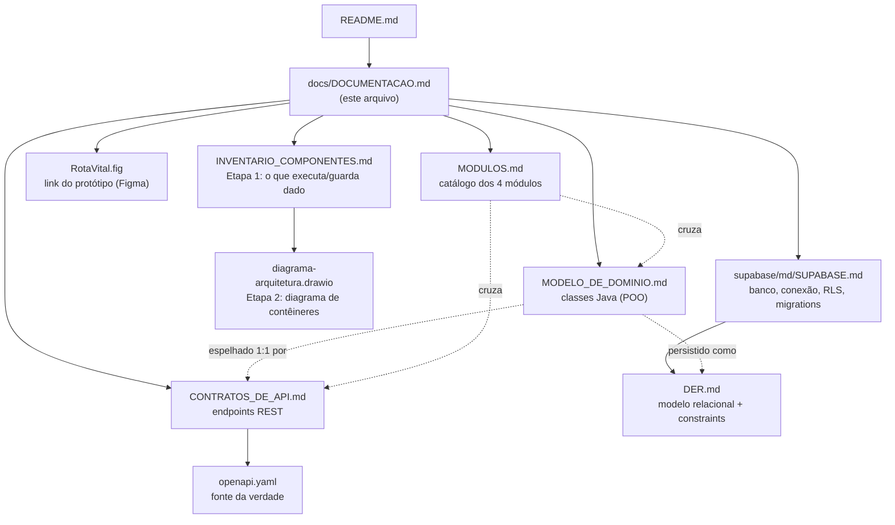
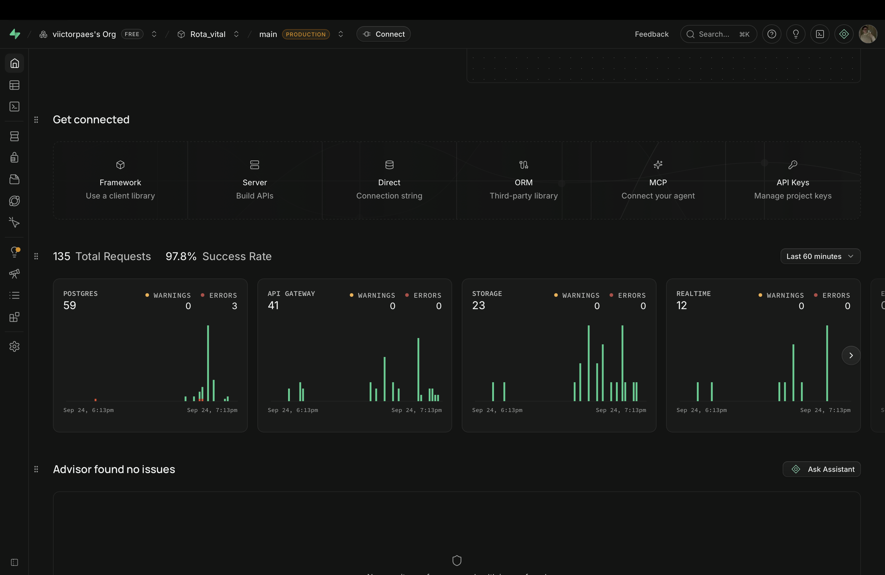
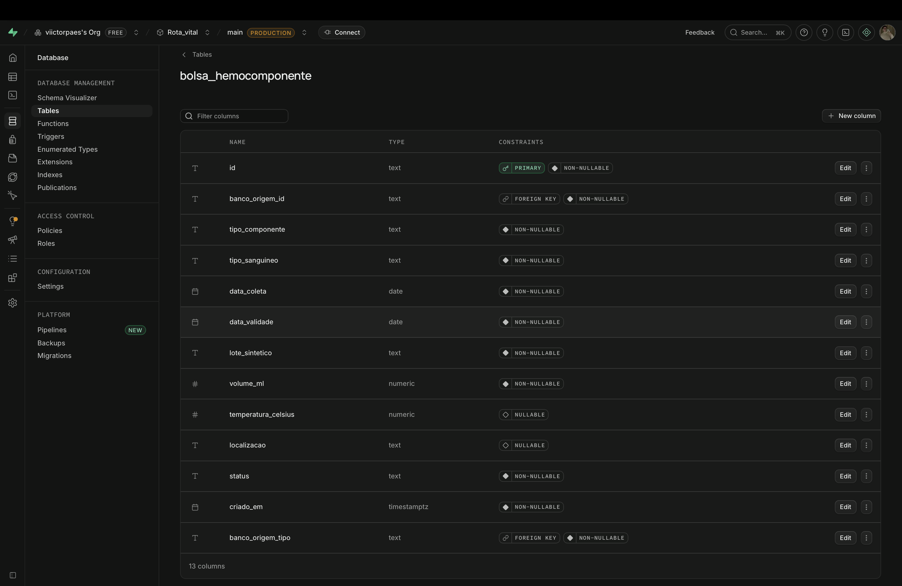
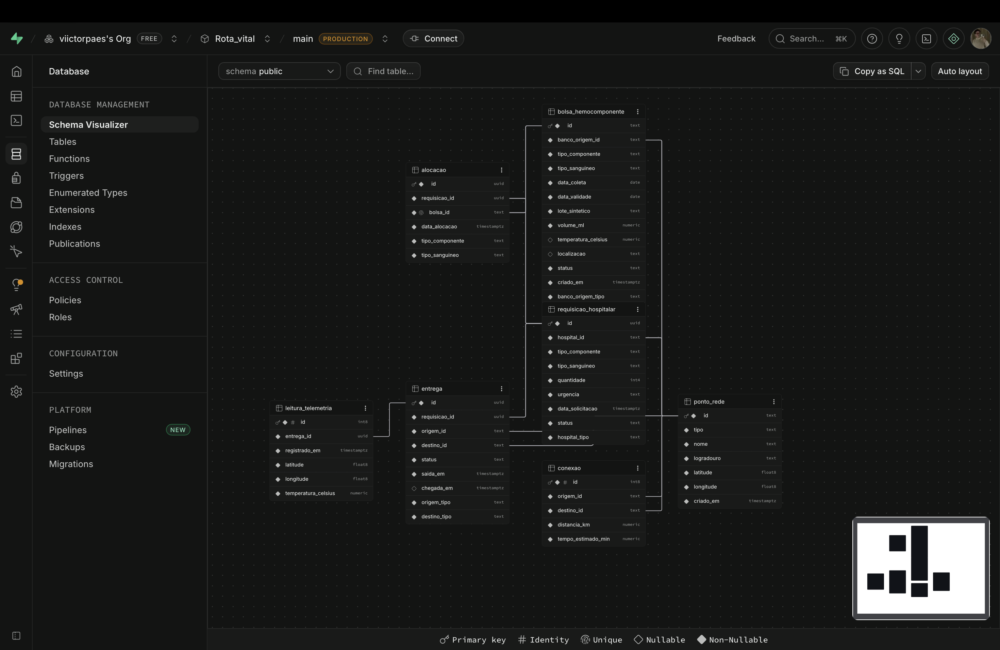
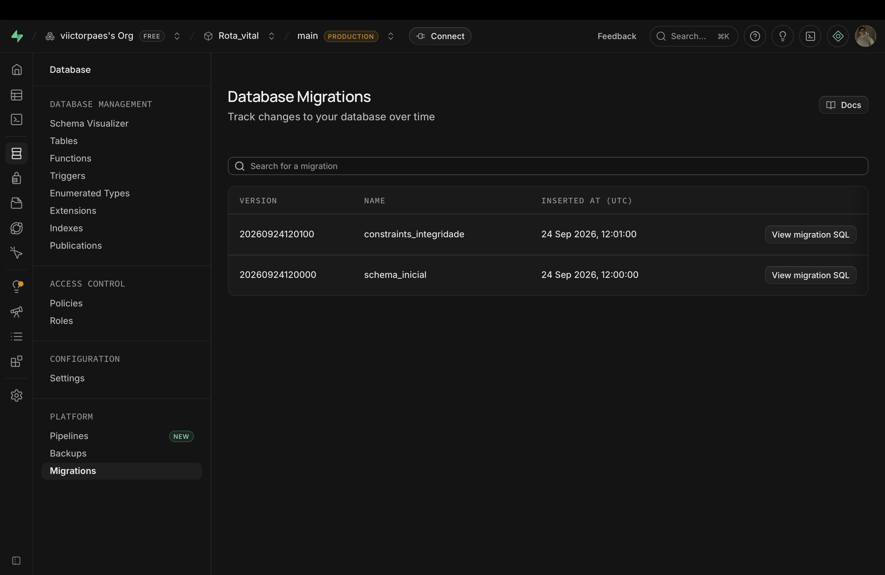
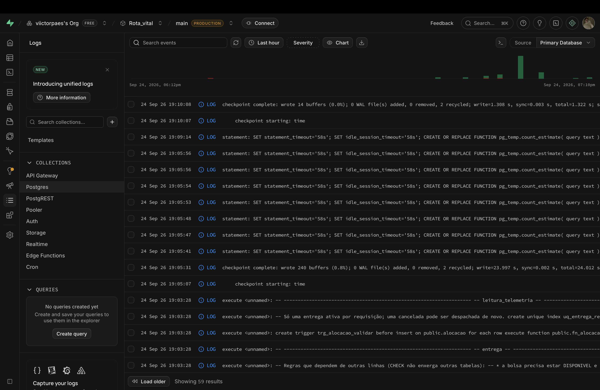

<h1 align="center">
  Rota Vital — Documentação Técnica <br> Índice de Documentação <br>
  🩸📚
</h1>

<p align="center">
    
    
    
</p>

> Mapa de toda a documentação técnica do Rota Vital. O [`README.md`](../README.md) principal só referencia
> este índice — o detalhe de cada documento (o que contém, quando ler, como abrir) vive aqui.

<h2 align="left">🧭 Sumário: </h2>

1. [Mapa dos documentos](#1-mapa)
2. [Modelo de Domínio](#2-dominio)
3. [Contratos de API](#3-api)
4. [Contrato OpenAPI (openapi.yaml)](#4-openapi)
5. [Módulos do Sistema](#5-modulos)
6. [Protótipo (Figma)](#6-figma)
7. [Visualizando o contrato REST](#7-visualizar)
8. [Inventário de Componentes (arquitetura)](#8-inventario)
9. [Banco de dados (Supabase)](#9-supabase)

<h2 align="left" id="1-mapa">🗺️ 1. Mapa dos documentos</h2>



| Documento | Formato | Conteúdo | Leia quando... |
| :--- | :--- | :--- | :--- |
| [`MODELO_DE_DOMINIO.md`](MODELO_DE_DOMINIO.md) | Markdown + Mermaid | Diagrama de classes, composição/herança, enums, fluxo de `TesteFluxo` | se for mexer nas classes de `com.rotavital.dominio` |
| [`CONTRATOS_DE_API.md`](CONTRATOS_DE_API.md) | Markdown + Mermaid | Os 4 módulos REST, padrão de erro (RFC 7807), diagramas de sequência, gaps | se for desenhar ou consumir um endpoint |
| [`openapi.yaml`](openapi.yaml) | OpenAPI 3.0.3 | Fonte da verdade do contrato — schemas, exemplos, respostas | se for importar no Swagger/Postman/Insomnia |
| [`MODULOS.md`](MODULOS.md) | Markdown + Mermaid | Catálogo dos 4 módulos cruzando domínio ↔ contrato | quiser uma visão geral rápida do sistema |
| [`../RotaVital.fig`](../RotaVital.fig) | Texto (link) | Aponta para o protótipo publicado no Figma | se for discutir UI/UX do frontend |
| [`INVENTARIO_COMPONENTES.md`](INVENTARIO_COMPONENTES.md) | Markdown | Levantamento do que executa código/guarda dado, validado contra o repositório | antes de desenhar o diagrama de arquitetura no draw.io |
| [`diagrama-arquitetura.drawio`](diagrama-arquitetura.drawio) | draw.io (mxGraph XML) | Diagrama de contêineres com os 8 componentes da Etapa 1, ativo × planejado | para visualizar/editar a arquitetura no draw.io |
| [`supabase/md/SUPABASE.md`](../supabase/md/SUPABASE.md) | Markdown + Mermaid | Projeto Supabase, conexão do backend, variáveis de ambiente, migrations, RLS, validação e prints | se for mexer no banco ou configurar o `.env` |
| [`DER.md`](DER.md) | Markdown + Mermaid | DER das 7 tabelas e catálogo de NOT NULL, UNIQUE, CHECK, FKs e gatilho | se for criar tabela, entidade JPA ou consulta |

<h2 align="left" id="2-dominio">🧬 2. Modelo de Domínio</h2>

Documenta o pacote `com.rotavital.dominio` (`backend/src/main/java/com/rotavital/dominio/`) — a entrega de
POO da sprint **W04**. Cobre `PontoDeRede`, `Endereco`, `Hospital`, `BancoDeSangue`, `Estoque`,
`BolsaHemocomponente`, `RequisicaoHospitalar` e os enums do domínio, além do fluxo manual de
[`TesteFluxo.java`](../backend/src/test/java/com/rotavital/dominio/TesteFluxo.java).

<h2 align="left" id="3-api">🌐 3. Contratos de API</h2>

Documenta os 5 temas da entrega **PI3-14 (RSD)**: padrões da API, e os módulos de Estoque, Requisições,
Rotas e Telemetria — cada um com sua tabela de endpoints, schema e diagrama de sequência/estado.

<h2 align="left" id="4-openapi">📄 4. Contrato OpenAPI (openapi.yaml)</h2>

Fonte da verdade do contrato REST, em OpenAPI 3.0.3. Validado com
[Spectral](https://github.com/stoplightio/spectral) (ruleset `spectral:oas`): **0 erros · 0 warnings**.

<h2 align="left" id="5-modulos">📦 5. Módulos do Sistema</h2>

Visão de catálogo dos 4 módulos (Estoque, Requisições, Rotas, Telemetria), cruzando o que cada um expõe no
contrato com a classe de domínio que ele espelha — ver [`MODULOS.md`](MODULOS.md).

<h2 align="left" id="6-figma">🎨 6. Protótipo (Figma)</h2>

Protótipo Lo-Fi publicado no Figma, com link em [`RotaVital.fig`](../RotaVital.fig) (arquivo de texto na
raiz do repositório, apontando para o protótipo online) — acesso direto:
[letter-raven-07178463.figma.site](https://letter-raven-07178463.figma.site).

> As histórias de usuário (BDD) da Entrega 01 estão no [`README.md`](../README.md#-entrega-01) principal,
> na seção "Entrega 01", em blocos expansíveis (▶️).

<h2 align="left" id="7-visualizar">🔎 7. Visualizando o contrato REST</h2>

**Swagger UI (via Docker):**

```bash
docker run -p 8081:8080 -e SWAGGER_JSON=/spec/openapi.yaml \
  -v "$(pwd)/docs:/spec" swaggerapi/swagger-ui
```

Acesse `http://localhost:8081`.

**Postman / Insomnia:** `Importar → File → docs/openapi.yaml`. Os `examples` de cada operação já vêm
populados com os dados de [`TesteFluxo.java`](../backend/src/test/java/com/rotavital/dominio/TesteFluxo.java)
(`BS-01`/Hemope Central, `BOLSA-001`, `HOSP-01`/Hospital das Clínicas), prontos para teste manual sem
backend.

**Lint do contrato (Spectral):**

```bash
npx --yes @stoplight/spectral-cli lint docs/openapi.yaml --ruleset <(echo "extends: spectral:oas")
```

<h2 align="left" id="8-inventario">🗺️ 8. Inventário de Componentes (arquitetura)</h2>

Etapa 1 do exercício de arquitetura: lista, validada contra o código real, de tudo que executa código ou
guarda dado no Rota Vital hoje — e o que é só planejado. Ver
[`INVENTARIO_COMPONENTES.md`](INVENTARIO_COMPONENTES.md).

**Etapa 2 — diagrama de contêineres:** [`diagrama-arquitetura.drawio`](diagrama-arquitetura.drawio), com os
8 componentes da Etapa 1, distinguindo visualmente o que já é real (linha sólida) do que é só planejado
(linha tracejada — Supabase/Postgres e a integração SPA→Backend). Abra no
[app.diagrams.net](https://app.diagrams.net) (`File → Open from → Device`) ou na extensão draw.io do
VS Code.

<h2 align="left" id="9-supabase">🟢 9. Banco de dados (Supabase)</h2>

O banco do Rota Vital roda no **Supabase** (PostgreSQL gerenciado), projeto `Rota_vital`, branch `main`
(*production*). O schema vem das migrations versionadas em [`supabase/migrations/`](../supabase/migrations/)
e segue o modelo de [`DER.md`](DER.md); conexão, variáveis de ambiente e RLS estão em
[`supabase/md/SUPABASE.md`](../supabase/md/SUPABASE.md). Os prints abaixo mostram o estado atual do projeto.

| # | Evidência | Onde no Supabase | O que comprova |
| :---: | :--- | :--- | :--- |
| 1 | Visão geral do projeto | **Project Overview** | Projeto ativo, requisições em Postgres/API/Storage/Realtime e *Advisor found no issues* |
| 2 | Lista de tabelas | **Database → Tables** | As 7 tabelas do DER criadas no schema `public` |
| 3 | Colunas de `bolsa_hemocomponente` | **Database → Tables → View columns** | Tipos, PK, FKs e NOT NULL / NULL batendo com o DER |
| 4 | Schema Visualizer | **Database → Schema Visualizer** | Diagrama gerado a partir do banco real, com os relacionamentos entre as tabelas |
| 5 | Migrations aplicadas | **Database → Migrations** | `schema_inicial` e `constraints_integridade` registradas |
| 6 | Logs do Postgres | **Logs → Postgres** | Execução do SQL das migrations (gatilho `trg_alocacao_validar`, índice `uq_entrega_requisicao_ativa`) |

<details>
<summary>▶️🏠 <b>1. Visão geral do projeto</b></summary>

<p align="center">

</p>

</details>

<details>
<summary>▶️🗂️ <b>2. Tabelas do banco (7)</b></summary>

`alocacao`, `bolsa_hemocomponente`, `conexao`, `entrega`, `leitura_telemetria`, `ponto_rede` e
`requisicao_hospitalar`, todas no schema `public`.

<p align="center">

</p>

</details>

<details>
<summary>▶️🩸 <b>3. Colunas de <code>bolsa_hemocomponente</code></b></summary>

13 colunas: `id` como PK, `banco_origem_id` + `banco_origem_tipo` como FK composta para `ponto_rede`, e só
`temperatura_celsius` e `localizacao` aceitando nulo.

<p align="center">

</p>

</details>

<details>
<summary>▶️🧩 <b>4. Schema Visualizer</b></summary>

Diagrama desenhado pelo próprio Supabase a partir do banco. Serve de conferência de que o banco segue o
[`DER.md`](DER.md).

<p align="center">

</p>

</details>

<details>
<summary>▶️📜 <b>5. Migrations aplicadas</b></summary>

| Versão | Nome | Arquivo |
| :--- | :--- | :--- |
| `20260924120000` | `schema_inicial` | [`20260924120000_schema_inicial.sql`](../supabase/migrations/20260924120000_schema_inicial.sql) |
| `20260924120100` | `constraints_integridade` | [`20260924120100_constraints_integridade.sql`](../supabase/migrations/20260924120100_constraints_integridade.sql) |

<p align="center">

</p>

</details>

<details>
<summary>▶️🪵 <b>6. Logs do Postgres</b></summary>

<p align="center">

</p>

</details>
