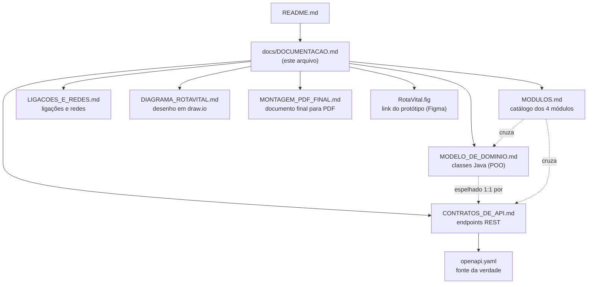

<h1 align="center">
  Rota Vital — Documentação Técnica <br> Índice de Documentação <br>
  🩸📚
</h1>

<p align="center">
    
    
    
</p>

> Mapa de toda a documentação técnica do Rota Vital. O [`README.md`](../README.md) principal só referencia
> este índice — o detalhe de cada documento (o que contém, quando ler, como abrir) vive aqui.

<h2 align="left">🧭 Sumário: </h2>

1. [Mapa dos documentos](#1-mapa)
2. [Modelo de Domínio](#2-dominio)
3. [Contratos de API](#3-api)
4. [Contrato OpenAPI (openapi.yaml)](#4-openapi)
5. [Módulos do Sistema](#5-modulos)
6. [Ligações e redes](#6-redes)
7. [Diagrama draw.io](#7-diagrama)
8. [Montagem do PDF final](#8-pdf)
9. [Protótipo (Figma)](#9-figma)
10. [Visualizando o contrato REST](#10-visualizar)

<h2 align="left" id="1-mapa">🗺️ 1. Mapa dos documentos</h2>



| Documento | Formato | Conteúdo | Leia quando... |
| :--- | :--- | :--- | :--- |
| [`MODELO_DE_DOMINIO.md`](MODELO_DE_DOMINIO.md) | Markdown + Mermaid | Diagrama de classes, composição/herança, enums, fluxo de `TesteFluxo` | se for mexer nas classes de `com.rotavital.dominio` |
| [`CONTRATOS_DE_API.md`](CONTRATOS_DE_API.md) | Markdown + Mermaid | Os 4 módulos REST, padrão de erro (RFC 7807), diagramas de sequência, gaps | se for desenhar ou consumir um endpoint |
| [`openapi.yaml`](openapi.yaml) | OpenAPI 3.0.3 | Fonte da verdade do contrato — schemas, exemplos, respostas | se for importar no Swagger/Postman/Insomnia |
| [`MODULOS.md`](MODULOS.md) | Markdown + Mermaid | Catálogo dos 4 módulos cruzando domínio ↔ contrato | quiser uma visão geral rápida do sistema |
| [`LIGACOES_E_REDES.md`](LIGACOES_E_REDES.md) | Markdown | Tabela de ligações, protocolos e redes/sub-redes com isolamento lógico | quiser validar a comunicação e a arquitetura de rede |
| [`DIAGRAMA_ROTAVITAL.md`](DIAGRAMA_ROTAVITAL.md) | Markdown + draw.io | Desenho da arquitetura com sub-redes, rótulos e legenda | quiser consultar o diagrama da solução |
| [`MONTAGEM_PDF_FINAL.md`](MONTAGEM_PDF_FINAL.md) | Markdown | Compilação final com capa, descrição, diagrama e verificação cruzada | quiser montar o PDF final |
| [`../RotaVital.fig`](../RotaVital.fig) | Texto (link) | Aponta para o protótipo publicado no Figma | se for discutir UI/UX do frontend |

<h2 align="left" id="2-dominio">🧬 2. Modelo de Domínio</h2>

Documenta o pacote `com.rotavital.dominio` (`backend/src/main/java/com/rotavital/dominio/`) — a entrega de
POO da sprint **W04**. Cobre `PontoDeRede`, `Endereco`, `Hospital`, `BancoDeSangue`, `Estoque`,
`BolsaHemocomponente`, `RequisicaoHospitalar` e os enums do domínio, além do fluxo manual de
[`TesteFluxo.java`](../backend/src/test/java/com/rotavital/dominio/TesteFluxo.java).

<h2 align="left" id="3-api">🌐 3. Contratos de API</h2>

Documenta os 5 temas da entrega **PI3-14 (RSD)**: padrões da API, e os módulos de Estoque, Requisições,
Rotas e Telemetria — cada um com sua tabela de endpoints, schema e diagrama de sequência/estado.

<h2 align="left" id="4-openapi">📄 4. Contrato OpenAPI (openapi.yaml)</h2>

Fonte da verdade do contrato REST, em OpenAPI 3.0.3. Validado com
[Spectral](https://github.com/stoplightio/spectral) (ruleset `spectral:oas`): **0 erros · 0 warnings**.

<h2 align="left" id="5-modulos">📦 5. Módulos do Sistema</h2>

Visão de catálogo dos 4 módulos (Estoque, Requisições, Rotas, Telemetria), cruzando o que cada um expõe no
contrato com a classe de domínio que ele espelha — ver [`MODULOS.md`](MODULOS.md).

<h2 align="left" id="6-redes">🌐 6. Ligações e Redes</h2>

Documenta a arquitetura de comunicação do sistema, incluindo:

- tabela de ligações e protocolos;
- portas de comunicação;
- isolamento por redes e sub-redes;
- regras de entrada e saída para cada segmento.

O detalhe completo está em [`LIGACOES_E_REDES.md`](LIGACOES_E_REDES.md).

<h2 align="left" id="7-diagrama">🗺️ 7. Diagrama draw.io</h2>

Arquivo do desenho da arquitetura com sub-redes, fluxos de dados e legenda, pronto para abrir em draw.io/app.diagrams.net e exportar em PNG/PDF.

- [`DIAGRAMA_ROTAVITAL.drawio`](DIAGRAMA_ROTAVITAL.drawio)
- [`DIAGRAMA_ROTAVITAL.md`](DIAGRAMA_ROTAVITAL.md)

<h2 align="left" id="8-pdf">📄 8. Montagem do PDF final</h2>

Documento compilado com as sete seções exigidas, pronta para exportação em PDF final e com verificação cruzada das dependências entre endpoints, ligações e redes.

- [`MONTAGEM_PDF_FINAL.md`](MONTAGEM_PDF_FINAL.md)

<h2 align="left" id="9-figma">🎨 9. Protótipo (Figma)</h2>

Protótipo Lo-Fi publicado no Figma, com link em [`RotaVital.fig`](../RotaVital.fig) (arquivo de texto na
raiz do repositório, apontando para o protótipo online) — acesso direto:
[letter-raven-07178463.figma.site](https://letter-raven-07178463.figma.site).

> As histórias de usuário (BDD) da Entrega 01 estão no [`README.md`](../README.md#-entrega-01) principal,
> na seção "Entrega 01", em blocos expansíveis (▶️).

<h2 align="left" id="10-visualizar">🔎 10. Visualizando o contrato REST</h2>

**Swagger UI (via Docker):**

```bash
docker run -p 8081:8080 -e SWAGGER_JSON=/spec/openapi.yaml \
  -v "$(pwd)/docs:/spec" swaggerapi/swagger-ui
```

Acesse `http://localhost:8081`.

**Postman / Insomnia:** `Importar → File → docs/openapi.yaml`. Os `examples` de cada operação já vêm
populados com os dados de [`TesteFluxo.java`](../backend/src/test/java/com/rotavital/dominio/TesteFluxo.java)
(`BS-01`/Hemope Central, `BOLSA-001`, `HOSP-01`/Hospital das Clínicas), prontos para teste manual sem
backend.

**Lint do contrato (Spectral):**

```bash
npx --yes @stoplight/spectral-cli lint docs/openapi.yaml --ruleset <(echo "extends: spectral:oas")
```