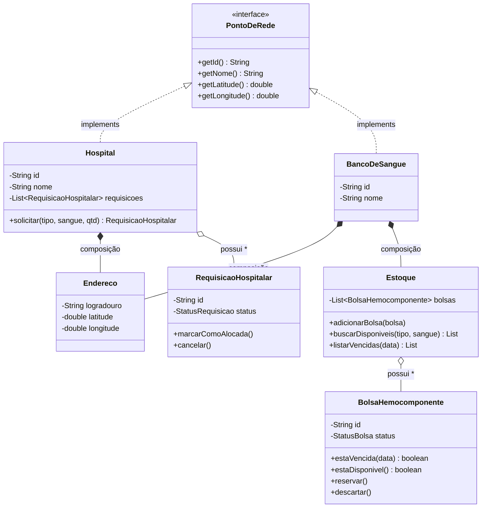
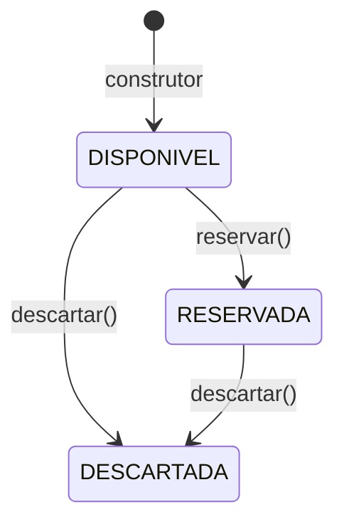
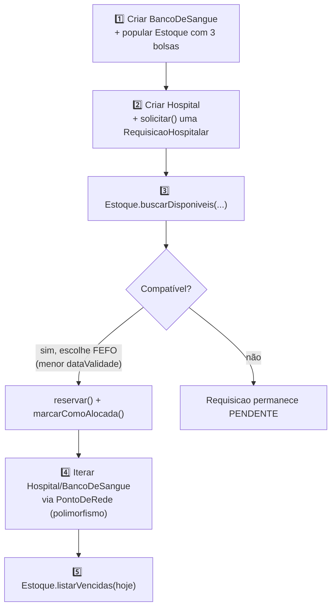

<h1 align="center">
  Rota Vital — Documentação Técnica <br> Modelo de Domínio (POO) <br>
  🩸🧬
</h1>

<p align="center">
    
    
    
    
    
</p>

>Pacote `com.rotavital.dominio`, em `backend/src/main/java/com/rotavital/dominio/` — a entrega de POO da
>sprint **W04**, usada como referência 1:1 pelo contrato REST documentado em
>[`CONTRATOS_DE_API.md`](CONTRATOS_DE_API.md). Este documento substitui os comentários/Javadoc que existiam
>nas classes: o código ficou só com a implementação, e a explicação de cada peça e das relações entre elas
>está aqui. 

<h2 align="left">🧭 Sumário: </h2>

1. [Visão geral: diagrama de classes](#1-visao-geral)
2. [PontoDeRede — o contrato comum](#2-pontoderede)
3. [Endereco — value object](#3-endereco)
4. [Hospital](#4-hospital)
5. [BancoDeSangue](#5-bancodesangue)
6. [Estoque](#6-estoque)
7. [BolsaHemocomponente](#7-bolsahemocomponente)
8. [RequisicaoHospitalar](#8-requisicaohospitalar)
9. [Enums](#9-enums)
10. [Fluxo de demonstração (TesteFluxo)](#10-testefluxo)
11. [Como executar](#11-executar)
12. [Onde o contrato de API diverge do domínio](#12-onde-o-contrato-diverge)
13. [Resumo final](#13-resumo)

<h2 align="left" id="1-visao-geral">🗺️ 1. Visão geral: diagrama de classes</h2>



- `Hospital` e `BancoDeSangue` **não têm relação de herança entre si**. Elas só compartilham o contrato da
  interface `PontoDeRede`, que existe para que ambas possam ser tratadas como nós do grafo de distribuição
  usado pelos algoritmos de rota (disciplina de AED).
- `Endereco` é um **value object** usado por **composição** dentro de `Hospital` e `BancoDeSangue` — não
  existe fora de um dono.
- `Estoque` é **composição** de `BancoDeSangue`: um estoque não existe sem o banco de sangue ao qual
  pertence, e é criado junto no construtor de `BancoDeSangue`.
- `RequisicaoHospitalar` é criada por `Hospital.solicitar(...)` e mantida numa lista dentro do próprio
  hospital que a originou.

<h2 align="left" id="2-pontoderede">🔌 2. PontoDeRede — o contrato comum</h2>

Interface implementada por `Hospital` e `BancoDeSangue`, sem nenhuma relação de herança entre as duas — só
o contrato em comum, o que permite tratá-las de forma polimórfica onde só interessa localização (ex.: o
algoritmo de rota mínima).

| Método | Retorno |
|---|---|
| `getId()` | `String` |
| `getNome()` | `String` |
| `getLatitude()` | `double` |
| `getLongitude()` | `double` |

<h2 align="left" id="3-endereco">📍 3. Endereco — value object</h2>

| Atributo | Tipo |
|---|---|
| `logradouro` | `String` |
| `latitude` | `double` |
| `longitude` | `double` |

Usado por composição dentro de `Hospital` e `BancoDeSangue` para fornecer as coordenadas exigidas por
`PontoDeRede`.

<h2 align="left" id="4-hospital">🏥 4. Hospital</h2>

`Hospital implements PontoDeRede`. Tem um `Endereco` (composição) e uma lista de `RequisicaoHospitalar`.

```java
public RequisicaoHospitalar solicitar(TipoComponente tipoComponente,
                                       TipoSanguineo tipoSanguineo,
                                       int quantidade)
```

Cria uma nova `RequisicaoHospitalar` vinculada a este hospital, adiciona à lista interna e a retorna.

<h2 align="left" id="5-bancodesangue">🏦 5. BancoDeSangue</h2>

`BancoDeSangue implements PontoDeRede`. Tem um `Endereco` (composição) e um `Estoque` — **composição criada
automaticamente no construtor**: não é possível ter um `BancoDeSangue` sem `Estoque`.

<h2 align="left" id="6-estoque">📦 6. Estoque</h2>

Controla o conjunto de `BolsaHemocomponente` de um `BancoDeSangue`. É composição: não existe um `Estoque`
sem o `BancoDeSangue` ao qual pertence.

| Método | O que faz |
|---|---|
| `adicionarBolsa(bolsa)` | Inclui uma bolsa no estoque |
| `buscarDisponiveis(tipoComponente, tipoSanguineo)` | Filtra bolsas `DISPONIVEL` que casam com o tipo pedido — base do algoritmo de alocação (compatibilidade ABO/Rh) |
| `listarVencidas(dataReferencia)` | Filtra bolsas cuja `dataValidade` já passou |

<h2 align="left" id="7-bolsahemocomponente">🩸 7. BolsaHemocomponente</h2>

Unidade física de hemocomponente (bolsa) armazenada em um banco de sangue, com tipo, validade, volume e
status. Nasce sempre com `status = DISPONIVEL`.



| Método | O que faz |
|---|---|
| `estaVencida(dataReferencia)` | Compara a data de referência com `dataValidade` |
| `estaDisponivel()` | Atalho para `status == DISPONIVEL` |
| `reservar()` | Transição para `RESERVADA` |
| `descartar()` | Transição para `DESCARTADA` |

<h2 align="left" id="8-requisicaohospitalar">📋 8. RequisicaoHospitalar</h2>

Representa o pedido de hemocomponentes feito por um `Hospital` a um banco de sangue. Nasce com `id` gerado
(`UUID`), `dataSolicitacao = LocalDateTime.now()` e `status = PENDENTE`.

| Método | O que faz |
|---|---|
| `marcarComoAlocada()` | Chamado quando uma bolsa compatível é encontrada e reservada para esta requisição |
| `cancelar()` | Marca a requisição como `CANCELADA` |

<h2 align="left" id="9-enums">🏷️ 9. Enums</h2>

| Enum | Valores | Usado em |
|---|---|---|
| `TipoComponente` | `HEMACIAS`, `PLASMA`, `PLAQUETAS`, `CRIOPRECIPITADO` | `BolsaHemocomponente`, `RequisicaoHospitalar` |
| `TipoSanguineo` | `A_POSITIVO`, `A_NEGATIVO`, `B_POSITIVO`, `B_NEGATIVO`, `AB_POSITIVO`, `AB_NEGATIVO`, `O_POSITIVO`, `O_NEGATIVO` | `BolsaHemocomponente`, `RequisicaoHospitalar` |
| `StatusBolsa` | `DISPONIVEL`, `RESERVADA`, `EM_TRANSITO`, `ENTREGUE`, `DESCARTADA` | `BolsaHemocomponente` |
| `StatusRequisicao` | `PENDENTE`, `ALOCADA`, `EM_TRANSITO`, `ENTREGUE`, `CANCELADA` | `RequisicaoHospitalar` |

<h2 align="left" id="10-testefluxo">🧪 10. Fluxo de demonstração (TesteFluxo)</h2>

[`TesteFluxo.java`](../backend/src/test/java/com/rotavital/dominio/TesteFluxo.java) é uma classe com `main`
que simula manualmente o fluxo básico do domínio — não é um teste automatizado (JUnit), é só uma
demonstração para validar que o modelo funciona antes de integrar com Spring Boot / persistência nas
próximas sprints.



| Etapa | O que demonstra |
|---|---|
| Popular estoque + criar requisição | Construtores e composição (`Estoque` dentro de `BancoDeSangue`) |
| Buscar compatíveis e alocar | **FEFO** (First Expired, First Out) feito "na mão" com `Comparator` sobre `dataValidade` |
| Iterar via `PontoDeRede` | Polimorfismo entre `Hospital` e `BancoDeSangue`, sem herança entre eles |
| Listar vencidas | `Estoque.listarVencidas` |

<h2 align="left" id="11-executar">▶️ 11. Como executar</h2>

```bash
cd backend
javac -d out $(find src/main/java src/test/java -name "*.java")
java -cp out com.rotavital.dominio.TesteFluxo
```

<h2 align="left" id="12-onde-o-contrato-diverge">🕳️ 12. Onde o contrato de API diverge do domínio</h2>

O contrato REST ([`openapi.yaml`](openapi.yaml) / [`CONTRATOS_DE_API.md`](CONTRATOS_DE_API.md)) foi
desenhado para espelhar 1:1 estas classes, mas antecipa alguns campos e estruturas que ainda não existem
aqui:

| Gap | Detalhe |
|---|---|
| `urgencia` em `RequisicaoHospitalar` | Existe no contrato (`NivelUrgencia`), não no domínio |
| `loteSintetico` em `BolsaHemocomponente` | Existe no contrato, não no domínio |
| Estrutura de grafo para `/rotas/conexoes` | Não existe no domínio — só lat/long via `PontoDeRede` |
| Classes de domínio para telemetria | Não existem — módulo `/telemetria` foi modelado só a partir da subtask |

> Ver a tabela completa em [`CONTRATOS_DE_API.md`, seção 8](CONTRATOS_DE_API.md#8-gaps).

<h2 align="left" id="13-resumo">📌 13. Resumo final</h2>

```
┌──────────────────────────────────────────────────────────────────┐
│  MODELO DE DOMÍNIO (POO) — com.rotavital.dominio                  │
├──────────────────────────────────────────────────────────────────┤
│  🔌 PontoDeRede     → interface comum, sem herança entre os dois   │
│  🏥 Hospital        → composição Endereco + lista de Requisições   │
│  🏦 BancoDeSangue   → composição Endereco + Estoque                │
│  📦 Estoque         → composição de BancoDeSangue; busca FEFO      │
│  🩸 BolsaHemocomponente → DISPONIVEL → RESERVADA/DESCARTADA        │
│  📋 RequisicaoHospitalar → PENDENTE → ALOCADA/CANCELADA            │
│  🧪 TesteFluxo      → demonstração manual, sem JUnit ainda         │
└──────────────────────────────────────────────────────────────────┘
```

> 🎓 **Conclusão:** a mesma composição `BancoDeSangue → Estoque → BolsaHemocomponente` e a mesma interface
> `PontoDeRede`, sem herança entre `Hospital` e `BancoDeSangue`, sustentam tanto o `TesteFluxo` quanto o
> contrato REST documentado em [`CONTRATOS_DE_API.md`](CONTRATOS_DE_API.md) — a API não inventa uma
> modelagem nova, só expõe esta por HTTP
> .
