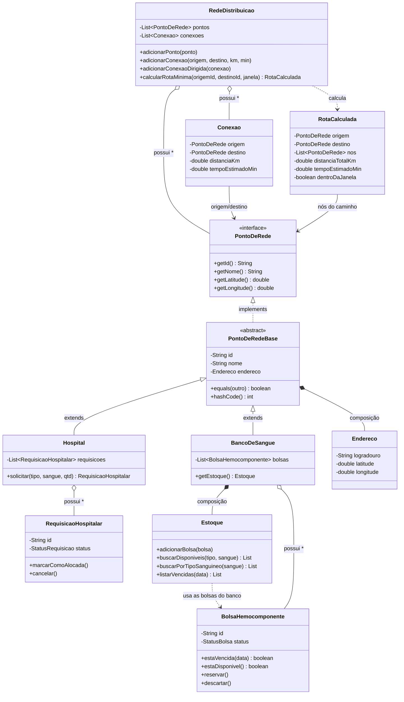
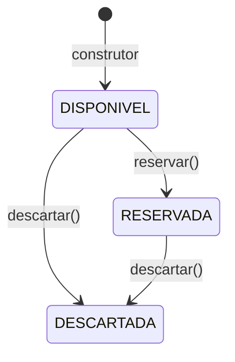
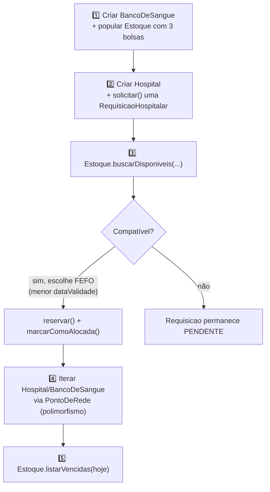

<h1 align="center">
  Rota Vital — Documentação Técnica <br> Modelo de Domínio (POO) <br>
  🩸🧬
</h1>

<p align="center">
    
    
    
    
    
</p>

>Pacote `com.rotavital.dominio`, em `backend/src/main/java/com/rotavital/dominio/` — a entrega de POO da
>sprint **W04**, usada como referência 1:1 pelo contrato REST documentado em
>[`CONTRATOS_DE_API.md`](CONTRATOS_DE_API.md). Este documento substitui os comentários/Javadoc que existiam
>nas classes: o código ficou só com a implementação, e a explicação de cada peça e das relações entre elas
>está aqui. 

<h2 align="left">🧭 Sumário: </h2>

1. [Visão geral: diagrama de classes](#1-visao-geral)
2. [PontoDeRede — o contrato comum](#2-pontoderede)
3. [Endereco — value object](#3-endereco)
4. [Hospital](#4-hospital)
5. [BancoDeSangue](#5-bancodesangue)
6. [Estoque](#6-estoque)
7. [BolsaHemocomponente](#7-bolsahemocomponente)
8. [RequisicaoHospitalar](#8-requisicaohospitalar)
9. [Conexao](#9-conexao)
10. [RedeDistribuicao — grafo e rota mínima (Dijkstra)](#10-rededistribuicao)
11. [RotaCalculada](#11-rotacalculada)
12. [Enums](#12-enums)
13. [Fluxo de demonstração (TesteFluxo) e testes JUnit](#13-testefluxo)
14. [Como executar](#14-executar)
15. [Onde o contrato de API diverge do domínio](#15-onde-o-contrato-diverge)
16. [Resumo final](#16-resumo)

<h2 align="left" id="1-visao-geral">🗺️ 1. Visão geral: diagrama de classes</h2>


```mermaid
classDiagram
    class PontoDeRede {
        <<interface>>
        +getId() String
        +getNome() String
        +getLatitude() double
        +getLongitude() double
    }

    class PontoDeRedeBase {
        <<abstract>>
        -String id
        -String nome
        -Endereco endereco
        +equals(outro) boolean
        +hashCode() int
    }

    class Endereco {
        -String logradouro
        -double latitude
        -double longitude
    }

    class Hospital {
        -List~RequisicaoHospitalar~ requisicoes
        +solicitar(tipo, sangue, qtd) RequisicaoHospitalar
    }

    class BancoDeSangue {
        -List~BolsaHemocomponente~ bolsas
        +getEstoque() Estoque
    }

    class Estoque {
        +adicionarBolsa(bolsa)
        +buscarDisponiveis(tipo, sangue) List
        +buscarPorTipoSanguineo(sangue) List
        +listarVencidas(data) List
    }

    class BolsaHemocomponente {
        -String id
        -StatusBolsa status
        +estaVencida(data) boolean
        +estaDisponivel() boolean
        +reservar()
        +descartar()
    }

    class RequisicaoHospitalar {
        -String id
        -StatusRequisicao status
        +marcarComoAlocada()
        +cancelar()
    }

    class Conexao {
        -PontoDeRede origem
        -PontoDeRede destino
        -double distanciaKm
        -double tempoEstimadoMin
    }

    class RedeDistribuicao {
        -List~PontoDeRede~ pontos
        -List~Conexao~ conexoes
        +adicionarPonto(ponto)
        +adicionarConexao(origem, destino, km, min)
        +adicionarConexaoDirigida(conexao)
        +calcularRotaMinima(origemId, destinoId, janela) RotaCalculada
    }

    class RotaCalculada {
        -PontoDeRede origem
        -PontoDeRede destino
        -List~PontoDeRede~ nos
        -double distanciaTotalKm
        -double tempoEstimadoMin
        -boolean dentroDaJanela
    }

    PontoDeRede <|.. PontoDeRedeBase : implements
    PontoDeRedeBase <|-- Hospital : extends
    PontoDeRedeBase <|-- BancoDeSangue : extends
    PontoDeRedeBase *-- Endereco : composição
    BancoDeSangue *-- Estoque : composição
    BancoDeSangue o-- BolsaHemocomponente : possui *
    Estoque ..> BolsaHemocomponente : usa as bolsas do banco
    Hospital o-- RequisicaoHospitalar : possui *
    RedeDistribuicao o-- PontoDeRede : possui *
    RedeDistribuicao o-- Conexao : possui *
    Conexao --> PontoDeRede : origem/destino
    RedeDistribuicao ..> RotaCalculada : calcula
    RotaCalculada --> PontoDeRede : nós do caminho
```

- `Hospital` e `BancoDeSangue` **herdam da classe abstrata `PontoDeRedeBase`**, que implementa a interface
  `PontoDeRede` e concentra o que é comum aos dois (`id`, `nome`, `endereco` e a igualdade por `id`). A
  herança existe por causa do JPA (PI3-150): os dois ficam na mesma tabela `ponto_rede`, e a coluna `tipo`
  diz qual classe criar ao ler cada linha. O grafo de distribuição continua usando só a interface
  `PontoDeRede` (disciplina de AED).
- `Endereco` é um **value object** usado por **composição** dentro de `PontoDeRedeBase` — não existe fora de
  um dono. No banco, vira as colunas `logradouro`, `latitude` e `longitude` da própria tabela `ponto_rede`.
- `Estoque` é **composição** de `BancoDeSangue`: um estoque não existe sem o banco de sangue ao qual
  pertence, e é criado junto no construtor de `BancoDeSangue`. Ele **não tem lista própria**: trabalha sobre
  a lista de bolsas do banco de sangue, que o Hibernate carrega da tabela `bolsa_hemocomponente`.
- `RequisicaoHospitalar` é criada por `Hospital.solicitar(...)` e mantida numa lista dentro do próprio
  hospital que a originou.
- `RedeDistribuicao` é o grafo de distribuição: guarda os `PontoDeRede` (nós) e as `Conexao` (arestas) e
  calcula o menor caminho entre dois pontos, devolvendo uma `RotaCalculada` — ver
  [seção 10](#10-rededistribuicao).

**Mapeamento para o banco (JPA, PI3-150).** As próprias classes do domínio são as entidades: não existe uma
segunda camada de classes só para o banco. O schema vem das migrations do Supabase e o Hibernate só confere
se as classes batem com as tabelas (`ddl-auto=validate`).

| Classe | No banco |
|---|---|
| `PontoDeRedeBase` → `Hospital` / `BancoDeSangue` | Tabela `ponto_rede`, herança `SINGLE_TABLE` com a coluna `tipo` = `HOSPITAL` / `BANCO_DE_SANGUE` |
| `Endereco` | Embutido (`@Embeddable`) nas colunas de `ponto_rede` |
| `BolsaHemocomponente` | Tabela `bolsa_hemocomponente`, ligada ao banco de sangue por `banco_origem_id` |
| `Conexao` | Tabela `conexao` — cada linha é uma aresta num único sentido |
| `Estoque`, `RequisicaoHospitalar`, `RedeDistribuicao`, `RotaCalculada` | Não são entidades: existem só em memória, durante a chamada |

<h2 align="left" id="2-pontoderede">🔌 2. PontoDeRede — o contrato comum</h2>

Interface que define o que todo nó do grafo precisa ter, o que permite tratar `Hospital` e `BancoDeSangue`
de forma polimórfica onde só interessa localização (ex.: o algoritmo de rota mínima). É implementada por
`PontoDeRedeBase`, a classe abstrata da qual os dois herdam.

| Método | Retorno |
|---|---|
| `getId()` | `String` |
| `getNome()` | `String` |
| `getLatitude()` | `double` |
| `getLongitude()` | `double` |

`PontoDeRedeBase` guarda `id`, `nome` e `endereco` e implementa esses quatro métodos (latitude e longitude
vêm do `Endereco`). Também define que **dois pontos com o mesmo `id` são iguais** (`equals`/`hashCode`): com
JPA, a mesma linha do banco pode chegar em objetos diferentes, e o Dijkstra usa os pontos como chave de
`HashMap`.

<h2 align="left" id="3-endereco">📍 3. Endereco — value object</h2>

| Atributo | Tipo |
|---|---|
| `logradouro` | `String` |
| `latitude` | `double` |
| `longitude` | `double` |

Usado por composição dentro de `PontoDeRedeBase` (herdado por `Hospital` e `BancoDeSangue`) para fornecer
as coordenadas exigidas por `PontoDeRede`.

<h2 align="left" id="4-hospital">🏥 4. Hospital</h2>

`Hospital extends PontoDeRedeBase` (linha de `ponto_rede` com `tipo = HOSPITAL`). Herda `id`, `nome` e
`Endereco` e tem uma lista de `RequisicaoHospitalar`, que ainda não é gravada no banco (`@Transient`).

```java
public RequisicaoHospitalar solicitar(TipoComponente tipoComponente,
                                       TipoSanguineo tipoSanguineo,
                                       int quantidade)
```

Cria uma nova `RequisicaoHospitalar` vinculada a este hospital, adiciona à lista interna e a retorna.

<h2 align="left" id="5-bancodesangue">🏦 5. BancoDeSangue</h2>

`BancoDeSangue extends PontoDeRedeBase` (linha de `ponto_rede` com `tipo = BANCO_DE_SANGUE`). Herda `id`,
`nome` e `Endereco`, tem a lista de bolsas lida do banco (as linhas de `bolsa_hemocomponente` com o seu `id`
em `banco_origem_id`, ordenadas por `dataValidade`) e um `Estoque` — **composição criada automaticamente no
construtor**: não é possível ter um `BancoDeSangue` sem `Estoque`.

<h2 align="left" id="6-estoque">📦 6. Estoque</h2>

Controla o conjunto de `BolsaHemocomponente` de um `BancoDeSangue`. É composição: não existe um `Estoque`
sem o `BancoDeSangue` ao qual pertence. Não guarda uma lista própria — todos os métodos trabalham sobre a
lista de bolsas do banco de sangue, então o estoque enxerga exatamente o que foi carregado do banco.

| Método | O que faz |
|---|---|
| `adicionarBolsa(bolsa)` | Inclui uma bolsa no estoque (na lista do banco de sangue) |
| `getBolsas()` | Devolve as bolsas do banco de sangue |
| `buscarDisponiveis(tipoComponente, tipoSanguineo)` | Filtra bolsas `DISPONIVEL` que casam com o tipo pedido — base do algoritmo de alocação (compatibilidade ABO/Rh) |
| `buscarPorTipoSanguineo(tipoSanguineo)` | Filtra as bolsas de um tipo sanguíneo — usado no filtro de `GET /api/v1/bancos/{bancoId}/estoque` |
| `listarVencidas(dataReferencia)` | Filtra bolsas cuja `dataValidade` já passou |

<h2 align="left" id="7-bolsahemocomponente">🩸 7. BolsaHemocomponente</h2>

Unidade física de hemocomponente (bolsa) armazenada em um banco de sangue, com tipo, validade, volume,
`loteSintetico` (identificador do lote gerado para simulação com dados sintéticos) e status. Nasce sempre
com `status = DISPONIVEL`. Cada bolsa é uma linha de `bolsa_hemocomponente`.


```mermaid
stateDiagram-v2
    [*] --> DISPONIVEL : construtor
    DISPONIVEL --> RESERVADA : reservar()
    DISPONIVEL --> DESCARTADA : descartar()
    RESERVADA --> DESCARTADA : descartar()
```

| Método | O que faz |
|---|---|
| `estaVencida(dataReferencia)` | Compara a data de referência com `dataValidade` |
| `estaForaDaFaixa()` | Compara `temperaturaCelsius` com a faixa ideal do `TipoComponente` |
| `estaDisponivel()` | Atalho para `status == DISPONIVEL` |
| `reservar()` | Transição para `RESERVADA` |
| `descartar()` | Transição para `DESCARTADA` |

<h2 align="left" id="8-requisicaohospitalar">📋 8. RequisicaoHospitalar</h2>

Representa o pedido de hemocomponentes feito por um `Hospital` a um banco de sangue. Nasce com `id` gerado
(`UUID`), `dataSolicitacao = LocalDateTime.now()` e `status = PENDENTE`.

| Método | O que faz |
|---|---|
| `marcarComoAlocada()` | Chamado quando uma bolsa compatível é encontrada e reservada para esta requisição |
| `cancelar()` | Marca a requisição como `CANCELADA` |

<h2 align="left" id="9-conexao">🔗 9. Conexao</h2>

Aresta do grafo de distribuição: liga dois `PontoDeRede` (origem e destino) com a distância (`km`) e o tempo
estimado (`min`) entre eles, **num único sentido**. Não tem setters: os campos só são atribuídos no
construtor (não são `final` porque o Hibernate precisa preenchê-los ao ler do banco). No banco, cada linha
de `conexao` é uma aresta, com `id` gerado pelo próprio banco — a ida e a volta são duas linhas.

| Atributo | Tipo |
|---|---|
| `origem` / `destino` | `PontoDeRede` |
| `distanciaKm` | `double` |
| `tempoEstimadoMin` | `double` |

<h2 align="left" id="10-rededistribuicao">🕸️ 10. RedeDistribuicao — grafo e rota mínima (Dijkstra)</h2>

O grafo de distribuição em si: uma lista de `PontoDeRede` (nós) e uma lista de `Conexao` (arestas). Entrega
a Sprint W04 de "cálculo de rota mínima" (algoritmos de AED).

| Método | O que faz |
|---|---|
| `adicionarPonto(ponto)` | Inclui um nó (`Hospital` ou `BancoDeSangue`) no grafo |
| `adicionarConexao(origem, destino, km, min)` | Cria a aresta **nos dois sentidos** (duas `Conexao`, uma por direção) |
| `adicionarConexaoDirigida(conexao)` | Inclui exatamente a `Conexao` recebida, **num sentido só** — usado com as conexões lidas do banco, que já guarda ida e volta como duas linhas (com `adicionarConexao`, as arestas ficariam duplicadas) |
| `calcularRotaMinima(origemId, destinoId, janelaEntregaLimite)` | Dijkstra sobre `distanciaKm` como peso; devolve uma `RotaCalculada` |

`calcularRotaMinima` implementa o algoritmo de **Dijkstra** "na mão" (sem biblioteca de grafos), usando uma
`PriorityQueue` ordenada pela distância acumulada e um mapa de predecessores para reconstruir o caminho.
Também acumula o tempo estimado ao longo do caminho e verifica se o total cabe dentro de
`janelaEntregaLimite` (quando informada). Lança `IllegalStateException` se não existir caminho até o
destino, e `IllegalArgumentException` se `origemId`/`destinoId` não corresponder a nenhum ponto cadastrado.

> ✅ Exposta via `RotaController` (`GET /api/v1/pontos`, `GET /api/v1/conexoes`, `GET /api/v1/rotas`). A
> cada chamada, `RedeDistribuicaoService.carregarRede()` monta a rede com o que está no banco (PI3-152): os
> pontos de `ponto_rede` (bancos de sangue primeiro, depois por `id`) e as linhas de `conexao`, cada uma
> incluída com `adicionarConexaoDirigida`. Com o `supabase/seed.sql`, são o hemocentro `BS-01` + 6
> hospitais. `TesteFluxo` continua sem exercitá-la; quem cobre a montagem e o Dijkstra são os testes JUnit
> da [seção 13](#13-testefluxo).

<h2 align="left" id="11-rotacalculada">🧭 11. RotaCalculada</h2>

Resultado de `RedeDistribuicao.calcularRotaMinima(...)`: um objeto de retorno imutável, não uma entidade
persistida.

| Atributo | Tipo |
|---|---|
| `origem` / `destino` | `PontoDeRede` |
| `nos` | `List<PontoDeRede>` — caminho completo, origem→destino |
| `distanciaTotalKm` | `double` |
| `tempoEstimadoMin` | `double` |
| `dentroDaJanela` | `boolean` |

<h2 align="left" id="12-enums">🏷️ 12. Enums</h2>

| Enum | Valores | Usado em |
|---|---|---|
| `TipoComponente` | `HEMACIAS`, `PLASMA`, `PLAQUETAS`, `CRIOPRECIPITADO` | `BolsaHemocomponente`, `RequisicaoHospitalar` |
| `TipoSanguineo` | `A_POSITIVO`, `A_NEGATIVO`, `B_POSITIVO`, `B_NEGATIVO`, `AB_POSITIVO`, `AB_NEGATIVO`, `O_POSITIVO`, `O_NEGATIVO` | `BolsaHemocomponente`, `RequisicaoHospitalar` |
| `StatusBolsa` | `DISPONIVEL`, `RESERVADA`, `EM_TRANSITO`, `ENTREGUE`, `DESCARTADA`, `UTILIZADA` | `BolsaHemocomponente` |
| `StatusRequisicao` | `PENDENTE`, `ALOCADA`, `EM_TRANSITO`, `ENTREGUE`, `CANCELADA` | `RequisicaoHospitalar` |

<h2 align="left" id="13-testefluxo">🧪 13. Fluxo de demonstração (TesteFluxo) e testes JUnit</h2>

[`TesteFluxo.java`](../backend/src/test/java/com/rotavital/dominio/TesteFluxo.java) é uma classe com `main`
que simula manualmente o fluxo básico do domínio — não é um teste automatizado (JUnit), é só uma
demonstração do modelo, sem banco de dados. Os testes automatizados estão logo abaixo, na
[tabela de testes JUnit](#testes-junit).


```mermaid
flowchart TD
    A["1️⃣ Criar BancoDeSangue<br/>+ popular Estoque com 3 bolsas"] --> B["2️⃣ Criar Hospital<br/>+ solicitar() uma RequisicaoHospitalar"]
    B --> C["3️⃣ Estoque.buscarDisponiveis(...)"]
    C --> D{"Compatível?"}
    D -- "sim, escolhe FEFO<br/>(menor dataValidade)" --> E["reservar() + marcarComoAlocada()"]
    D -- "não" --> F["Requisicao permanece PENDENTE"]
    E --> G["4️⃣ Iterar Hospital/BancoDeSangue<br/>via PontoDeRede (polimorfismo)"]
    G --> H["5️⃣ Estoque.listarVencidas(hoje)"]
```

| Etapa | O que demonstra |
|---|---|
| Popular estoque + criar requisição | Construtores e composição (`Estoque` dentro de `BancoDeSangue`) |
| Buscar compatíveis e alocar | **FEFO** (First Expired, First Out) feito "na mão" com `Comparator` sobre `dataValidade` |
| Iterar via `PontoDeRede` | Polimorfismo entre `Hospital` e `BancoDeSangue` pela interface comum |
| Listar vencidas | `Estoque.listarVencidas` |

> `TesteFluxo` ainda não exercita `RedeDistribuicao`/`Conexao`/`RotaCalculada` — a demonstração cobre só o
> fluxo de estoque + requisição. Ver [seção 10](#10-rededistribuicao).

<h3 align="left" id="testes-junit">✅ Testes JUnit do domínio e dos serviços (PI3-153)</h3>

Garantem que a migração para o banco (PI3-122) não mudou o comportamento. Rodam sem banco de dados: os
serviços recebem repositórios falsos (`RepositorioFalso`, feito com `java.lang.reflect.Proxy`, sem
biblioteca extra), que devolvem o que as tabelas devolveriam.

| Classe | O que garante |
|---|---|
| [`PontoDeRedeTest`](../backend/src/test/java/com/rotavital/dominio/PontoDeRedeTest.java) | `Hospital` e `BancoDeSangue` herdam de `PontoDeRedeBase`; pontos com o mesmo `id` são iguais, inclusive como chave de `HashMap` |
| [`BolsaHemocomponenteTest`](../backend/src/test/java/com/rotavital/dominio/BolsaHemocomponenteTest.java) | Bolsa nasce `DISPONIVEL`; `reservar()`/`descartar()`; vencimento; temperatura fora da faixa |
| [`EstoqueTest`](../backend/src/test/java/com/rotavital/dominio/EstoqueTest.java) | O estoque enxerga as bolsas carregadas no banco de sangue; filtros por disponibilidade, tipo sanguíneo e vencimento |
| [`RedeDistribuicaoTest`](../backend/src/test/java/com/rotavital/dominio/RedeDistribuicaoTest.java) | `adicionarConexaoDirigida` cria uma aresta só; Dijkstra com ida e volta gravadas separadamente; erros de ponto inexistente e sem caminho |
| [`EstoqueServiceTest`](../backend/src/test/java/com/rotavital/servico/EstoqueServiceTest.java) | Banco inexistente devolve vazio (404 na API); estoque com e sem filtro de tipo sanguíneo |
| [`RedeDistribuicaoServiceTest`](../backend/src/test/java/com/rotavital/servico/RedeDistribuicaoServiceTest.java) | Ordem dos pontos (bancos de sangue primeiro, depois por `id`); cada linha de `conexao` vira uma única aresta |

<h2 align="left" id="14-executar">▶️ 14. Como executar</h2>

```bash
cd backend
mvn test                       # testes JUnit (domínio, serviços e AuditoriaTelemetriaTest)
mvn test-compile
java -cp target/classes:target/test-classes com.rotavital.dominio.TesteFluxo
```

No Windows (PowerShell), o separador do classpath é `;`:
`java -cp "target/classes;target/test-classes" com.rotavital.dominio.TesteFluxo`.

<h2 align="left" id="15-onde-o-contrato-diverge">🕳️ 15. Onde o contrato de API diverge do domínio</h2>

O contrato REST ([`openapi.yaml`](openapi.yaml) / [`CONTRATOS_DE_API.md`](CONTRATOS_DE_API.md)) foi
desenhado para espelhar 1:1 estas classes, mas ainda diverge em alguns pontos:

| Gap | Detalhe |
|---|---|
| `urgencia` em `RequisicaoHospitalar` | Existe no contrato (`NivelUrgencia`), não no domínio |
| Classes de domínio para telemetria | Não existem — módulo de telemetria (`/entregas/{id}/leituras`) foi modelado só a partir da subtask |

> Ver a tabela completa em [`CONTRATOS_DE_API.md`, seção 9](CONTRATOS_DE_API.md#9-gaps).

<h2 align="left" id="16-resumo">📌 16. Resumo final</h2>

```
┌──────────────────────────────────────────────────────────────────┐
│  MODELO DE DOMÍNIO (POO) — com.rotavital.dominio                  │
├──────────────────────────────────────────────────────────────────┤
│  🔌 PontoDeRede     → interface comum, implementada por PontoDeRedeBase │
│  🧱 PontoDeRedeBase → base abstrata de Hospital e BancoDeSangue (JPA)  │
│  🏥 Hospital        → composição Endereco + lista de Requisições   │
│  🏦 BancoDeSangue   → composição Endereco + Estoque                │
│  📦 Estoque         → composição de BancoDeSangue; busca FEFO      │
│  🩸 BolsaHemocomponente → DISPONIVEL → RESERVADA/DESCARTADA        │
│  📋 RequisicaoHospitalar → PENDENTE → ALOCADA/CANCELADA            │
│  🔗 Conexao / 🕸️ RedeDistribuicao → grafo + Dijkstra, via RotaController │
│  🧭 RotaCalculada   → retorno imutável de calcularRotaMinima(...)  │
│  🗄️ Persistência    → as classes do domínio são as entidades JPA     │
│  🧪 TesteFluxo      → demonstração manual; testes JUnit na seção 13 │
└──────────────────────────────────────────────────────────────────┘
```

> 🎓 **Conclusão:** a mesma composição `BancoDeSangue → Estoque → BolsaHemocomponente` e a mesma interface
> `PontoDeRede` sustentam o `TesteFluxo`, o contrato REST documentado em
> [`CONTRATOS_DE_API.md`](CONTRATOS_DE_API.md) e a leitura do banco — a API não inventa uma modelagem nova,
> só expõe esta por HTTP, e o JPA mapeia essas mesmas classes para as tabelas do Supabase. O grafo de rotas
> (`RedeDistribuicao`) já chegou ao domínio e ao `RotaController`
> .
