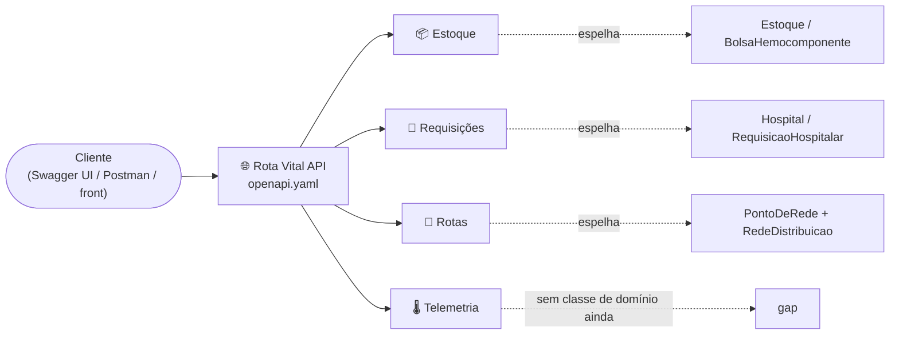
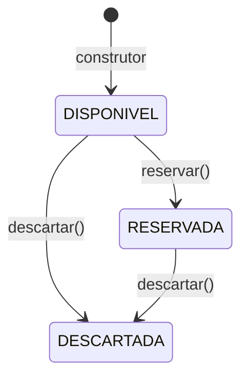
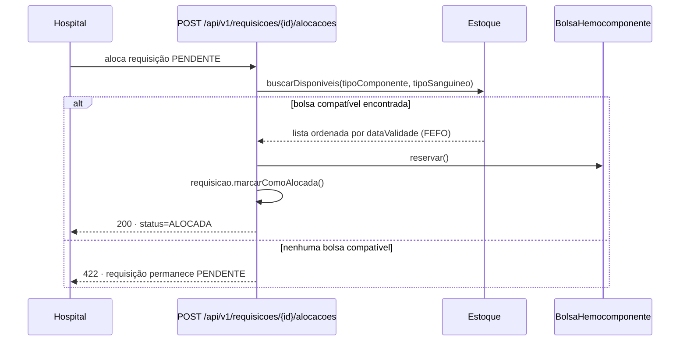

<h1 align="center">
  Rota Vital — Documentação Técnica <br> Módulos do Sistema <br>
  🩸📦
</h1>

<p align="center">
    
    
    
</p>

> Catálogo dos 4 módulos que compõem o Rota Vital, cruzando o que o contrato REST expõe
> ([`CONTRATOS_DE_API.md`](CONTRATOS_DE_API.md) / [`openapi.yaml`](openapi.yaml)) com as classes do modelo
> de domínio que cada um espelha ([`MODELO_DE_DOMINIO.md`](MODELO_DE_DOMINIO.md)). O README principal só
> referencia este arquivo — o detalhe de cada módulo vive aqui.

<h2 align="left">🧭 Sumário: </h2>

1. [Visão geral](#1-visao-geral)
2. [📦 Estoque e Hemocomponentes](#2-estoque)
3. [🏥 Requisições e Alocação](#3-requisicoes)
4. [🚚 Roteirização e Logística](#4-rotas)
5. [🌡️ Telemetria e Cadeia Fria](#5-telemetria)
6. [Resumo final](#6-resumo)

<h2 align="left" id="1-visao-geral">🗺️ 1. Visão geral</h2>



| Módulo | Recursos | Espelha no domínio | Status |
| :--- | :--- | :--- | :---: |
| 📦 Estoque e Hemocomponentes | `/bancos/{bancoId}/estoque`, `/hemocomponentes` | `Estoque`, `BolsaHemocomponente` | ⚠️ Domínio + contrato prontos; só `GET /api/v1/bancos/{bancoId}/estoque` implementado |
| 🏥 Requisições e Alocação | `/requisicoes` | `Hospital`, `RequisicaoHospitalar` | ⚠️ Domínio + contrato prontos; nenhum controller ainda |
| 🚚 Roteirização e Logística | `/pontos`, `/conexoes`, `/rotas` | `PontoDeRede`, `RedeDistribuicao`, `Conexao`, `RotaCalculada` | ✅ Implementado (`RotaController`, grafo + Dijkstra) |
| 🌡️ Telemetria e Cadeia Fria | `/entregas/{id}/leituras` | *(nenhuma)* | ⚠️ Só contrato, sem domínio nem controller |

> ⚠️ **Fora deste catálogo de 4:** `POST /api/v1/acessos` (HU-01) está implementado em `AcessoController`,
> funcionando de fato **e já documentado** em `openapi.yaml`/`CONTRATOS_DE_API.md` — só não entra aqui
> porque este catálogo cruza contrato com classe de domínio, e Acesso não espelha nenhuma. Ver
> [`CONTRATOS_DE_API.md`, seção 3](CONTRATOS_DE_API.md#3-acesso).

<h2 align="left" id="2-estoque">📦 2. Estoque e Hemocomponentes</h2>

Controla o cadastro e o ciclo de vida das bolsas de hemocomponentes de um banco de sangue.

| Método | Endpoint | Descrição | Equivalente no domínio |
| :--- | :--- | :--- | :--- |
| `GET` | `/api/v1/bancos/{bancoId}/estoque` | Estoque consolidado de um banco de sangue | `BancoDeSangue.getEstoque()` |
| `GET` | `/api/v1/hemocomponentes` | Lista bolsas (filtros: `bancoId`, `tipoComponente`, `tipoSanguineo`, `status`, `page`, `size`) | `Estoque.buscarDisponiveis(...)` |
| `POST` | `/api/v1/hemocomponentes` | Cadastra uma nova bolsa (`status` inicial `DISPONIVEL`) | construtor de `BolsaHemocomponente` |
| `PATCH` | `/api/v1/hemocomponentes/{id}` | Transição de status (`reservar`, `descartar`) | `reservar()` / `descartar()` |
| `DELETE` | `/api/v1/hemocomponentes/{id}` | Remove o cadastro (erro de lançamento) | — |



Detalhes de schema e DTOs Java: [`CONTRATOS_DE_API.md`, seção 4](CONTRATOS_DE_API.md#4-estoque).

<h2 align="left" id="3-requisicoes">🏥 3. Requisições e Alocação</h2>

Recebe pedidos de hospitais e dispara o algoritmo de alocação — compatibilidade **ABO/Rh** entre o tipo
solicitado e o tipo das bolsas, priorizando **FEFO** (*First Expired, First Out*: a bolsa de vencimento mais
próximo é escolhida primeiro).

| Método | Endpoint | Descrição | Equivalente no domínio |
| :--- | :--- | :--- | :--- |
| `POST` | `/api/v1/requisicoes` | Cria requisição (`status` inicial `PENDENTE`) | `Hospital.solicitar(...)` |
| `GET` | `/api/v1/requisicoes` | Lista requisições (filtros: `hospitalId`, `status`, `page`, `size`) | `Hospital.getRequisicoes()` |
| `POST` | `/api/v1/requisicoes/{id}/alocacoes` | Cria a alocação: busca bolsa compatível (FEFO/ABO-Rh) e reserva (`201`) | `Estoque.buscarDisponiveis(...)` + `reservar()` + `marcarComoAlocada()` |
| `PATCH` | `/api/v1/requisicoes/{id}` | Cancela a requisição (`{"status": "CANCELADA"}`) | `RequisicaoHospitalar.cancelar()` |



Detalhes de schema e DTOs Java: [`CONTRATOS_DE_API.md`, seção 5](CONTRATOS_DE_API.md#5-requisicoes).

<h2 align="left" id="4-rotas">🚚 4. Roteirização e Logística</h2>

Consulta o grafo de distribuição (hospitais + bancos de sangue como nós) e calcula a rota de menor custo
entre origem e destino — algoritmos de menor caminho da disciplina de AED.

| Método | Endpoint | Descrição | Equivalente no domínio |
| :--- | :--- | :--- | :--- |
| `GET` | `/api/v1/pontos` | Lista os nós do grafo | `RedeDistribuicao.getPontos()` |
| `GET` | `/api/v1/conexoes` | Lista as arestas do grafo (distância/tempo) | `RedeDistribuicao.getConexoes()` |
| `GET` | `/api/v1/rotas?origemId=&destinoId=&janelaEntregaLimite=` | Calcula a rota de menor custo | `RedeDistribuicao.calcularRotaMinima(...)` (Dijkstra) |

`Hospital` e `BancoDeSangue` **não têm herança entre si** — só implementam `PontoDeRede`, o que permite
tratá-los como nós intercambiáveis do mesmo grafo dentro de `RedeDistribuicao`.

O domínio resolve o grafo e o menor caminho com Dijkstra
([`MODELO_DE_DOMINIO.md`, seção 10](MODELO_DE_DOMINIO.md#10-rededistribuicao)) e os três endpoints acima já
rodam via `RotaController`, sobre uma rede populada em memória (`RedeDistribuicaoEmMemoria`: hemocentro
`BS-01` + 6 hospitais em topologia de estrela).

Detalhes de schema e DTOs Java: [`CONTRATOS_DE_API.md`, seção 6](CONTRATOS_DE_API.md#6-rotas).

<h2 align="left" id="5-telemetria">🌡️ 5. Telemetria e Cadeia Fria</h2>

Recebe e consulta leituras simuladas (dados sintéticos) de temperatura e localização de uma entrega em
trânsito, para acompanhar a cadeia fria dos hemocomponentes.

| Método | Endpoint | Descrição |
| :--- | :--- | :--- |
| `POST` | `/api/v1/entregas/{id}/leituras` | Registra uma leitura (timestamp, GPS, temperatura em °C) |
| `GET` | `/api/v1/entregas/{id}/leituras` | Histórico de leituras de uma entrega, em ordem cronológica |

Este módulo ainda **não tem nenhuma classe de domínio correspondente** — foi modelado só a partir do
contrato. Detalhes: [`CONTRATOS_DE_API.md`, seção 7](CONTRATOS_DE_API.md#7-telemetria).

<h2 align="left" id="6-resumo">📌 6. Resumo final</h2>

```
┌──────────────────────────────────────────────────────────────────┐
│  MÓDULOS DO SISTEMA — ROTA VITAL                                  │
├──────────────────────────────────────────────────────────────────┤
│  📦 Estoque        → domínio+contrato prontos; só GET implementado │
│  🏥 Requisições    → domínio+contrato prontos; sem controller      │
│  🚚 Rotas          → GET /pontos, /conexoes, /rotas → Dijkstra ✅   │
│  🌡️ Telemetria     → cadeia fria simulada — gap de domínio         │
│  🔑 Acesso (HU-01) → implementado e documentado, sem espelho no domínio │
└──────────────────────────────────────────────────────────────────┘
```

> Ver o modelo de domínio completo em [`MODELO_DE_DOMINIO.md`](MODELO_DE_DOMINIO.md) e a tabela integral de
> gaps entre contrato e domínio em [`CONTRATOS_DE_API.md`, seção 9](CONTRATOS_DE_API.md#9-gaps). Dos 4
> módulos do catálogo, **Estoque** (só `GET /api/v1/bancos/{bancoId}/estoque`) e **Rotas** (os 3 endpoints) já rodam em
> código hoje — Requisições e Telemetria ainda descrevem só o contrato aprovado, não o backend em produção.
