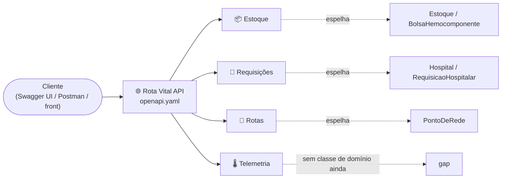
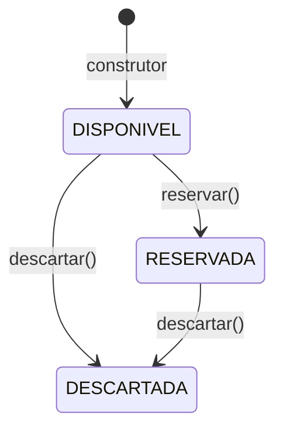
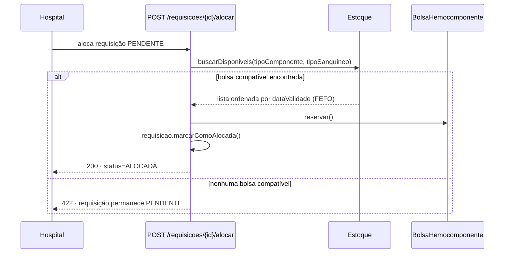

<h1 align="center">
  Rota Vital — Documentação Técnica <br> Módulos do Sistema <br>
  🩸📦
</h1>

<p align="center">
    
    
    
</p>

> Catálogo dos 4 módulos que compõem o Rota Vital, cruzando o que o contrato REST expõe
> ([`CONTRATOS_DE_API.md`](CONTRATOS_DE_API.md) / [`openapi.yaml`](openapi.yaml)) com as classes do modelo
> de domínio que cada um espelha ([`MODELO_DE_DOMINIO.md`](MODELO_DE_DOMINIO.md)). O README principal só
> referencia este arquivo — o detalhe de cada módulo vive aqui.

<h2 align="left">🧭 Sumário: </h2>

1. [Visão geral](#1-visao-geral)
2. [📦 Estoque e Hemocomponentes](#2-estoque)
3. [🏥 Requisições e Alocação](#3-requisicoes)
4. [🚚 Roteirização e Logística](#4-rotas)
5. [🌡️ Telemetria e Cadeia Fria](#5-telemetria)
6. [Resumo final](#6-resumo)

<h2 align="left" id="1-visao-geral">🗺️ 1. Visão geral</h2>



| Módulo | Recursos | Espelha no domínio | Status |
| :--- | :--- | :--- | :---: |
| 📦 Estoque e Hemocomponentes | `/estoque`, `/hemocomponentes` | `Estoque`, `BolsaHemocomponente` | ✅ Domínio + contrato |
| 🏥 Requisições e Alocação | `/requisicoes` | `Hospital`, `RequisicaoHospitalar` | ✅ Domínio + contrato |
| 🚚 Roteirização e Logística | `/rotas` | `PontoDeRede` (`Hospital`, `BancoDeSangue`) | ⚠️ Só lat/long, sem grafo |
| 🌡️ Telemetria e Cadeia Fria | `/telemetria`, `/entregas` | *(nenhuma)* | ⚠️ Só contrato, sem domínio |

<h2 align="left" id="2-estoque">📦 2. Estoque e Hemocomponentes</h2>

Controla o cadastro e o ciclo de vida das bolsas de hemocomponentes de um banco de sangue.

| Método | Endpoint | Descrição | Equivalente no domínio |
| :--- | :--- | :--- | :--- |
| `GET` | `/estoque/{bancoId}` | Estoque consolidado de um banco de sangue | `BancoDeSangue.getEstoque()` |
| `GET` | `/hemocomponentes` | Lista bolsas (filtros: `bancoId`, `tipoComponente`, `tipoSanguineo`, `status`) | `Estoque.buscarDisponiveis(...)` |
| `POST` | `/hemocomponentes` | Cadastra uma nova bolsa (`status` inicial `DISPONIVEL`) | construtor de `BolsaHemocomponente` |
| `PATCH` | `/hemocomponentes/{id}` | Transição de status (`reservar`, `descartar`) | `reservar()` / `descartar()` |
| `DELETE` | `/hemocomponentes/{id}` | Remove o cadastro (erro de lançamento) | — |



Detalhes de schema e DTOs Java: [`CONTRATOS_DE_API.md`, seção 3](CONTRATOS_DE_API.md#3-estoque).

<h2 align="left" id="3-requisicoes">🏥 3. Requisições e Alocação</h2>

Recebe pedidos de hospitais e dispara o algoritmo de alocação — compatibilidade **ABO/Rh** entre o tipo
solicitado e o tipo das bolsas, priorizando **FEFO** (*First Expired, First Out*: a bolsa de vencimento mais
próximo é escolhida primeiro).

| Método | Endpoint | Descrição | Equivalente no domínio |
| :--- | :--- | :--- | :--- |
| `POST` | `/requisicoes` | Cria requisição (`status` inicial `PENDENTE`) | `Hospital.solicitar(...)` |
| `GET` | `/requisicoes` | Lista requisições (filtros: `hospitalId`, `status`) | `Hospital.getRequisicoes()` |
| `POST` | `/requisicoes/{id}/alocar` | Busca bolsa compatível (FEFO/ABO-Rh) e reserva | `Estoque.buscarDisponiveis(...)` + `reservar()` + `marcarComoAlocada()` |
| `POST` | `/requisicoes/{id}/cancelar` | Cancela a requisição | `RequisicaoHospitalar.cancelar()` |



Detalhes de schema e DTOs Java: [`CONTRATOS_DE_API.md`, seção 4](CONTRATOS_DE_API.md#4-requisicoes).

<h2 align="left" id="4-rotas">🚚 4. Roteirização e Logística</h2>

Consulta o grafo de distribuição (hospitais + bancos de sangue como nós) e calcula a rota de menor custo
entre origem e destino — algoritmos de menor caminho da disciplina de AED.

| Método | Endpoint | Descrição | Equivalente no domínio |
| :--- | :--- | :--- | :--- |
| `GET` | `/rotas/pontos` | Lista os nós do grafo | implementações de `PontoDeRede` |
| `GET` | `/rotas/conexoes` | Lista as arestas do grafo (distância/tempo) | — *(gap, ver seção 6)* |
| `POST` | `/rotas/calcular` | Calcula a rota de menor custo | algoritmo de menor caminho sobre o grafo |

`Hospital` e `BancoDeSangue` **não têm herança entre si** — só implementam `PontoDeRede`, o que permite
tratá-los como nós intercambiáveis do mesmo grafo.

Detalhes de schema e DTOs Java: [`CONTRATOS_DE_API.md`, seção 5](CONTRATOS_DE_API.md#5-rotas).

<h2 align="left" id="5-telemetria">🌡️ 5. Telemetria e Cadeia Fria</h2>

Recebe e consulta leituras simuladas (dados sintéticos) de temperatura e localização de uma entrega em
trânsito, para acompanhar a cadeia fria dos hemocomponentes.

| Método | Endpoint | Descrição |
| :--- | :--- | :--- |
| `POST` | `/telemetria/temperatura` | Registra uma leitura (timestamp, GPS, temperatura em °C) |
| `GET` | `/entregas/{id}/monitoramento` | Histórico de leituras de uma entrega, em ordem cronológica |

Este módulo ainda **não tem nenhuma classe de domínio correspondente** — foi modelado só a partir do
contrato. Detalhes: [`CONTRATOS_DE_API.md`, seção 6](CONTRATOS_DE_API.md#6-telemetria).

<h2 align="left" id="6-resumo">📌 6. Resumo final</h2>

```
┌──────────────────────────────────────────────────────────────────┐
│  MÓDULOS DO SISTEMA — ROTA VITAL                                  │
├──────────────────────────────────────────────────────────────────┤
│  📦 Estoque        → CRUD de bolsas + transições de status         │
│  🏥 Requisições    → solicitar() + alocar() → FEFO + ABO/Rh        │
│  🚚 Rotas          → grafo via PontoDeRede + menor caminho (AED)   │
│  🌡️ Telemetria     → cadeia fria simulada — gap de domínio         │
└──────────────────────────────────────────────────────────────────┘
```

> Ver o modelo de domínio completo em [`MODELO_DE_DOMINIO.md`](MODELO_DE_DOMINIO.md) e a tabela integral de
> gaps entre contrato e domínio em [`CONTRATOS_DE_API.md`, seção 8](CONTRATOS_DE_API.md#8-gaps).
