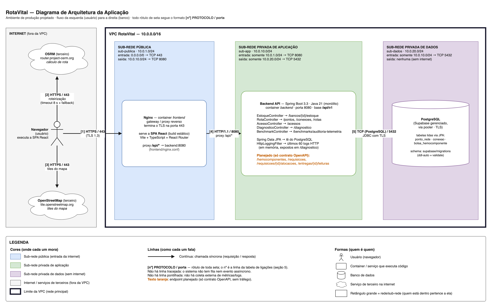

# RotaVital — Documento Final de Arquitetura

> Versão em texto do documento entregue na atividade de RSD. Os arquivos entregues são
> [`pdf/Arquitetura-RotaVital-Victor-Paes.pdf`](../pdf/Arquitetura-RotaVital-Victor-Paes.pdf) e
> [`docs/Arquitetura-RotaVital-Victor-Paes.drawio`](./Arquitetura-RotaVital-Victor-Paes.drawio). As seções seguem a ordem
> exigida pelo enunciado (capa, descrição, diagrama, endpoints, ligações, redes e legenda).

## 1. Capa

**RotaVital** — Sistema de logística de distribuição de hemocomponentes  
Documento de Arquitetura da Aplicação · Projetos 3 — RSD · Atividade avaliativa

| | |
|---|---|
| Instituição | CESAR School — Análise e Desenvolvimento de Sistemas |
| Turma | ADS 2026.2 — 3º período |
| Data | 09/10/2026 |
| Integrantes | Victor José Paes e Silva (líder); Eduardo de Souza Cavalcanti Junior; Felipe Franca Alves de Lima; Helamã Leone de Lima Procídio; João Pedro Arruda Guimarães; Júlia Oliveira Veríssimo; Lucas Paguetti Pereira; Tiago Luiz Moreira de Vasconcelos |
| Arquivos da entrega | `Arquitetura-RotaVital-Victor-Paes.pdf` · `Arquitetura-RotaVital-Victor-Paes.drawio` |

---

## 2. Descrição do sistema

O RotaVital é um sistema web de logística para a distribuição de hemocomponentes (concentrado de hemácias,
plasma e plaquetas) entre hemocentros, bancos de sangue e hospitais. Ele reúne em um só lugar a gestão de
estoque, as requisições hospitalares, a checagem de compatibilidade ABO/Rh, a roteirização das entregas e o
acompanhamento da temperatura da cadeia fria. O objetivo é garantir que a bolsa certa chegue ao paciente
certo, no tempo certo, com rastreabilidade e controle de validade.

### Quem usa

| Usuário | O que faz no sistema |
|---|---|
| Profissional de hemocentro | Cadastra bolsas, acompanha estoque e validade, atende requisições alocando bolsas compatíveis. |
| Médico | Abre requisições de hemocomponentes para pacientes e acompanha o andamento. |
| Gestor hospitalar | Acompanha o estoque consolidado, a priorização das requisições e as entregas em trânsito. |
| Doador (portal de doações) | Consulta informações do portal de doações. |
| Administrador | Acompanha o painel de diagnóstico: saúde do backend, latência do banco e últimas requisições HTTP. |

### Principais funcionalidades

- Visão do estoque por banco de sangue, tipo ABO/Rh e hemocomponente.
- Requisições hospitalares com prioridade e alocação automática por **FEFO** (vence primeiro, sai primeiro) e
  compatibilidade.
- Rede de distribuição modelada como grafo (pontos e conexões) e cálculo de rota entre origem e destino, com
  mapa.
- Registro e histórico das leituras de temperatura de cada entrega (cadeia fria).

### Estado atual do MVP e como ler o diagrama

Hoje o projeto roda em dois containers do `docker-compose.yml`: **frontend** (Nginx servindo a SPA React) e
**backend** (Spring Boot). O backend lê do PostgreSQL (Supabase) via Spring Data JPA: os pontos e as conexões
da rede de distribuição e as bolsas do estoque. A SPA já consome a API nas telas de **Estoque** e de
**Administração**; as telas de rede hospitalar, requisições, pacientes e doações ainda usam dados simulados
(`frontend/src/data/*Mock.ts`).

Nenhum endpoint grava dados ainda: as operações de escrita existem só no contrato OpenAPI
([`openapi.yaml`](./openapi.yaml)) e aparecem em laranja como planejadas. As cinco ligações do diagrama estão
ativas. As redes, sub-redes e o HTTPS na borda representam o **ambiente de produção projetado**, como pede a
atividade.

---

## 3. Diagrama de arquitetura

*Figura 1 — Diagrama de arquitetura exportado do draw.io (PNG, zoom 300%). Arquivo-fonte:
[`Arquitetura-RotaVital-Victor-Paes.drawio`](./Arquitetura-RotaVital-Victor-Paes.drawio), organizado em três camadas
(Redes · Componentes e ligações · Legenda). Setas [1]–[5] = linhas da tabela da seção 5. Detalhes do desenho
em [`DIAGRAMA_ROTAVITAL.md`](./DIAGRAMA_ROTAVITAL.md).*

### 3.1 Inventário de componentes

Lista de tudo que executa código ou guarda dado no RotaVital (etapa 1 da atividade). Todo item daqui aparece
no diagrama, e nada aparece no diagrama sem estar aqui.

| Componente | O que é / o que faz | Onde mora | Situação |
|---|---|---|---|
| **Navegador** (SPA React) | Inicia todas as requisições; executa a SPA (Vite + TypeScript + React Router). | Internet | Ativo |
| **Nginx** (container *frontend*) | Serve o build estático da SPA e faz proxy reverso de `/api/*` para o backend. É o único ponto de entrada (gateway) e termina o TLS. | sub-publica | Ativo |
| **Backend API** (container *backend*) | Monólito Spring Boot 3.3 (Java 21), porta 8080, base `/api/v1`. Controllers: Estoque, Rota, Acesso, Diagnóstico e Benchmark. Lê o banco com Spring Data JPA. | sub-app | Ativo |
| **PostgreSQL** (Supabase) | Banco relacional gerenciado, acessado via pooler com TLS. Schema versionado em `supabase/migrations` e carga inicial em `supabase/seed.sql`; o backend mapeia `ponto_rede`, `conexao` e `bolsa_hemocomponente` (`ddl-auto=validate`). | sub-dados | Ativo (somente leitura) |
| **OSRM** (terceiro) | API pública de roteirização (`router.project-osrm.org`), chamada pelo navegador com timeout de 8 s e fallback. | Internet | Ativo |
| **OpenStreetMap** (terceiro) | Servidor de tiles do mapa (`tile.openstreetmap.org`), chamado pelo navegador. | Internet | Ativo |

**Como o sistema é observado:** não há ferramenta externa. O próprio backend guarda as últimas 60 requisições
HTTP em memória (`HttpLoggingFilter` + `LogHttpService`) e as expõe, junto com uptime e latência do banco, em
`GET /api/v1/diagnostico`, exibido no painel de Administração. Isso roda dentro do Backend API e usa o mesmo
caminho das setas [1] e [4], por isso não é um componente separado.

**O que não existe no projeto** (e por isso não está no diagrama): fila ou mensageria, cache, balanceador de
carga separado (o Nginx cumpre esse papel), NAT Gateway, servidor de e-mail e ferramenta de observabilidade
(Prometheus, Grafana etc.).

---

## 4. Tabela de endpoints REST

Todos os endpoints são servidos pelo **Backend API** na base `/api/v1` e chegam ao navegador pelo Nginx em
`https://<domínio>/api/v1/...`. Como o MVP passa de 15 operações, elas foram agrupadas por recurso (4.1) e
detalhadas (4.2).

### 4.1 Resumo por recurso

| Recurso | Caminho base | Métodos | Controller | Situação |
|---|---|---|---|---|
| Estoque de um banco | `/api/v1/bancos/{id}/estoque` | GET | EstoqueController | Implementado (lê do banco) |
| Rede de distribuição | `/api/v1/pontos`, `/api/v1/conexoes` | GET | RotaController | Implementado (lê do banco) |
| Rotas | `/api/v1/rotas` | GET | RotaController | Implementado (calcula sobre o grafo do banco) |
| Acessos | `/api/v1/acessos` | POST | AcessoController | Implementado (sem persistência) |
| Diagnóstico | `/api/v1/diagnostico` | GET | DiagnosticoController | Implementado |
| Benchmarks | `/api/v1/benchmarks/auditoria-telemetria` | GET, POST | BenchmarkController | Implementado (dados gerados em memória) |
| Hemocomponentes (bolsas) | `/api/v1/hemocomponentes` | GET, POST, PATCH, DELETE | — | Planejado (contrato OpenAPI) |
| Requisições e alocações | `/api/v1/requisicoes`, `/api/v1/requisicoes/{id}/alocacoes` | GET, POST, PATCH | — | Planejado (contrato OpenAPI) |
| Leituras de temperatura | `/api/v1/entregas/{id}/leituras` | GET, POST | — | Planejado (contrato OpenAPI) |

### 4.2 Endpoints detalhados

A autenticação ainda não existe no MVP: os endpoints implementados são abertos. Nos planejados, a coluna
indica o perfil previsto (token JWT): **401** = sem token ou token inválido; **403** = token válido, mas sem o
perfil exigido. Erros seguem o formato `application/problem+json` (`ErroDTO`).

**Implementados**

| Método | Caminho | Descrição | Autenticação | Resposta | Status |
|---|---|---|---|---|---|
| GET | `/api/v1/bancos/{id}/estoque?tipoSanguineo=O_NEGATIVO` | Bolsas em estoque do banco de sangue, com filtro opcional por tipo ABO/Rh | Não (MVP) | `EstoqueDTO` | 200, 400, 404 |
| GET | `/api/v1/pontos` | Lista os pontos (bancos de sangue e hospitais) da rede de distribuição | Não (MVP) | `List<PontoRedeDTO>` | 200 |
| GET | `/api/v1/conexoes` | Lista as conexões (trechos) entre os pontos | Não (MVP) | `List<ConexaoDTO>` | 200 |
| GET | `/api/v1/rotas?origemId=BS-01&destinoId=HOSP-01&janelaEntregaLimite=…` | Calcula a rota mínima entre origem e destino e indica se chega dentro da janela. Nada é persistido. | Não (MVP) | `RotaCalculadaDTO` | 200, 400, 404, 422 |
| POST | `/api/v1/acessos` | Identifica o usuário e devolve o perfil e os módulos liberados. Funciona como login: não cria recurso persistido, por isso responde 200. | Não | `AcessoDTO` | 200, 400 |
| GET | `/api/v1/diagnostico` | Saúde do backend, latência do banco e últimos 60 logs HTTP (o estado do banco vai no corpo) | Não no MVP (a SPA restringe ao admin); previsto JWT (ADMIN) | `DiagnosticoResponse` | 200 |
| GET, POST | `/api/v1/benchmarks/auditoria-telemetria?tamanho=100000&modo=TODOS` | Executa o benchmark de auditoria de telemetria (sequencial × paralelo) sobre dados gerados em memória | Não (MVP) | `BenchmarkResponse` | 200 |

**Planejados (contrato OpenAPI)**

| Método | Caminho | Descrição | Autenticação | Resposta | Status |
|---|---|---|---|---|---|
| GET | `/api/v1/hemocomponentes?bancoId=BS-01&tipoSanguineo=O_NEGATIVO&status=DISPONIVEL&page=0&size=20` | Lista bolsas com filtros e paginação | JWT (HEMOCENTRO, GESTOR) | `Page<BolsaHemocomponenteDTO>` | 200, 401, 403 |
| POST | `/api/v1/hemocomponentes` | Registra uma nova bolsa | JWT (HEMOCENTRO) | `BolsaHemocomponenteDTO` | 201, 400, 401, 403 |
| GET | `/api/v1/hemocomponentes/{id}` | Detalha uma bolsa | JWT (HEMOCENTRO, GESTOR) | `BolsaHemocomponenteDTO` | 200, 401, 403, 404 |
| PATCH | `/api/v1/hemocomponentes/{id}` | Atualiza o status da bolsa (ex.: DISPONIVEL → DESCARTADA) | JWT (HEMOCENTRO) | `BolsaHemocomponenteDTO` | 200, 400, 401, 403, 404, 409 |
| DELETE | `/api/v1/hemocomponentes/{id}` | Remove um cadastro (409 se a bolsa já estiver alocada) | JWT (HEMOCENTRO) | — | 204, 401, 403, 404, 409 |
| POST | `/api/v1/requisicoes` | Cria uma requisição hospitalar | JWT (MEDICO) | `RequisicaoHospitalarDTO` | 201, 400, 401, 403 |
| GET | `/api/v1/requisicoes?hospitalId=HOSP-01&status=PENDENTE&page=0&size=20` | Lista requisições com filtros e paginação | JWT (MEDICO, HEMOCENTRO, GESTOR) | `Page<RequisicaoHospitalarDTO>` | 200, 401, 403 |
| GET | `/api/v1/requisicoes/{id}` | Detalha uma requisição | JWT (dono ou HEMOCENTRO) | `RequisicaoHospitalarDTO` | 200, 401, 403, 404 |
| POST | `/api/v1/requisicoes/{id}/alocacoes` | Aloca uma bolsa compatível (ABO/Rh + FEFO) à requisição | JWT (HEMOCENTRO) | `AlocacaoDTO` | 201, 401, 403, 404, 409 |
| PATCH | `/api/v1/requisicoes/{id}` | Atualiza o status da requisição (ex.: cancelar com `{"status": "CANCELADA"}`) | JWT (dono ou GESTOR) | `RequisicaoHospitalarDTO` | 200, 400, 401, 403, 404, 409 |
| POST | `/api/v1/entregas/{id}/leituras` | Registra uma leitura de temperatura da entrega | JWT (HEMOCENTRO) | `LeituraTelemetriaDTO` | 201, 400, 401, 403, 404 |
| GET | `/api/v1/entregas/{id}/leituras` | Histórico de temperatura da entrega | JWT (HEMOCENTRO, GESTOR) | `List<LeituraTelemetriaDTO>` | 200, 401, 403, 404 |

**Padrões REST aplicados:** substantivos no plural e nenhum verbo na URL; versão no caminho (`/api/v1`);
sub-recursos por hierarquia (`/bancos/{id}/estoque`, `/requisicoes/{id}/alocacoes`,
`/entregas/{id}/leituras`); filtros e paginação por query string; 201 para criação, 204 para exclusão, 404
para recurso inexistente, 409 para conflito de estado e 422 para regra de negócio violada.

---

## 5. Tabela de ligações e protocolos

Cada linha corresponde a uma seta do diagrama, com o mesmo número [1]–[5].

| # | Origem | Destino | Protocolo | Porta | Situação |
|---:|---|---|---|---:|---|
| 1 | Navegador | Nginx (frontend) | HTTPS (HTTP/1.1 ou HTTP/2 sobre TLS 1.3) | 443 | Ativa |
| 2 | Navegador | OSRM (terceiro) | HTTPS | 443 | Ativa |
| 3 | Navegador | OpenStreetMap tiles (terceiro) | HTTPS | 443 | Ativa |
| 4 | Nginx (frontend) | Backend API | HTTP/1.1 (proxy reverso de `/api/*`) | 8080 | Ativa — estoque, pontos e diagnóstico |
| 5 | Backend API | PostgreSQL (Supabase) | Protocolo PostgreSQL sobre TCP (driver JDBC, com TLS: `sslmode=require`) | 5432 | Ativa — leitura via JPA |

- **Borda sempre em HTTPS:** tudo que vem da internet chega ao Nginx em HTTPS/443. O TLS termina no Nginx;
  dali para dentro, na rede privada, o tráfego segue em HTTP/1.1 na porta 8080.
- **Banco nunca exposto:** só o Backend API alcança a porta 5432; nenhuma seta sai da internet para o banco.
- **Sem comunicação assíncrona:** não há fila nem eventos no projeto, por isso não há linha tracejada.
- **Terceiros chamados pelo navegador:** OSRM e tiles são acessados direto do navegador do usuário, não pelo
  servidor. Assim nenhum componente da VPC precisa sair para a internet, e não é necessário NAT Gateway.
- **Ambiente local × produção:** no `docker-compose` de desenvolvimento o Nginx atende em HTTP na porta 80 do
  `localhost` (`listen 80` em `frontend/nginx.conf`). No ambiente projetado ele escuta apenas na 443, com o
  certificado TLS do domínio; essa configuração de produção ainda não está no repositório.

---

## 6. Tabela de definição de redes

| Rede / sub-rede | CIDR | Tipo | Componentes | Entrada permitida | Saída permitida |
|---|---|---|---|---|---|
| VPC RotaVital | `10.0.0.0/16` | Rede principal | Todas as sub-redes abaixo | — | — |
| sub-publica | `10.0.1.0/24` | Pública | Nginx (container frontend) | `0.0.0.0/0` → TCP 443 | `10.0.10.0/24` → TCP 8080 |
| sub-app | `10.0.10.0/24` | Privada de aplicação | Backend API | `10.0.1.0/24` → TCP 8080 | `10.0.20.0/24` → TCP 5432 |
| sub-dados | `10.0.20.0/24` | Privada de dados | PostgreSQL (Supabase) | `10.0.10.0/24` → TCP 5432 | Nenhuma (sem internet) |

### 6.1 Regras de acesso (firewall / security groups)

| Regra | Origem | Destino | Porta | Ação | Motivo |
|---|---|---|---|---|---|
| R1 | Internet (`0.0.0.0/0`) | sub-publica (Nginx) | TCP 443 | Permitir | Acesso HTTPS dos usuários |
| R2 | sub-publica | sub-app (Backend) | TCP 8080 | Permitir | Nginx encaminha `/api/*` ao backend |
| R3 | sub-app | sub-dados (PostgreSQL) | TCP 5432 | Permitir | Backend acessa o banco |
| R4 | Internet | sub-app e sub-dados | Qualquer | Negar | Nada da internet chega direto à aplicação ou ao banco |
| R5 | sub-publica | sub-dados | Qualquer | Negar | O gateway não fala com o banco |
| R6 | sub-dados | Internet | Qualquer | Negar | Banco sem saída para a internet |

Padrão: tudo que não está listado é negado. As regras são *stateful* (a resposta de uma conexão permitida volta
automaticamente).

**Regra de ouro atendida:** o banco está na sub-rede privada de dados, só é acessível a partir da sub-rede de
aplicação na porta 5432 e não tem entrada nem saída para a internet.

**Sobre o Supabase:** é um PostgreSQL gerenciado. No ambiente projetado ele é tratado como a sub-rede de
dados, sem endereço público e acessível apenas pela sub-rede de aplicação por conexão privada. No
desenvolvimento atual o backend conecta ao pooler do Supabase pela internet com TLS, o que é aceitável só
para o MVP.

### 6.2 Correspondência com o Docker Compose atual

| Sub-rede projetada | Container (`docker-compose.yml`) | Rede Docker hoje | Porta no host |
|---|---|---|---|
| sub-publica | `rotavital-frontend` (nginx:alpine) | rede padrão do projeto (`bridge`) | `80:80` |
| sub-app | `rotavital-backend` (Java 21) | rede padrão do projeto (`bridge`) | `8080:8080` |
| sub-dados | — (Supabase gerenciado, fora do compose) | — | — |

O compose de desenvolvimento não implementa o isolamento: os dois containers estão na mesma rede `bridge`
padrão e a 8080 do backend é publicada no host para facilitar o desenvolvimento e os testes com
Postman/Insomnia. No ambiente projetado a 8080 só é alcançável a partir da `sub-publica` (regra R2).

---

## 7. Legenda e convenções

As mesmas convenções estão desenhadas na caixa de legenda do próprio diagrama.

### Cores — onde cada um mora

| Cor | Significado |
|---|---|
| Azul | Sub-rede pública (recebe tráfego da internet) — Nginx |
| Verde | Sub-rede privada de aplicação — Backend API |
| Roxo | Sub-rede privada de dados (sem internet) — PostgreSQL |
| Cinza | Internet / serviços de terceiros (fora da VPC) — navegador, OSRM, OpenStreetMap |
| Borda grossa escura | Limite da VPC (rede principal `10.0.0.0/16`) |
| Texto laranja | Endpoint planejado (existe só no contrato OpenAPI, sem tráfego) |

### Formas — quem é quem

| Forma | Significado |
|---|---|
| Boneco | Usuário (navegador) |
| Retângulo arredondado | Container / serviço que executa código (Nginx, Backend API) |
| Cilindro | Banco de dados (PostgreSQL) |
| Nuvem | Serviço de terceiro na internet (OSRM, OpenStreetMap) |
| Retângulo grande | Rede ou sub-rede; o componente desenhado dentro dele pertence àquela rede |

### Linhas — como cada um fala

| Linha | Significado |
|---|---|
| Contínua | Chamada síncrona (requisição/resposta). Todas as cinco setas do diagrama são deste tipo. |
| Tracejada (não usada) | Comunicação assíncrona (fila/evento). Não aparece porque o projeto não tem fila. |
| Pontilhada (não usada) | Observabilidade (coleta de métricas/logs). Não aparece porque não há coletor externo. |
| `[1] HTTPS / 443` | Rótulo de toda seta: **[nº] PROTOCOLO / porta**. O número liga a seta à linha da tabela da seção 5. |

**Camadas do .drawio:** o arquivo-fonte separa *Redes* (VPC e sub-redes), *Componentes e ligações* e
*Legenda* no painel Layers (`Ctrl+Shift+L`).

### Verificação cruzada

- ✅ **Todo endpoint da tabela está exposto por algum componente do diagrama:** todos ficam no Backend API
  (base `/api/v1`), que lista seus cinco controllers e os recursos planejados; o Nginx apenas repassa
  `/api/*`.
- ✅ **Toda seta do diagrama tem uma linha na tabela de protocolos:** setas [1] a [5] ↔ linhas 1 a 5 da seção
  5, com o mesmo protocolo e porta.
- ✅ **Todo componente do diagrama está em alguma sub-rede:** Nginx → sub-publica; Backend API → sub-app;
  PostgreSQL → sub-dados. Navegador, OSRM e OpenStreetMap ficam, de propósito, na Internet (fora da VPC).
- ✅ **Inventário ↔ diagrama:** os 6 componentes do inventário (3.1) estão no diagrama, e nenhum componente
  foi inventado.

### Revisão contra os erros comuns do enunciado

| Erro a evitar | Situação no documento |
|---|---|
| Seta sem rótulo | As 5 setas têm `[nº] PROTOCOLO / porta` |
| HTTP/80 na borda da internet | A borda é HTTPS/443; HTTP/1.1 aparece só entre Nginx e Backend, na rede privada |
| Banco em sub-rede pública | PostgreSQL na `sub-dados`, acessível só pelo Backend em 5432 |
| Verbo na URL | Nenhum: só substantivos no plural e sub-recursos |
| Imagem ilegível | PNG exportado do draw.io a 300% (4890 × 3000 px) |
| Trocar por outro tipo de diagrama | É diagrama de arquitetura (componentes, redes e ligações), não de classes, DER ou caso de uso |
| Ícone sem legenda | Caixa de legenda no diagrama e na seção 7 |
| Componente inventado | Nenhum; fila, cache, NAT e observabilidade externa estão listados como inexistentes |
| Esquecer o assíncrono | Não há fila nem eventos no projeto; a legenda registra que a linha tracejada não é usada |
| Entregar só o PDF | O `.drawio` editável é entregue junto |
