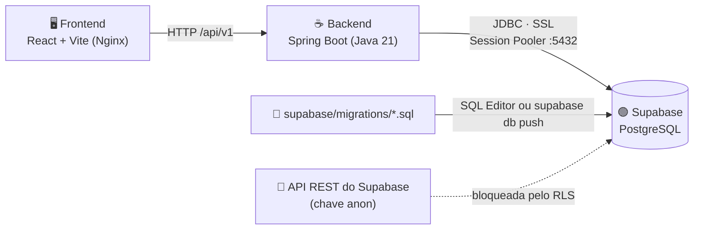

<h1 align="center">
  Detalhamento do Supabase <br>
  
  
</h1>

<p align="center">
    
    
    
    
</p>

> Como o Rota Vital usa o **Supabase** (PostgreSQL gerenciado): projeto, conexão do backend, variáveis de
> ambiente, migrations, constraints, RLS e como validar. O modelo relacional completo (DER em Mermaid e o
> catálogo de cada constraint) está em [`DER.md`](../../docs/DER.md).

<h2 align="left">🧭 Sumário: </h2>

1. [Visão geral](#1-visao-geral)
2. [Projeto no Supabase](#2-projeto)
3. [Conexão do backend](#3-conexao)
4. [Variáveis de ambiente](#4-variaveis)
5. [Migrations versionadas](#5-migrations)
6. [Tabelas](#6-tabelas)
7. [Constraints de integridade](#7-constraints)
8. [Row Level Security (RLS)](#8-rls)
9. [Validação](#9-validacao)
10. [Como aplicar e conferir](#10-como-aplicar)
11. [Prints / evidências](#11-prints)

<h2 align="left" id="1-visao-geral">🌐 1. Visão geral</h2>



| Camada | Tecnologia | Papel |
| :--- | :--- | :--- |
| 🖥️ Frontend | React + TypeScript | Consome só o backend; nunca fala direto com o banco |
| ☕ Backend | Spring Boot + JPA/Hibernate + driver `org.postgresql` | Único cliente do banco, conectado como `postgres` |
| 🟢 Banco | Supabase (PostgreSQL gerenciado) | Persistência, constraints e RLS |
| 📜 Schema | SQL versionado em `supabase/migrations/` | Fonte da verdade da estrutura do banco |

<h2 align="left" id="2-projeto">🏗️ 2. Projeto no Supabase</h2>

| Item | Valor |
| :--- | :--- |
| 🆔 Project ref | `gilyfswvezmvtmlxgvrd` |
| 🌍 URL do projeto | `https://gilyfswvezmvtmlxgvrd.supabase.co` |
| 📍 Região | AWS `us-east-2` (Ohio) |
| 🐘 Banco | PostgreSQL, database `postgres`, schema `public` |
| 🔌 Pooler | `aws-0-us-east-2.pooler.supabase.com:5432` (Session mode) |

> [!NOTE]
> Usamos o **Session Pooler** (porta `5432`) e não a conexão direta: a conexão direta do Supabase é só
> IPv6, e o pooler aceita IPv4, que funciona na rede da faculdade e dentro do Docker.

<h2 align="left" id="3-conexao">🔌 3. Conexão do backend</h2>

Em [`backend/src/main/resources/application.properties`](../../backend/src/main/resources/application.properties):

```properties
spring.datasource.url=jdbc:postgresql://aws-0-us-east-2.pooler.supabase.com:5432/postgres?sslmode=require
spring.datasource.username=postgres.gilyfswvezmvtmlxgvrd
spring.datasource.password=${SUPABASE_DB_PASSWORD}
spring.datasource.driver-class-name=org.postgresql.Driver
spring.jpa.hibernate.ddl-auto=update
```

| Propriedade | Por quê |
| :--- | :--- |
| `sslmode=require` 🔒 | O Supabase só aceita conexões criptografadas |
| `postgres.<project-ref>` 👤 | No pooler, o usuário leva o id do projeto como sufixo |
| `${SUPABASE_DB_PASSWORD}` 🔑 | A senha nunca vai para o Git; vem do `backend/.env` |
| `ddl-auto=update` ⚠️ | Hoje ainda não há `@Entity`. Quando as entidades entrarem, trocar para `validate`: o schema passa a vir só das migrations |

<h2 align="left" id="4-variaveis">🔑 4. Variáveis de ambiente</h2>

| Variável | Onde é usada | Onde fica | Pode ir para o Git? |
| :--- | :--- | :--- | :---: |
| `SUPABASE_DB_PASSWORD` | Backend (JDBC) e `docker-compose.yml` | `backend/.env` | ❌ |
| `SUPABASE_URL` | Clientes da API REST/Auth do Supabase | `backend/.env` | ✅ (é pública) |
| `SUPABASE_KEY` | Chave `anon` para a API do Supabase | `backend/.env` | ⚠️ só a `anon`, nunca a `service_role` |

O modelo fica em [`backend/.env.example`](../../backend/.env.example): copie para `backend/.env` e preencha.
O `.env` está no `.gitignore`.

> [!WARNING]
> A chave **`service_role`** ignora o RLS e dá acesso total ao banco. Ela não entra em `.env.example`, em
> commit, nem no frontend.

<h2 align="left" id="5-migrations">📜 5. Migrations versionadas</h2>

As migrations ficam em [`supabase/migrations/`](../migrations/), no formato do Supabase CLI
(`<timestamp>_<nome>.sql`), e rodam em ordem:

| # | Arquivo | O que faz |
| :---: | :--- | :--- |
| 1️⃣ | [`20260924120000_schema_inicial.sql`](../migrations/20260924120000_schema_inicial.sql) | Cria as 7 tabelas, PKs, FKs e índices, e liga o RLS |
| 2️⃣ | [`20260924120100_constraints_integridade.sql`](../migrations/20260924120100_constraints_integridade.sql) | NOT NULL, DEFAULT, UNIQUE, CHECK, FKs compostas de regra de negócio e o gatilho de alocação |

<h2 align="left" id="6-tabelas">🗂️ 6. Tabelas</h2>

| Tabela | Classe de domínio | PK | Relaciona com |
| :--- | :--- | :--- | :--- |
| 📍 `ponto_rede` | `Hospital`, `BancoDeSangue` (+ `Endereco`) | `id` (text, ex.: `BS-01`) | origem/destino de conexões, bolsas, requisições e entregas |
| 🛣️ `conexao` | `Conexao` | `id` (identity) | `ponto_rede` × 2 |
| 🩸 `bolsa_hemocomponente` | `BolsaHemocomponente` | `id` (text, ex.: `CH-1042`) | `ponto_rede` (banco de origem) |
| 🏥 `requisicao_hospitalar` | `RequisicaoHospitalar` | `id` (uuid) | `ponto_rede` (hospital) |
| 🔗 `alocacao` | `AlocacaoDTO` | `id` (uuid) | `requisicao_hospitalar`, `bolsa_hemocomponente` |
| 🚑 `entrega` | `MonitoramentoEntregaDTO` | `id` (uuid) | `requisicao_hospitalar`, `ponto_rede` × 2 |
| 🌡️ `leitura_telemetria` | `LeituraTelemetriaDTO` | `id` (identity) | `entrega` |

> 🧩 `Hospital` e `BancoDeSangue` dividem a tabela `ponto_rede` porque uma `Conexao` liga dois pontos
> quaisquer. A coluna `tipo` e as FKs compostas `(id, tipo)` garantem que cada relação aponte para o tipo
> certo de ponto. Detalhes no [DER](../../docs/DER.md#1-der).

<h2 align="left" id="7-constraints">🔒 7. Constraints de integridade</h2>

Resumo por tipo; a lista completa, com a origem de cada regra, está em [`DER.md` → seção 2](../../docs/DER.md#2-constraints).

| Tipo | Qtd. | Exemplos |
| :--- | :---: | :--- |
| 🚫 **NOT NULL** | todas as colunas, exceto 3 | só `temperatura_celsius`, `localizacao` (bolsa) e `chegada_em` (entrega) aceitam nulo |
| ⚙️ **DEFAULT** | 13 | `status = 'DISPONIVEL'`, `status = 'PENDENTE'`, `urgencia = 'MEDIA'`, `criado_em = now()` |
| ✅ **CHECK** | 33 | enums do Java, `validade > coleta`, prazo máximo por componente (ANVISA), `distancia_km > 0`, coordenadas válidas |
| 🔑 **UNIQUE** | 6 de negócio (+ 4 técnicas) | lote único por componente, uma bolsa por requisição, uma entrega ativa por requisição |
| 🔗 **FK composta** | 7 | bolsa vem de banco de sangue; bolsa alocada tem o mesmo componente e tipo sanguíneo do pedido |
| ⚡ **Gatilho** | 1 (4 regras) | bolsa vencida ou já reservada não é alocada; não passa da quantidade pedida |

<details>
<summary>▶️🩸 <b>Prazo máximo de validade por componente</b> (<code>ck_bolsa_prazo_maximo_por_componente</code>)</summary>

| Componente | Faixa ideal de temperatura | Validade máxima desde a coleta |
| :--- | :---: | :---: |
| 🔴 Hemácias | 2 °C a 6 °C | 42 dias |
| 🟡 Plaquetas | 20 °C a 24 °C | 7 dias |
| 🔵 Plasma | −30 °C a −18 °C | 730 dias |
| ⚪ Crioprecipitado | −30 °C a −18 °C | 365 dias |

Base: RDC ANVISA 34/2014. A faixa de temperatura **não** é constraint: uma bolsa fora da faixa ideal é um
alerta do sistema (`estaForaDaFaixa()`), não um dado inválido.
</details>

<details>
<summary>▶️⚡ <b>Gatilho <code>trg_alocacao_validar</code></b></summary>

| Regra | Nome no erro |
| :--- | :--- |
| 📋 Requisição precisa estar `PENDENTE` ou `ALOCADA` | `ck_alocacao_requisicao_aberta` |
| 🔢 Não alocar mais bolsas do que a quantidade pedida | `ck_alocacao_quantidade_maxima` |
| 🟢 Bolsa precisa estar `DISPONIVEL` | `ck_alocacao_bolsa_disponivel` |
| 📅 Bolsa não pode estar vencida | `ck_alocacao_bolsa_dentro_validade` |

A linha da requisição é travada com `FOR UPDATE`, então duas alocações simultâneas não ultrapassam a
quantidade.
</details>

<h2 align="left" id="8-rls">🛡️ 8. Row Level Security (RLS)</h2>

| Acesso | Role | RLS se aplica? | Resultado hoje |
| :--- | :--- | :---: | :--- |
| ☕ Backend (JDBC) | `postgres` | ❌ (ignora RLS) | ✅ lê e escreve normalmente |
| 🌐 API REST do Supabase com chave `anon` | `anon` | ✅ | 🚫 bloqueado (RLS ligado, sem políticas) |
| 👤 Usuário logado via Supabase Auth | `authenticated` | ✅ | 🚫 bloqueado até existirem políticas |

> [!IMPORTANT]
> Toda tabela em `public` fica exposta pela API REST do Supabase. Com o RLS ligado e sem políticas, o acesso
> público é negado por padrão. As políticas por papel (médico × doador) ficam para a subtarefa de RLS.

<h2 align="left" id="9-validacao">🧪 9. Validação</h2>

As migrations foram aplicadas no projeto dentro de uma transação desfeita no final (`ROLLBACK`), com os
dados-semente do backend (`BancosEmMemoria` e `RedeDistribuicaoEmMemoria`). Resultado: **34/34**.

| Grupo | Casos | Resultado |
| :--- | :---: | :---: |
| 🌱 Migrations + seed do backend | 2 migrations + 3 pontos, 7 bolsas, 1 requisição | ✅ |
| 🚫 Inserções inválidas recusadas pela constraint esperada | 31 | ✅ 31/31 |
| ✅ Fluxos válidos aceitos | 3 | ✅ 3/3 |

<details>
<summary>▶️🚫 <b>Os 31 casos inválidos</b></summary>

| # | Cenário | Recusado por |
| :---: | :--- | :--- |
| 1 | Ponto de rede com tipo `CLINICA` | `ck_ponto_rede_tipo` |
| 2 | Nome só com espaços | `ck_ponto_rede_nome_preenchido` |
| 3 | Latitude 95 | `ck_ponto_rede_latitude` |
| 4 | Dois hospitais com o mesmo nome | `uq_ponto_rede_tipo_nome` |
| 5 | Ponto sem logradouro | NOT NULL `logradouro` |
| 6 | Conexão de um ponto para ele mesmo | `ck_conexao_sem_laco` |
| 7 | Conexão com distância 0 | `ck_conexao_distancia_positiva` |
| 8 | Conexão duplicada | `uq_conexao_origem_destino` |
| 9 | Bolsa com origem em um hospital | `fk_bolsa_banco_origem_e_banco_de_sangue` |
| 10 | Tipo sanguíneo `O+` (fora do enum) | `ck_bolsa_tipo_sanguineo` |
| 11 | Validade antes da coleta | `ck_bolsa_validade_apos_coleta` |
| 12 | Plaquetas com 30 dias de validade | `ck_bolsa_prazo_maximo_por_componente` |
| 13 | Volume negativo | `ck_bolsa_volume_ml` |
| 14 | Status `PERDIDA` | `ck_bolsa_status` |
| 15 | Mesmo lote e componente duas vezes | `uq_bolsa_lote_componente` |
| 16 | Requisição feita por banco de sangue | `fk_requisicao_hospital_e_hospital` |
| 17 | Requisição com quantidade 0 | `ck_requisicao_quantidade` |
| 18 | Urgência `CRITICA` | `ck_requisicao_urgencia` |
| 19 | Alocar A− para pedido de O− | `fk_alocacao_bolsa_compativel` |
| 20 | Alocar bolsa vencida | `ck_alocacao_bolsa_dentro_validade` |
| 21 | Alocar bolsa já reservada | `ck_alocacao_bolsa_disponivel` |
| 22 | Alocar além da quantidade pedida | `ck_alocacao_quantidade_maxima` |
| 23 | Alocar em requisição cancelada | `ck_alocacao_requisicao_aberta` |
| 24 | Mesma bolsa em duas requisições | `uq_alocacao_bolsa` |
| 25 | Entrega para outro hospital | `fk_entrega_destino_e_hospital_da_requisicao` |
| 26 | Entrega saindo de um hospital | `fk_entrega_origem_e_banco_de_sangue` |
| 27 | `ENTREGUE` sem hora de chegada | `ck_entrega_entregue_tem_chegada` |
| 28 | Chegada antes da saída | `ck_entrega_chegada_apos_saida` |
| 29 | Duas entregas ativas da mesma requisição | `uq_entrega_requisicao_ativa` |
| 30 | Leitura de 200 °C | `ck_leitura_temperatura_sensor` |
| 31 | Duas leituras no mesmo instante | `uq_leitura_entrega_instante` |

</details>

<details>
<summary>▶️✅ <b>Os 3 fluxos válidos</b></summary>

| # | Fluxo | Resultado |
| :---: | :--- | :--- |
| 1 | Alocar `CH-1042` (O−) → despachar → registrar telemetria → marcar `ENTREGUE` | ✅ aceito; o gatilho preencheu `HEMACIAS / O_NEGATIVO` na alocação |
| 2 | Bolsa de plaquetas a 25,6 °C (fora da faixa ideal) | ✅ aceita, porque é alerta e não erro |
| 3 | Cancelar uma entrega e despachar de novo | ✅ aceito (índice único parcial) |

</details>

<h2 align="left" id="10-como-aplicar">🚀 10. Como aplicar e conferir</h2>

**Opção A: SQL Editor (painel do Supabase)** 🖱️

| Passo | Ação |
| :---: | :--- |
| 1 | Abrir o projeto → **SQL Editor** → **New query** |
| 2 | Colar e rodar `20260924120000_schema_inicial.sql` |
| 3 | Colar e rodar `20260924120100_constraints_integridade.sql` |
| 4 | Conferir em **Table Editor** e **Database → Tables** |

**Opção B: Supabase CLI** 💻

```bash
npx supabase login
npx supabase link --project-ref gilyfswvezmvtmlxgvrd
npx supabase db push
```

**Conferir as constraints criadas** 🔍

```sql
select conrelid::regclass as tabela, conname as constraint, pg_get_constraintdef(oid) as definicao
from pg_constraint
where connamespace = 'public'::regnamespace
order by 1, 2;
```

**Ver uma constraint recusando um dado** 🚫

```sql
insert into public.bolsa_hemocomponente
    (id, banco_origem_id, tipo_componente, tipo_sanguineo, data_coleta, data_validade, lote_sintetico, volume_ml)
values ('PQ-TESTE', 'BS-01', 'PLAQUETAS', 'O_NEGATIVO', current_date, current_date + 30, 'LOTE-TESTE', 300);
-- ERROR: new row for relation "bolsa_hemocomponente" violates check constraint
--        "ck_bolsa_prazo_maximo_por_componente"
```

<h2 align="left" id="11-prints">📸 11. Prints / evidências</h2>

Prints salvos em [`supabase/img/`](../img/). ✅ = já tirado · ⏳ = pendente.

| # | Print | Onde tirar | Arquivo | Status |
| :---: | :--- | :--- | :--- | :---: |
| 1 | Home do projeto (requisições por serviço, *Advisor found no issues*) | Supabase → **Project Overview** | [`supabase.png`](../img/supabase.png) | ✅ |
| 2 | Lista das 7 tabelas | **Database → Tables** | [`Database Tables.png`](../img/Database%20Tables.png) | ✅ |
| 3 | Colunas de `bolsa_hemocomponente` (tipos, PK, FKs, nullable) | **Database → Tables** → `bolsa_hemocomponente` → *View columns* | [`Colunas_exemplo(bolsa_hemocomponente).png`](<../img/Colunas_exemplo(bolsa_hemocomponente).png>) | ✅ |
| 4 | Lista das constraints | **SQL Editor**, rodando a consulta da seção 10 | `supabase_04_constraints.png` | ⏳ |
| 5 | Constraint recusando um dado | **SQL Editor**, rodando o `insert` inválido da seção 10 | `supabase_05_check_violado.png` | ⏳ |
| 6 | Diagrama gerado pelo Supabase | **Database → Schema Visualizer** | [`Schema_Vizualizer.png`](../img/Schema_Vizualizer.png) | ✅ |
| 7 | RLS ligado nas 7 tabelas | **Authentication → Policies** | `supabase_07_rls.png` | ⏳ |
| 8 | Histórico das migrations | **Database → Migrations** | [`Migrations_no_supabase.png`](../img/Migrations_no_supabase.png) | ✅ |
| 9 | Logs do Postgres executando as migrations | **Logs → Postgres** | [`logs_postgres.png`](../img/logs_postgres.png) | ✅ |

> [!TIP]
> O print 6 (**Schema Visualizer**) desenha o DER a partir do banco real. Serve de evidência de que o banco
> segue o DER de [`DER.md`](../../docs/DER.md).

<details>
<summary>▶️🏠 <b>1. Project Overview</b></summary>

<p align="center">

</p>

</details>

<details>
<summary>▶️🗂️ <b>2. Tabelas (7)</b></summary>

<p align="center">

</p>

</details>

<details>
<summary>▶️🩸 <b>3. Colunas de <code>bolsa_hemocomponente</code></b></summary>

<p align="center">

</p>

</details>

<details>
<summary>▶️🧩 <b>6. Schema Visualizer</b></summary>

<p align="center">

</p>

</details>

<details>
<summary>▶️📜 <b>8. Migrations</b></summary>

<p align="center">

</p>

</details>

<details>
<summary>▶️🪵 <b>9. Logs do Postgres</b></summary>

<p align="center">

</p>

</details>
